# HOW TO STUDY STEM: For Brains That Forget Immediately

> **This method works for:** math, physics, machine learning, programming, engineering, chemistry, biology, ANY STEM subject. Theory exams. Oral exams. Written exams. Practical labs. No matter how hard the material is.

You don't need to be smart. You need the right method for YOUR brain.
---

## YOUR MEMORY ISSUES: What This Method Is Built To Overcome

This method is designed for a brain with ALL of the following challenges. If you have even half of these, this method is for you.

### Neurotransmitter & Energy Issues
- **Extremely low dopamine**: your brain does not naturally tag information as "important, save this"
- **Tired/sleepy when trying to study or be productive**: mental effort triggers fatigue, not engagement

### Memory Systems Affected
- **Short-term memory problems**: information disappears within seconds of reading
- **Long-term memory problems**: information never makes it past the first 24 hours
- **Working memory issues**: cannot hold more than 1-2 chunks in mind at once; overloads immediately
- **Spatial memory issues**: cannot visualize or mentally manipulate objects, graphs, or layouts
- **Memory consolidation issues**: sleep does not efficiently transfer memories from hippocampus to cortex
- **Recall issues**: even when something IS stored, accessing it on demand is unreliable

### Comprehension & Processing
- **Cannot understand easy or hard concepts**: both simple and complex ideas feel equally impenetrable
- **Cannot understand math, STEM subjects, or programming**: technical material feels like a foreign language
- **Cannot understand complex or programming languages**: syntax, logic, and abstraction do not compute
- **Problem-solving issues**: cannot break down a problem into steps or see a path to the solution
- **Pattern recognition issues**: cannot see similarities across problems or identify problem types
- **Needing to read multiple times to understand/remember**: one pass does nothing; even 5 passes may not work
- **Cannot remember things even after trying to understand**: effort does not translate into retention

### The "Instant Forget" Phenomenon
- **Reading and forgetting the next second**: eyes move across words, brain retains nothing
- **Studying and forgetting the next second**: even active study yields zero recall moments later

### Focus & Attention
- **Issues focusing and poor concentration**: attention shatters within minutes
- **Mind wandering**: brain drifts away from the page uncontrollably
- **Brain fog**: a thick mental haze that makes thinking feel impossible

### Emotional & Stress Factors
- **Stress**: chronic stress impairs memory formation and retrieval
- **Anxiety**: constant worry consumes cognitive resources needed for learning
- **Social anxiety**: fear of judgment in class, labs, or presentations blocks participation
- **Difficulty staying calm or focused during exams**: exam pressure wipes whatever memory was there

> **If you recognize yourself in this list:** You are not broken. You are not stupid. Your brain simply needs a DIFFERENT approach than what standard education assumes. Every strategy in this guide was chosen BECAUSE of these specific issues. This method works WITH your brain, not against it.

---


## THE BIG PICTURE: How Your Brain's Memory Systems Work Together

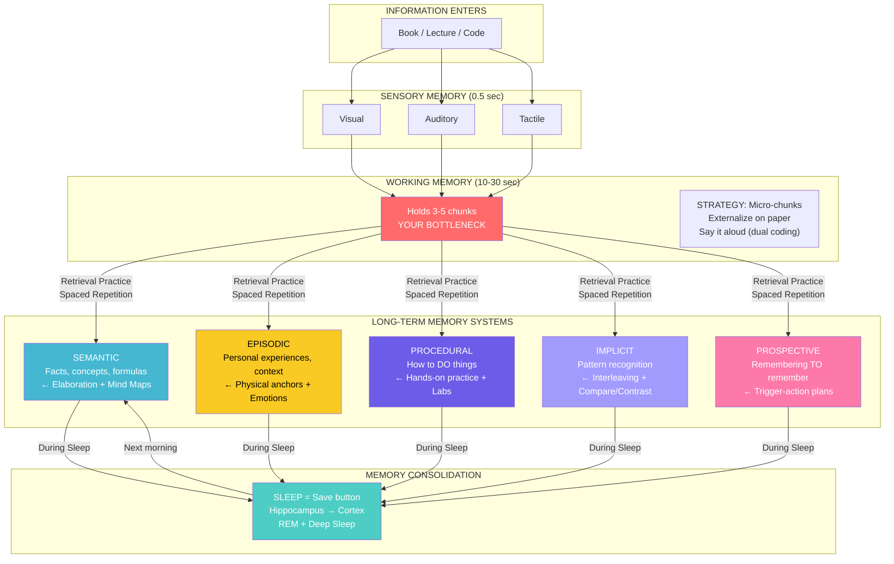

> **The red box is your bottleneck.** Working memory holds only 3-5 chunks for 10-30 seconds. Every strategy in this guide exists to WORK AROUND this limit. You are NOT stupid. Your working memory is just small. We work with it, not against it.

---

## YOUR MEMORY SYSTEMS: What Each One Does & How To Train It

| Memory System | What It Does | Your Problem | The Fix |
|---------------|-------------|--------------|---------|
| **Working Memory** | Holds info while you think | Overloads immediately → brain fog | Micro-chunks (2 min), externalize on paper, talk aloud |
| **Short-Term Memory** | Holds info for seconds/minutes | Forgets within 10 seconds | 3-Pass System, immediate vocal recall |
| **Long-Term Memory** | Stores info for days/years | Never makes it there | Spaced recall schedule (1h, 3h, sleep, next day, 3 days, 1 week) |
| **Semantic Memory** | Facts, concepts, formulas | Can't connect ideas | Elaboration, mind maps, "why" chains, compare/contrast tables |
| **Episodic Memory** | Personal experiences, context | Can't remember where/when learned | Physical anchors, emotional hooks, location rotation |
| **Procedural Memory** | How to DO things (muscle memory) | Can't translate theory to action | Hands-on labs, type code from scratch, execute by hand |
| **Implicit Memory** | Pattern recognition (unconscious) | Can't see patterns across problems | Interleaving, many examples side-by-side, "spot the difference" |
| **Prospective Memory** | Remembering TO do something later | Forgets to recall at exam time | Trigger-action plans, exam simulation, "when I see X, I say Y" |

---

## WHY NORMAL STUDYING DOESN'T WORK FOR YOU

Reading and highlighting does NOT work. Period. Your brain throws away the information the second you close the book. It's not your fault. You're using the wrong method for your brain.

Your brain needs: **talking out loud, moving, taking breaks, drinking water, sleeping.**

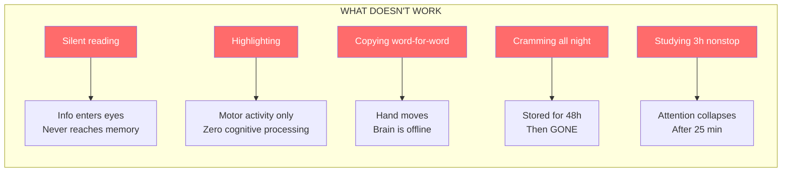

---

## RULE ZERO: NEVER STUDY IN SILENCE

Silent reading = wasted time. Every time you study something, you MUST:

1. **Read it OUT LOUD**
2. **Close your eyes**
3. **Say it again without looking**

This is the ONLY way your brain holds onto it. Otherwise it disappears in 10 seconds.

### Why Voice Works For Your Brain

- When you speak, your brain processes the information **TWICE** (once to produce it, once to hear it). This is **dual coding**: the strongest encoding path into semantic + episodic memory.
- Your **mouth remembers**. Even if your semantic memory fails, procedural memory (speech muscles) holds the words.
- You **can't zone out** while talking. Reading silently = mind wandering. Talking = forced focus on working memory.
- Voice creates an **episodic trace**: "I remember saying this in my room on Tuesday." That context helps retrieval.

### If You Can't Record Your Voice

- Talk to the wall. Talk to a stuffed animal. Talk to yourself in the mirror.
- The point is: **sound comes out of your mouth, enters your ears.** Brain processes it twice.
- Whispering counts. Just move your lips and make sound.

### When You're Too Tired To Speak (Backup Method)

- Play an AI voice explanation of the topic (Speechify, NaturalReader, or your phone's text-to-speech).
- BUT: **whisper along with it.** Move your lips. Even silently mouthing the words engages procedural memory far more than just listening.
- After it finishes, close your eyes and try to say it yourself. If you can't, replay and mouth along again.
- Use this ONLY when exhausted. **Your own voice is always better.** AI voice is the spare tire, not the main wheel.

### The Whisper Technique (For Libraries, Late Nights, Shared Rooms)

- Mouth every word. Exaggerate the lip movements like you're talking to a deaf person.
- Put your hand on your throat. **Feel the vibration.** That vibration IS your voice, even if no sound comes out.
- Your brain still registers this as "speaking." It still processes twice. Procedural memory still encodes.

---

## STEP ZERO: THE 30-SECOND PREVIEW (For Your Semantic + Working Memory)

> **DO THIS BEFORE EVERY STUDY SESSION. NEVER SKIP.**

Your brain throws away information because it doesn't know WHERE to put it. There's no "mental shelf." The preview builds the shelf.

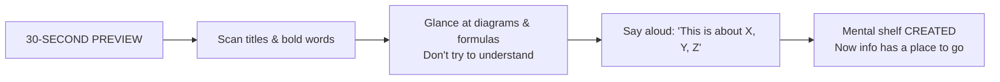

**What you do:**
1. **Skim ONLY titles, headings, and bold words.** 15 seconds.
2. **Let your eyes float over diagrams, flowcharts, formulas.** Don't try to understand them. Just notice they exist. 10 seconds.
3. **Say aloud:** "Ok, this section covers [topic A], [topic B], and [topic C]." 5 seconds.

Now your semantic memory has a **framework**. When you read details, they stick to the framework instead of floating away.

---

## THE 5-STEP METHOD: For ANY Subject, No Matter How Hard

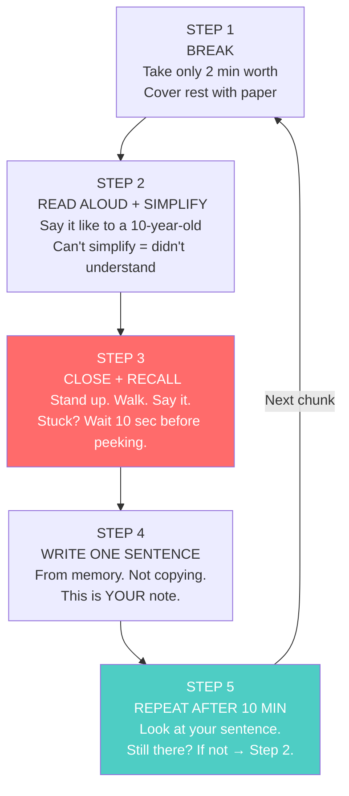

### Step 1: Break It Into Tiny Pieces (2 minutes)

Open the book. Don't look at everything. Take ONLY what you can read in 2 minutes. One definition. One formula. One paragraph. That's it.

Cover the rest with a piece of paper. You only see that one piece.

> **Why:** Your **working memory** holds 3-5 chunks max. A full page is 20+ chunks = instant overload = brain fog. One piece = one chunk = your brain can handle it.

### Step 2: Read Aloud And Simplify (3 minutes)

Read the piece out loud. Then say it IN YOUR OWN WORDS. Like you're explaining it to a 10-year-old.

**Example:**
- Book: "The perceptron is a binary linear classifier that computes a weighted sum of inputs and applies a threshold activation function."
- You: "The perceptron draws a line. Numbers go in. It adds them up with weights. Above the line = yes. Below the line = no."

If you can't say it in your own words, you DIDN'T understand it. Go back. Try an even simpler word.

> **This builds SEMANTIC MEMORY.** You're not memorizing words. You're connecting the concept to words YOU already own.

### Step 3: Close And Recall (2 minutes)

Close the book. **Stand up. Walk.** Say it out loud.

If you get stuck, DON'T look immediately. **Force yourself to remember for 10 seconds.** Then look at only the word you missed and try again.

> **The pain of not remembering IS the moment you learn.** This is **retrieval practice**: the single most powerful learning technique. It forces your brain to STRENGTHEN the neural pathway. Every time you almost-remember, the connection gets thicker.

### Step 4: Write One Sentence (1 minute)

On a blank piece of paper, write ONE sentence. What you just said. Don't copy from the book. Write what you remember.

At the end you'll have a sheet with 20-30 sentences. Those are YOUR notes. Not the book.

> **This externalizes working memory.** The paper becomes your extended brain. You don't need to hold everything in your head: the paper holds it.

### Step 5: Repeat After 10 Minutes (2 minutes)

After 10 minutes, look at your sentence. Can you still explain it? If no, redo from Step 2.

> **This starts the transfer from short-term → long-term memory.** The first 10-minute recall is critical. Without it, the memory dies.

---

## THE "I DON'T UNDERSTAND ANYTHING" PROTOCOL

> **For when your brain is fog and even Step 2 fails.**

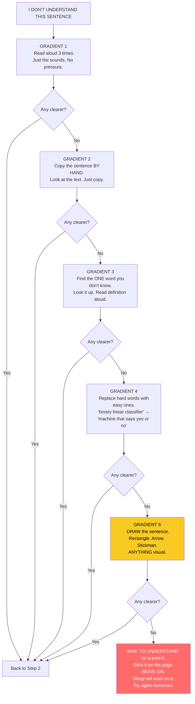

**The key insight:** Sometimes your brain just needs TIME and SLEEP to process a concept. Moving on is NOT giving up. It's trusting your brain's offline processing. Many students understand a concept the NEXT DAY that made zero sense the night before.

---

## DOPAMINE: How To Tell Your Brain That Studying Matters

> **Dopamine is the "this is important, SAVE IT" signal.** Low dopamine = your brain doesn't tag memories for storage. We must create artificial reward signals.

```mermaid
flowchart LR
    subgraph REWARD["MICRO-REWARDS (After Each Milestone)"]
        M1["1 Step 5 done →<br/> 1 square dark chocolate"]
        M2["3 cycles done →<br/> 2 min of a song you love<br/>DANCE. Move your body."]
        M3["1 session done (25 min) →<br/> 5 min looking out window<br/>Stretch. Pet an animal."]
    end

    subgraph JOURNAL["DOPAMINE JOURNAL (End of Day)"]
        J1["Write 3 things you LEARNED today<br/>(NOT 3 things you STUDIED)"]
        J2["'I now know that...'<br/>'I can now explain...'<br/>'I understand why...'"]
    end

    subgraph NO["AVOID (Destroys Dopamine)"]
        N1["Phone during breaks"]
        N2["Caffeine / Energy drinks"]
        N3["Social media scrolling"]
    end

    REWARD -->|"Builds motivation loop"| JOURNAL
    NO -->|"Dopamine crash"| REWARD

    style REWARD fill:#4ecdc4,color:#fff
    style JOURNAL fill:#f9ca24,color:#000
    style NO fill:#ff6b6b,color:#fff
```

- **After every Step 5:** One square of dark chocolate (70%+ cocoa). It stimulates dopamine naturally.
- **After 3 complete cycles:** 2 minutes of a song you LOVE. Stand up. Dance. Move.
- **After one full session (25 min):** 5 minutes of something joyful. Look out the window. Stretch. Pet your cat/dog. NO PHONE.
- **End of day: Dopamine Journal:** Write 3 things you **now know** that you didn't know yesterday. This trains your brain to scan for PROGRESS, not perfection.

---

## THE 3-PASS SYSTEM: For When You Read And Forget The Next Second

> **This is for your SHORT-TERM MEMORY collapse.** Three passes on the same material from three angles. Your brain CANNOT not retain at least some of it.

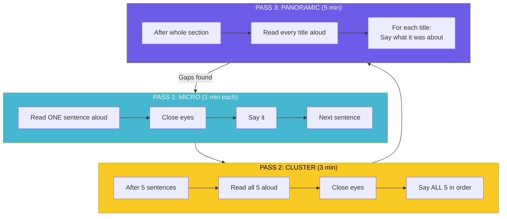

**Pass 1: Micro:** Read ONE sentence aloud. Close eyes. Say it. Move on. (1 minute each)
**Pass 2: Cluster:** After 5 sentences, go back. Read all 5 aloud. Close eyes. Say all 5 in order. (3 minutes)
**Pass 3: Panoramic:** After the whole section, read every title aloud. For each title, say ONE sentence about what it covered. (5 minutes)

If Pass 3 reveals gaps: you can't say what a section was about: that section gets a Pass 1 redo tomorrow.

### The "One More Time" Rule

If you finish a section and remember NOTHING: do it **one more time.** Not five more times. ONE. Your brain learns on the **second pass**, not the fifth. The fifth is just frustration and dopamine depletion. One more. Then move on. Trust that something stuck: it did.

---

## THE RECALL SCHEDULE: How To Move Info Into LONG-TERM Memory

> **This is the MOST IMPORTANT section for you.** Your forgetting curve is steeper than normal. Standard "review tomorrow" isn't enough. You need MORE frequent recalls in the FIRST 24 HOURS.

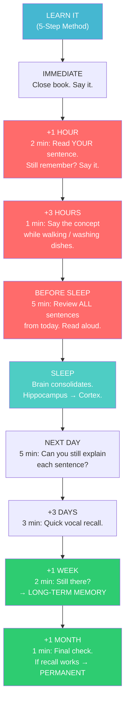

| When | What To Do | Time | Why |
|------|-----------|------|-----|
| **Immediate** | Close book, say it aloud | 30 sec | Prevents instant decay |
| **+1 hour** | Read YOUR sentence, recall | 2 min | First reconsolidation. Critical. |
| **+3 hours** | Say concept while doing something else | 1 min | Context-shift strengthens episodic trace |
| **Before sleep** | Review ALL sentences from today aloud | 5 min | Feeds hippocampus for overnight consolidation |
| **Next day** | Try to explain each sentence without looking | 5 min | Tests if sleep consolidation worked |
| **+3 days** | Quick vocal recall | 3 min | Moves from hippocampus → cortex |
| **+1 week** | 2-minute check | 2 min | If recall works → in long-term memory |
| **+1 month** | Final check | 1 min | If still there → permanent semantic memory |

> **The first 4 recalls (immediate, 1h, 3h, bedtime) are NON-NEGOTIABLE.** They are the difference between remembering for 1 day vs remembering for 1 year.

---

## HOW TO TRAIN EACH MEMORY SYSTEM: Specific Techniques

### Working Memory (Holds 3-5 chunks, 10-30 seconds)

Your biggest bottleneck. Every strategy reduces load on this system.

| Technique | How It Helps |
|-----------|-------------|
| **Externalize on paper** | Paper = extended working memory. Write intermediate steps. Don't hold them in your head. |
| **One chunk at a time** | Never read more than 2 minutes' worth. Cover the rest. |
| **Say it aloud** | Transfers load from visual working memory to auditory loop. Less competition. |
| **Draw it** | Converts abstract → spatial. Uses different working memory channel. |

### Semantic Memory (Facts, Concepts, Formulas)

This is your "textbook knowledge." Facts, definitions, theories, formulas.

| Technique | How It Helps |
|-----------|-------------|
| **Elaboration** | Ask "WHY is this true?" Connect to something you already know. |
| **Mind Maps** | One word per bubble. Draw lines between related concepts. Your brain sees connections. |
| **"Why" chains** | "A is true because B. B is true because C." Keep asking why until you hit foundations. |
| **Compare/Contrast tables** | Put two concepts side by side. Same column headers. Spot differences. |

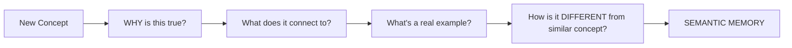

### Episodic Memory (Personal Experiences, Context)

Your brain remembers WHERE you were and HOW you FELT when you learned something. Exploit this.

| Technique | How It Helps |
|-----------|-------------|
| **Physical anchors** | Tap left shoulder when you say "Gain Ratio." Tap right for "KL penalty." Body remembers. |
| **Location rotation** | Study Topic A at desk, Topic B standing at window, Topic C on the floor. Location = retrieval cue. |
| **Emotional hooks** | "This formula saved a company from bankruptcy." Emotion = stronger encoding. |
| **Story-ify** | Turn any concept into a story with characters and drama. "In 1969, Minsky KILLED neural networks..." |

### Procedural Memory (How To DO Things: Muscle Memory)

This is "knowing how," not "knowing that." Labs, coding, experiments, calculations.

| Technique | How It Helps |
|-----------|-------------|
| **Type every code example** | Never copy-paste. Your fingers learn syntax. Make typos. Fix them. |
| **Execute code by hand** | Paper and pen. Be the computer. Write variable values at each line. |
| **Lab procedures from memory** | After reading the procedure once, write it from memory. Numbered steps. |
| **"Break it and fix it"** | Change one line of code. Guess what happens. Run. Were you right? |

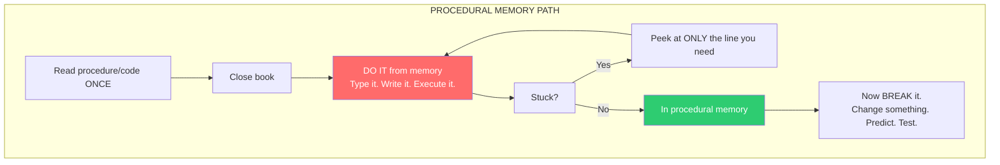

### Implicit Memory: Pattern Recognition (Unconscious)

This is how you look at a problem and KNOW it's "a dynamic programming problem" or "a Bayes theorem problem" without consciously reasoning.

| Technique | How It Helps |
|-----------|-------------|
| **Interleaving** | Mix 3 different problem types in one session. Don't do 10 of the same type. |
| **"Spot the difference"** | Put two similar-looking problems side by side. Why does one use method A and the other method B? |
| **Many examples, compared** | Don't study one example deeply. Study 5 examples shallowly, side by side. The pattern emerges from comparison. |
| **Categorize before solving** | Before solving, say aloud: "This looks like a [type] problem because [reason]." |

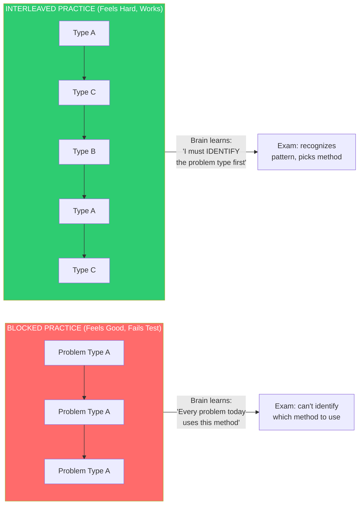

### Prospective Memory (Remembering TO Remember)

This is the memory of "when I see X on the exam, I need to recall Y." It's about TRIGGERS.

| Technique | How It Helps |
|-----------|-------------|
| **Implementation intentions** | "WHEN I see [formula name], I will say [explanation]." If-Then format. |
| **Trigger-action pairs** | Write on a card: "If question has 'ISO 27035' → say '5 phases: Plan, Identify, Assess, Respond, Learn.'" |
| **Exam simulation** | Have someone ask you questions in random order. Practice the trigger→response path. |
| **Keyword bridges** | For each topic, pick ONE trigger word. When you hear that word, your response unspools automatically. |

---

## FOR ORAL EXAMS (Viva, Presentations, Discussion-Based)

Oral exams are different. You don't need to write perfectly. You need to TALK.

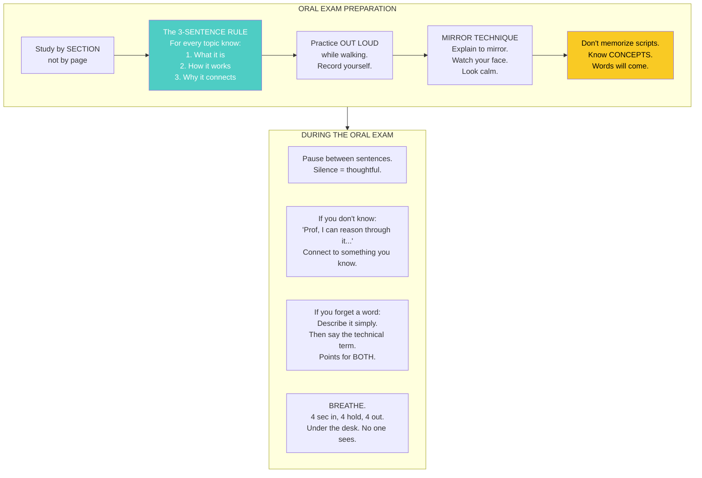

### How To Prepare For An Oral Exam

1. **Study by section, not by page.** The professor asks "Tell me about decision trees." Not "Tell me about page 47."

2. **The 3-Sentence Rule.** For EVERY topic, know 3 things:
   - What it is (1 sentence)
   - How it works (2 sentences)
   - Why it connects to something else (1 sentence)

3. **Practice out loud while walking.** Record yourself on your phone. Listen back. If you cringe, you'll remember it better next time.

4. **The Mirror Technique.** Stand in front of a mirror. Explain a concept. Watch your face. If you look confused, the professor will see it too. Practice until you look calm.

5. **Don't memorize scripts.** Know the CONCEPTS. The words will come. If you memorize exact sentences and forget one, you panic. Concepts don't have exact words.

### During The Oral Exam

- **Pause between sentences.** Silence is not failure. It makes you sound thoughtful.
- **If you don't know:** "Professor, I don't have the precise answer but I can reason through it: [connect to something you know]."
- **If you forget a word:** Describe the concept in simple words. Then say "This is called [technical term]." Points for BOTH understanding AND terminology.
- **Breathe.** 4 seconds in, 4 seconds hold, 4 seconds out. Do it under the desk. No one sees.

---

## FOR THEORY SUBJECTS (Heavy Reading, Concepts, Relationships)

Theory = definitions, concepts, relationships, history. Lots of words. No numbers.

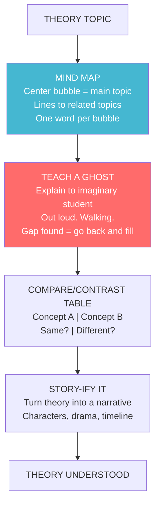

1. **Map it.** Draw a bubble in the center of a page. Write the main topic. Draw lines to related topics. One word per bubble. This is a mind map. Your brain sees connections it misses when reading linearly.

2. **Teach a ghost.** Explain the theory to an imaginary student. Out loud. Walking. When you can't explain something, you've found a gap. Go back and fill it. **This is the single most powerful technique for theory.** Teaching forces you to organize knowledge into coherent semantic structures.

3. **Compare and contrast.** Theory is about relationships. Make a simple table:
   | Concept A | Concept B | Same? | Different? |
   |-----------|-----------|-------|-------------|
   | SVM | Neural Net | Both classify | SVM has global min, NN doesn't |

4. **Story-ify it.** Turn the theory into a story with characters and drama:
   > "In 1969, Minsky proved the perceptron couldn't do XOR. Everyone gave up on neural networks. This was the first AI winter: funding vanished, researchers abandoned the field. Then in the 1980s, Rumelhart and Hinton figured out multi-layer networks and backpropagation. AI came back from the dead. Then it died again in the 1990s..."

   Stories use **episodic memory**, which is stronger than semantic memory for you.

---

## FOR WRITTEN EXAMS (Essay Questions, Problem Sets, Proofs)

Written exams require you to PRODUCE, not just recognize.

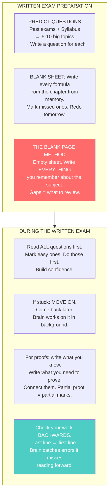

### How To Prepare For Written Exams

1. **Predict the questions.** Look at past exams. Look at the syllabus. What are the 5-10 big topics? Write a question for each. Answer them in writing. Under timed conditions.

2. **Practice writing formulas from memory.** Blank sheet. Write every formula from a chapter. Don't peek. Then check. Mark the ones you missed. Redo those tomorrow.

3. **The Blank Page Method.** Before the exam, take a blank sheet. Write EVERYTHING you remember about the subject. No book. No notes. Just your brain and a pen. The gaps on the page are EXACTLY what you need to review. This is retrieval practice at its most powerful.

### During A Written Exam

- **Read ALL questions first.** Mark the easy ones. Do those first. Build confidence.
- **If stuck on a question, move on.** Come back later. Your brain works on it in the background (unconscious pattern recognition).
- **For math proofs:** Write what you know. Write what you need to prove. Try to connect them. Even a partial proof gets partial marks.
- **Check your work BACKWARDS.** Read your answer from the last line to the first. Your brain catches errors it misses reading forward (breaks the pattern-recognition auto-correct).

---

## FOR MATH AND FORMULAS

Formulas are not meant to be read. They are meant to be SAID out loud.

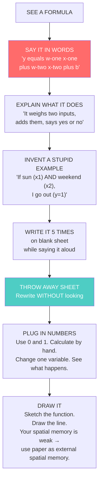

### The Formula Method

1. **Say the formula in words** (not symbols): "y equals sign of w-one x-one plus w-two x-two plus b"
2. **Explain what it does:** "It takes two things, weighs them, adds them up, and says yes or no."
3. **Invent a stupid example:** "If there's sun (x1) and it's weekend (x2), I go out (y=1)."
4. **Write the formula 5 times on a blank sheet while saying it out loud.**
5. **Throw away the sheet. Rewrite it without looking.**

Never stare at a formula in silence. It won't enter your brain.

### For Understanding What A Formula MEANS (Not Just Memorizing)

- **Plug in numbers.** Pick simple numbers. 0 and 1. Calculate by hand. See what happens. This builds procedural memory for the formula.
- **Change one variable.** What happens if x1 goes from 0 to 10? Does the output change a lot or a little? This builds implicit pattern recognition.
- **Draw it.** If it's a function, sketch it. If it's a line, draw the line. Your spatial memory is weak, so use paper as EXTERNAL spatial memory.

---

## FOR PROGRAMMING AND CODE

Don't read code. EXECUTE it in your head. Be the computer.

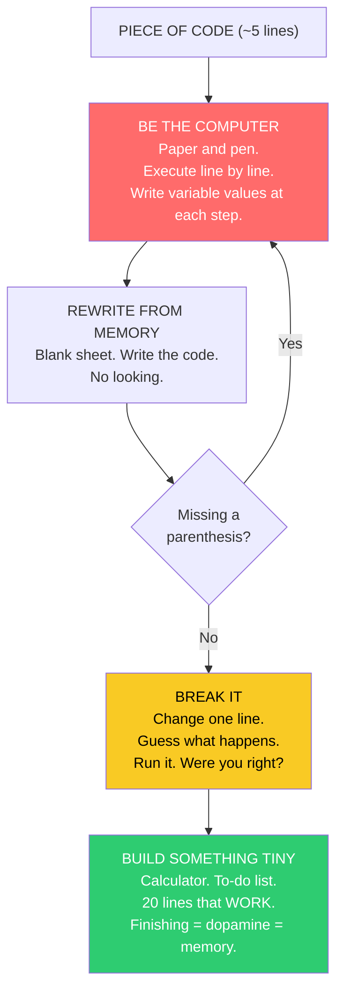

### The Code Method

1. **Take a piece of code. About 5 lines.**
2. **Pretend you're the computer.** Paper and pen. Execute line by line. Write down variable values at each step. This builds PROCEDURAL MEMORY.
3. **Then write the code on a blank sheet.** Without looking.
4. **If you miss a parenthesis, restart.** Never copy and paste. Ever.
5. **Break it.** Change one line. Guess what happens. Run it. Were you right? That's how you learn.

### For Learning Programming Languages

- **Type every example yourself.** Don't download the code. Type it. Make typos. Fix them. That's learning: your fingers build procedural memory for syntax.
- **One concept at a time.** Today: if statements. Tomorrow: for loops. Don't mix: your working memory can't handle it.
- **Build something tiny.** A calculator. A to-do list. Something that works in 20 lines. Finishing gives DOPAMINE. Dopamine helps memory consolidation.

---

## FOR PRACTICAL STEM (Labs, Projects, Experiments)

Practical work is about DOING, not reading about doing. This builds PROCEDURAL MEMORY.

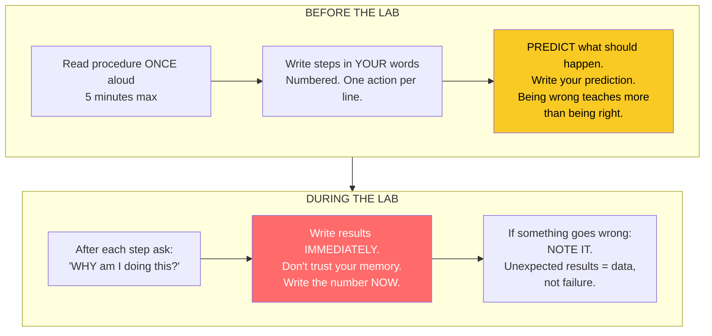

### Before The Lab/Project Session

1. **Read the procedure once.** Out loud. 5 minutes max.
2. **Write the steps in your own words.** Numbered list. One action per line.
3. **Predict what should happen.** Write your prediction. After the lab, compare. Being wrong teaches you more than being right: it highlights flaws in your semantic model.

### During The Lab

- **Don't follow the script blindly.** After each step, ask: "WHY am I doing this?"
- **Write results immediately.** Don't trust your memory. Write the number NOW.
- **If something goes wrong, note it.** Unexpected results are not failures. They are data.

---

## THE "TERRIBLE BRAIN DAY" PROTOCOL

> **For days when brain fog is so thick you can't even do Step 1.**

Not every day is a study day. Some days your brain simply won't cooperate. Fighting it burns energy and produces nothing. On those days, use the RIGHT level.

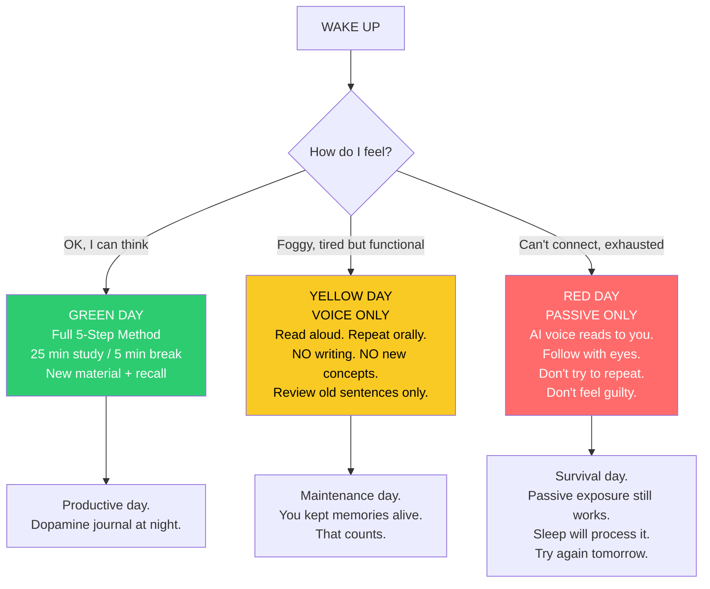

| Level | How You Feel | What To Do | Why It Still Works |
|-------|-------------|------------|-------------------|
|  **Green** | Ok, I can think | Full 5-Step Method. New material + recall schedule. | Optimal encoding. All memory systems engaged. |
|  **Yellow** | Foggy but functional | VOICE ONLY: Read aloud, repeat orally. NO writing. Only review old sentences, no new concepts. | Maintains existing memories. Prevents decay. Vocal loop still encodes. |
|  **Red** | Can't connect, exhausted | PASSIVE ONLY: AI voice reads to you. Follow with eyes. Don't try to repeat. Don't feel guilty. | Passive exposure still activates semantic networks weakly. Sleep will consolidate what little got through. |

> **A red day is NOT a wasted day.** It's a day you did what your brain could handle. Guilt destroys dopamine. Acceptance preserves it.

---

## FOR FOCUS AND BRAIN FOG

Non-negotiable rules:

- **25 minutes study, 5 minutes break.** Timer on your phone. When it rings, stand up. Walk. Drink water. Do NOT look at your phone during the break. Close your eyes.
- **Water always nearby.** One sip every 10 minutes. Dehydration = brain fog. You don't need to drink a lot. You need to drink often.
- **Never study right after eating.** Wait 30 minutes. Blood goes to your stomach, not your brain.
- **No caffeine or energy drinks.** Anxiety + caffeine = disaster. Drink water or decaf tea.
- **Study standing up or walking.** Your brain works better in motion. Put your book on a high shelf. Stand. Walk while you repeat.
- **Background noise:** If silence makes your mind wander, use **brown noise** (not music, not white noise). YouTube: "brown noise for studying." It fills the silence without distracting.

---

## FOR STRESS AND ANXIETY (Before And During Exams)

1. **4-4-4-4 breathing:** Inhale 4 seconds, hold 4, exhale 4, wait 4. Repeat 5 times. This works every time. Even during an exam. Your heart rate drops. Your brain gets oxygen.

2. **Don't study in the last 30 minutes.** What you don't know, you won't learn at the last minute. The last 30 minutes are for breathing and drinking water.

3. **Enter smiling.** Even if it's fake. Your brain doesn't know the difference. Smiling lowers cortisol (stress hormone).

4. **Social anxiety during presentations/orals:** The professor has seen hundreds of students. They've seen worse presentations than yours. They've seen people freeze, cry, forget everything. You won't be the worst. You won't even be memorable. Just get through it.

5. **Before sleep the night before:** No screens for 30 minutes. Read something non-academic. Your brain consolidates memory during sleep. Let it work.

---

## EMERGENCY CRAMMING (When You Have 30 Minutes)

> **For when you have NO time. This is damage minimization, not ideal learning.**

- Read ONLY the section titles. One after another. Aloud.
- For each title, say ONE sentence about it. If you can't, read the first line of that section.
- Do NOT read the whole text. Your brain in panic mode cannot absorb paragraphs. It CAN absorb titles and first lines.
- At the end, close your eyes. List the titles you remember. That's what you know. The rest was never going to stick in 30 minutes anyway.

---

## LONG-TERM MEMORY: How To Remember SOMETHING FOREVER

> **This is the difference between "I passed the exam" and "I still know this 5 years later."**

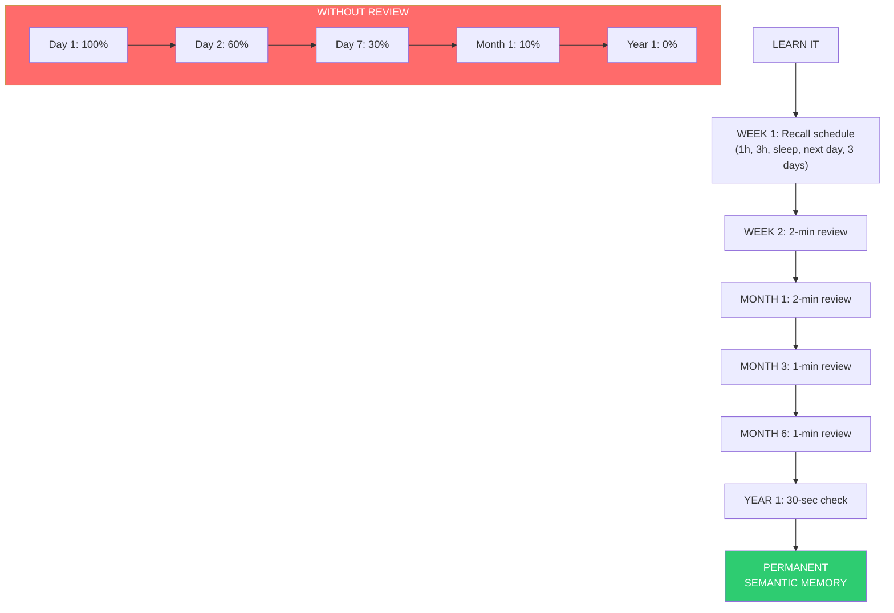

### The Spaced Repetition Principle For Lifetime Retention

Each time you successfully recall something RIGHT BEFORE you were about to forget it, the memory gets STRONGER and lasts LONGER. The intervals expand exponentially:

| Review # | When | What Happens |
|----------|------|--------------|
| 1 | Immediate | Memory formed (fragile) |
| 2 | +1 hour | Strengthened for ~1 day |
| 3 | +3 hours | Strengthened for ~3 days |
| 4 | Before sleep | Consolidated overnight |
| 5 | Next day | Strengthened for ~1 week |
| 6 | +3 days | Strengthened for ~2 weeks |
| 7 | +1 week | Strengthened for ~1 month |
| 8 | +1 month | Strengthened for ~3 months |
| 9 | +3 months | Strengthened for ~1 year |
| 10 | +1 year | **Essentially permanent** |

> **The first 4 reviews (same day) are the ones that matter MOST.** They determine whether something survives to Day 2. After Day 2, the intervals grow and the reviews become trivially short (1-2 minutes each).

### The "Big Picture" Annual Review

Once a year, spend 30 minutes doing a "brain dump" of everything you learned that year:
- Take a blank sheet. Write every major concept, formula, and method you remember.
- Don't look anything up. This is a test of what SURVIVED.
- Whatever is missing: that's what needs a single 2-minute review.
- One 2-minute review per year is enough to keep something in memory for life.

---

## DAILY ROUTINE FOR YOUR BRAIN

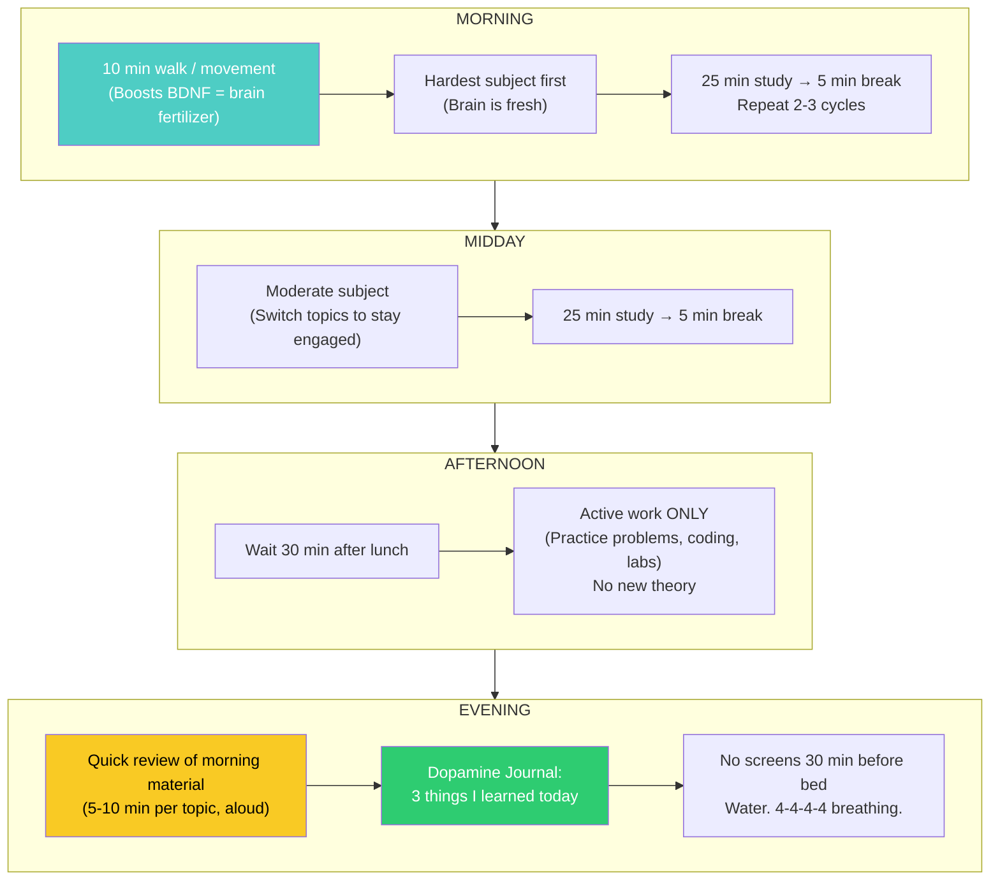

| Time | Action | Memory System Targeted |
|------|--------|----------------------|
| **Morning** | 10 min walk/movement FIRST. Then hardest subject. 25/5 cycles. | Working memory at peak. BDNF boost from exercise. |
| **Mid-morning** | Moderate subject. Switch topics to keep brain engaged. | Interleaving builds implicit pattern recognition. |
| **After lunch** | Wait 30 min. Light review, NOT new material. | Blood is in stomach, not brain. Don't fight biology. |
| **Afternoon** | Practice problems, coding, or lab work (active, not passive). | Procedural memory. Hands-on encoding. |
| **Evening** | Quick review of morning material (5-10 min per topic, aloud). Dopamine journal. | Feeds hippocampus for overnight consolidation. |
| **Before bed** | No screens. Water. 4-4-4-4 breathing. | Sleep quality determines memory retention. |

---

## THE COMPLETE SYSTEM: Overview Flowchart

```mermaid
flowchart TB
    PREVIEW["STEP 0: 30-sec Preview<br/>Build mental shelf"] --> PIECE["STEP 1: Take 2-min piece<br/>Cover rest with paper"]
    PIECE --> READ["STEP 2: Read aloud + Simplify<br/>Say it like to a 10-year-old"]
    READ --> UNDERSTAND{"Understand it?"}
    UNDERSTAND -->|"No"| LADDER["'I Don't Understand' Protocol<br/>5 gradients. Still no?<br/>Post-it → Sleep → Tomorrow"]
    LADDER --> READ
    UNDERSTAND -->|"Yes"| RECALL["STEP 3: Close + Recall<br/>Stand. Walk. Say it."]
    RECALL --> WRITE["STEP 4: Write one sentence<br/>From memory"]
    WRITE --> REPEAT["STEP 5: Repeat after 10 min"]
    REPEAT --> SCHEDULE["RECALL SCHEDULE<br/>+1h → +3h → Bedtime →<br/>Next day → +3 days →<br/>+1 week → +1 month → PERMANENT"]
    SCHEDULE --> DOPAMINE["DOPAMINE REWARD<br/>Chocolate. Music. Journal."]
    DOPAMINE --> NEXT["Next chunk → Back to Step 1"]

    subgraph BAD_DAY["YELLOW/RED DAY PATH"]
        BAD_CHECK{"Brain working?"} -->|"Foggy"| VOICE_ONLY["Voice only. No writing.<br/>Review old sentences."]
        BAD_CHECK -->|"Dead"| PASSIVE["Passive only.<br/>AI reads. You follow."]
    end

    style RECALL fill:#ff6b6b,color:#fff
    style SCHEDULE fill:#4ecdc4,color:#fff
    style DOPAMINE fill:#2ecc71,color:#fff
```

---

## QUICK REFERENCE: Memory System Cheat Sheet

| I want to... | Use this technique | Targets |
|-------------|-------------------|---------|
| Understand a concept deeply | Elaboration + "Why" chains | Semantic |
| Remember a formula forever | Say aloud + Write 5x + Plug numbers | Semantic + Procedural |
| Recognize problem types fast | Interleaving + Compare side-by-side | Implicit (Pattern Recognition) |
| Remember where I learned something | Physical anchors + Location rotation | Episodic |
| Do a lab procedure from memory | Write steps from memory before lab | Procedural |
| Recall on command during exam | Trigger-action pairs + Exam simulation | Prospective |
| Not forget after 1 day | 1h + 3h + Bedtime recall (non-negotiable) | Short-Term → Long-Term |
| Keep something for years | Spaced recall: 1wk → 1mo → 3mo → 1yr | Long-Term (Permanent) |
| Study when brain is dead | Yellow/Red day protocol. Don't fight it. | All (damage control) |
| Stay focused with brain fog | 25/5 timer + Water + Brown noise + Standing | Working Memory |

---

## THE ONLY RULE THAT MATTERS

**Done is better than perfect. Known is better than unknown.**

Your goal is NOT to understand everything. Your goal is NOT to remember everything.

Your goal is to know **3 things more than you knew yesterday.**

If you know 3 more things, you won the day. An oral exam is 3 questions. A written exam is 3-5 problems. You don't need 60 perfect answers. You need 3-5 solid ones.

The degree gets the job. The job doesn't ask about your GPA after the first one.

Study. Use your voice. Move your body. Drink water. Sleep. Pass. Move on.

---

*Method built on evidence from cognitive science: retrieval practice, spaced repetition, dual coding, elaboration, interleaving, and concrete examples (The Learning Scientists). Adapted for brains with working memory deficits, dopamine deficiency, brain fog, and severe forgetting curves.*
