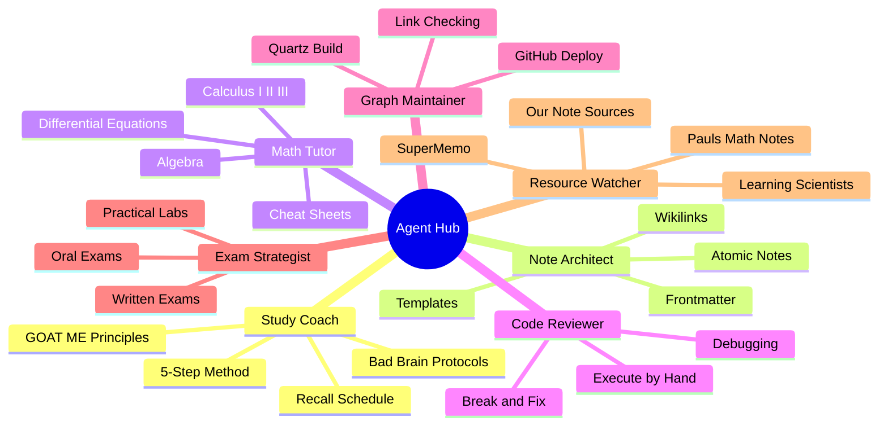
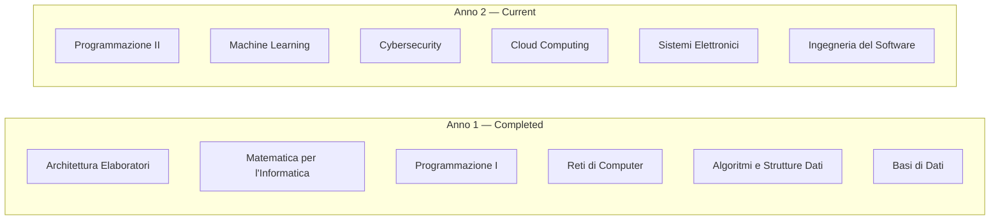

# Agent Hub — Study Command Center

Your central dashboard for accessing every resource, agent, and tool in the COME STUDIARE system. Click any card below to navigate.

---

## Quick Actions

| Action | Link |
|--------|------|
|  Start Today's Study Session | [[come-studiare/5-step-method|5-Step Method]] |
|  Check Recall Schedule | [[come-studiare/recall-schedule|What to review right now]] |
|  Create New Course Note | [[templates/note-template|Note Template]] |
|  Browse Knowledge Graph | [Graph View](/) — click the graph icon in sidebar |
|  Push to Deploy | `git add -A && git commit -m "notes" && git push` |

---

## Your AI Agents



### Study Coach
Guides through evidence-based learning. Never suggests passive reading.

**Invoke:** `@study-coach I don't understand this concept`

**Resources:**
- [[come-studiare/5-step-method|The 5-Step Method]]
- [[come-studiare/recall-schedule|Recall Schedule (non-negotiable)]]
- [[come-studiare/3-pass-system|3-Pass System for instant forget]]
- [[notes/goat-me-method|GOAT ME — How Memory Works]]
- [[notes/complete-learning-system|Complete Learning System]]

### Note Architect
Creates atomic, linked notes. One concept per file. Never copies — always writes from memory.

**Invoke:** `@note-architect create a note for today's lecture on [topic]`

**Resources:**
- [[templates/note-template|Note Template]]
- [[notes/how-i-write-notes|How I Write Notes]]
- [[notes/matuschak-complete-system|Matuschak's Complete System]]
- [[notes/graph-view-guide|Graph View Guide]]

### Math Tutor
Explains with concrete examples. Formulas in words first, symbols second.

**Invoke:** `@math-tutor explain [concept] with an example`

**Resources:**
- [[math/index|Complete Math Reference (Paul's Notes)]]
- [[math/algebra/index|Algebra]]
- [[math/calculus-1/index|Calculus I]] — [[math/calculus-2/index|II]] — [[math/calculus-3/index|III]]
- [[math/differential-equations/index|Differential Equations]]
- [[math/cheatsheets/index|Cheat Sheets & Quick Reference]]

### Code Reviewer
Debugs and explains. Never gives complete answers — guides through retrieval.

**Invoke:** `@code-reviewer why is this code not working?`

**Resources:**
- [[courses/anno-2/programmazione-2|Programmazione II]]
- [[courses/anno-2/lab-programmazione-web-1|Lab Programmazione Web I]]
- [[courses/anno-2/lab-programmazione-web-2|Lab Programmazione Web II]]

### Knowledge Graph Maintainer
Manages site deployment, link integrity, and graph structure.

**Invoke:** `@graph-maintainer fix the broken links`

**Resources:**
- [[notes/graph-view-guide|How the Graph Works]]
- Site: [boluwajioadepojuworkp.github.io/study-notes](https://boluwajioadepojuworkp.github.io/study-notes)
- Repo: [github.com/boluwajioadepojuworkp/study-notes](https://github.com/boluwajioadepojuworkp/study-notes)

### Exam Strategist
Prepares for oral, written, and practical exams. Simulates real conditions.

**Invoke:** `@exam-strategist I have an oral exam on [subject]`

**Resources:**
- [[come-studiare/index|Oral Exam Preparation]]
- [[come-studiare/index|Written Exam Preparation]]
- [[come-studiare/index|Practical STEM Preparation]]
- [[come-studiare/index|Emergency Cramming (30 min)]]

### Resource Watcher
Monitors external sources for updates. Runs automatically via GitHub Actions.

**Invoke:** `@resource-watcher what's new?`

**Resources:**
- [Learning Scientists](https://www.learningscientists.org/blog)
- [Paul's Math Notes](https://tutorial.math.lamar.edu/)
- [SuperMemo Blog](https://www.supermemo.com/en/blog)
- [Our Note Methodology](/notes/how-i-write-notes)
- GitHub Action: `.github/workflows/watch-sources.yml` (runs 2x daily)

---

## Your Courses



**Full courses:** [[courses/anno-1/index|Anno 1]] | [[courses/anno-2/index|Anno 2]]

---

## All Reference Notes

### Evidence-Based Methods
- [[notes/complete-learning-system|Complete Learning System — ALL Frameworks]]
- [[notes/goat-me-method|GOAT ME Method]]
- [[notes/dunlosky-2013-study-techniques|Dunlosky 2013 Scientific Rankings]]
- [[notes/supermemo-20-rules|SuperMemo 20 Rules]]

### Note-Taking Systems
- [[notes/how-i-write-notes|How I Write Notes]]
- [[notes/matuschak-evergreen-notes|Matuschak Evergreen Notes]]
- [[notes/matuschak-complete-system|Matuschak Complete System]]
- [[notes/graph-view-guide|Graph View Guide]]

### Tools
- [[notes/highlight-converter|Book Highlight Converter]]
- [[notes/latex-templates|LaTeX Templates]]
- [[notes/agents-reference|Agents Reference]]

---

## Today's Status

```mermaid
gantt
    title Today's Study Plan
    dateFormat HH:mm
    axisFormat %H:%M
    
    section Morning
    Review yesterday's notes  :crit, 08:00, 30min
    Hardest subject session   :09:00, 50min
    Break                     :09:50, 10min
    Second session            :10:00, 50min
    
    section Afternoon
    Practice problems         :14:00, 60min
    Lab work                  :15:00, 60min
    
    section Evening
    Write today's notes       :19:00, 30min
    Dopamine journal          :19:30, 10min
```



---

## Quick Commands

```bash
# Build and preview site locally
cd ~/ME/notes-site && npx quartz build -d content --serve

# Create a new course note
cp content/templates/note-template.md content/courses/anno-2/new-topic.md

# Push changes to deploy
cd ~/ME/notes-site && git add -A && git commit -m "notes: [what you learned]" && git push

# Convert book highlights to notes
cd ~/ME/highlight-converter && ./md2org.sh highlights.md

# Check monitored learning sources for updates
gh run watch --repo boluwajioadepojuworkp/study-notes
```

---

*This hub connects every resource in your study system. Bookmark this page. Return here to start every study session.*
