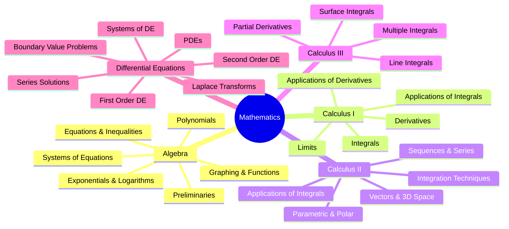

# Mathematics Reference Notes

Complete mathematics reference adapted from Paul's Online Math Notes. These notes serve as a structured reference for all math courses in the Programmazione e Gestione dei Sistemi Informatici (L-P03) degree program.

## Subjects

| Subject | Topics | Relevance |
|---------|--------|-----------|
| [[math/algebra/index|Algebra]] | Preliminaries, Equations, Functions, Polynomials, Exponentials, Systems | Foundation for all STEM |
| [[math/calculus-1/index|Calculus I]] | Limits, Derivatives, Integrals, Applications | Machine Learning foundations |
| [[math/calculus-2/index|Calculus II]] | Integration Techniques, Series, Vectors | Advanced ML, Signal Processing |
| [[math/calculus-3/index|Calculus III]] | Multivariable, Partial Derivatives, Surface Integrals | ML optimization, Physics |
| [[math/differential-equations/index|Differential Equations]] | First/Second Order, Laplace, PDEs | Modeling, Control Systems |
| [[math/cheatsheets/index|Cheat Sheets & References]] | Algebra, Trig, Calculus, Laplace tables | Quick reference |

## How to Study Math

See: [[come-studiare/index|COME STUDIARE Method]] for the full evidence-based study system.

Key principles for mathematics specifically:
- Never read math passively — solve problems from memory
- Write formulas 5 times, then throw away the sheet and rewrite
- Execute derivations by hand without looking
- Interleave problem types in each study session
- Draw the function before calculating it

---

*Source: Paul Dawkins, Lamar University. https://tutorial.math.lamar.edu/*
