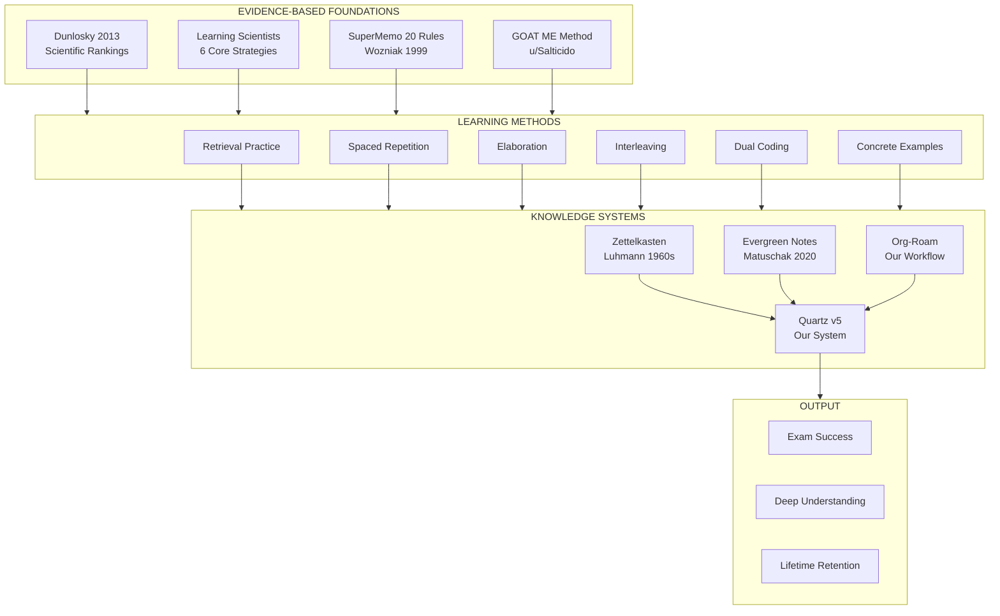
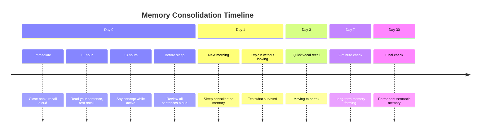
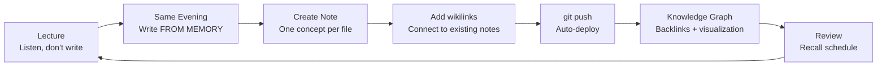
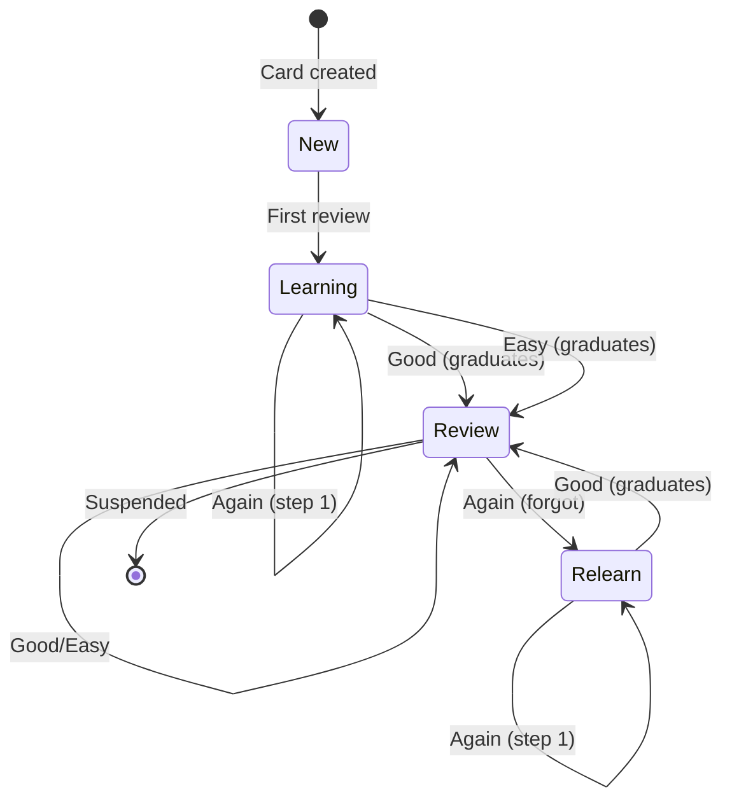
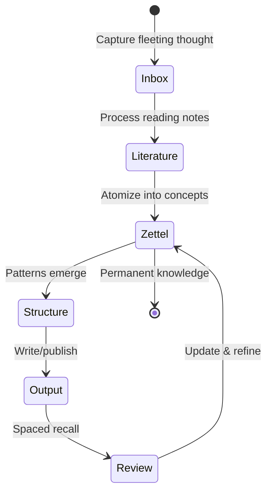

# The Complete Learning System

**A unified synthesis of every evidence-based learning framework. Built from 30+ sources across cognitive psychology, spaced repetition research, and real-world student methods.**

## System Architecture



---

## The 6 Core Strategies (Learning Scientists)

These are the ONLY strategies with strong scientific evidence. Everything else builds on these.

| Strategy | What It Is | Our Implementation |
|----------|-----------|-------------------|
| **Spaced Practice** | Spread study over time. Never cram. | [[come-studiare/recall-schedule|Recall Schedule]] (1h→3h→sleep→next day→3d→1w→1mo) |
| **Retrieval Practice** | Bring info to mind from memory. No book. | [[come-studiare/5-step-method|Step 3: Close + Recall]] |
| **Elaboration** | Ask why. Connect new to old. | "Why chains", teach a ghost, [[wikilinks]] |
| **Interleaving** | Mix problem types. Don't block. | [[come-studiare/index|Implicit Memory training]] |
| **Concrete Examples** | Abstract → concrete. Real world. | "My example" in every note template |
| **Dual Coding** | Words + visuals together. | Voices + writing + Quartz graph |

---

## How to Combine Them (Learning Scientists)

1. **Spacing is the container**: it's about WHEN, not HOW. Every other strategy must be spaced.
2. **Retrieval practice integrates with ALL**: elaborate from memory, sketch from memory, create examples from memory.
3. **Dual coding amplifies everything**: add visuals to elaboration, examples, and retrieval.
4. **Concrete examples + elaboration**: trade examples with peers, explain how they fit.

---

## Memory Systems and How to Train Each

| System | Function | Training Method |
|--------|----------|----------------|
| Working Memory | Holds 3-5 chunks, 10-30 sec | Micro-chunks (2 min), externalize on paper, talk aloud |
| Short-Term | Seconds to minutes | 3-Pass System, immediate vocal recall |
| Long-Term | Days to years | Spaced recall schedule |
| Semantic | Facts, concepts, formulas | Elaboration, mind maps, why chains, compare/contrast |
| Episodic | Personal experiences, context | Physical anchors, emotional hooks, location rotation |
| Procedural | How to DO things | Hands-on labs, type code, execute by hand |
| Implicit | Pattern recognition | Interleaving, side-by-side comparison |
| Prospective | Remembering TO remember | Trigger-action plans, exam simulation |

---

## GOAT ME: Study Based on How Memory Works (u/Salticido)

Memory = Attention → Encoding → Retrieval. Optimize the first two.

| Letter | Meaning | Action |
|--------|---------|--------|
| G | Generate & Test | Quiz yourself. Wrong answers teach more than reading. |
| O | Organize | Outlines, color coding, timelines. Position = meaning. |
| A | Avoid Illusions | Recognition ≠ Recall. Rereading = fluency trap. |
| T | Take Breaks | Short sessions > cramming. Sleep = save button. |
| M | Match Conditions | Study like you'll be tested. OR vary conditions for long-term. |
| E | Elaborate | Deep thinking. Songs, stories, doodles, personal connections. |

---

## Dunlosky 2013: Scientific Ranking of Techniques

| Tier | Techniques |
|------|-----------|
| **HIGH Utility** | Practice testing, Distributed practice |
| **MODERATE Utility** | Elaborative interrogation, Self-explanation, Interleaved practice |
| **LOW Utility** | Highlighting, Rereading, Summarization, Keyword mnemonics, Imagery for text |

---

## SuperMemo 20 Rules (Wozniak, 1999)

The definitive guide to formulating knowledge for spaced repetition.

| # | Rule |
|---|------|
| 1 | Do not learn if you do not understand |
| 2 | Learn before you memorize: build overall picture first |
| 3 | Build upon the basics |
| 4 | Stick to minimum information principle |
| 5 | Cloze deletion is easy and effective |
| 6 | Use imagery |
| 7 | Use mnemonic techniques |
| 8 | Graphic deletion = cloze deletion for images |
| 9 | Avoid sets: convert to enumerations |
| 10 | Avoid enumerations: use overlapping cloze |
| 11 | Combat interference: similar items confuse |
| 12 | Optimize wording: fewer words = faster |
| 13 | Refer to other memories |
| 14 | Personalize and provide examples |
| 15 | Rely on emotional states |
| 16 | Context cues simplify wording |
| 17 | Redundancy ≠ violation of minimum information |
| 18 | Provide sources |
| 19 | Provide date stamping |
| 20 | Prioritize: you can't learn everything |

---

## Zettelkasten / Evergreen Notes Principles

| Principle | Meaning |
|-----------|---------|
| Atomic | One note = one concept |
| Concept-oriented | Organized by idea, not source |
| Densely linked | Links > folders |
| Titles are APIs | Complete declarative sentences |
| Write for yourself | Don't write for an audience |
| Inbox → Process → Connect | Capture first, organize later |
| Structure Notes | Freeze thought trails for development |
| Plain text | Timeless, portable, future-proof |
| Bottom-up emergence | Hierarchies emerge, not imposed |
| Notes = thinking work | Notes are the fundamental unit of knowledge work |

---

## Our Note-Taking Workflow

1. **Don't take notes during lectures**: listen and understand
2. **Same evening**: write notes FROM MEMORY
3. **Fill gaps** with textbook and lecture slides
4. **Structure:** Index → Year → Semester → Course → Week → Topic
5. **Link topics** with wikilinks
6. **Publish** as static site with graph view

---

## Anki Spaced Repetition: Key Concepts

| Concept | Meaning |
|---------|---------|
| Card States | New → Learning → Review (Young/Mature) → Relearn |
| FSRS | Modern algorithm replacing SM-2. ML-based, adapts to your memory. |
| Desired Retention | 90% default. Higher = more reviews. Above 97% = overwhelming. |
| Learning Steps | Short delays (1m, 10m). Keep under 1 day with FSRS. |
| Again button | Use when you FORGOT. NOT Hard. Hard = remembered with effort. |
| Leeches | Cards you keep forgetting. Suspend and reformulate. |
| Siblings | Related cards buried until next day to prevent interference. |

---

## The Daily Routine

```mermaid
gantt
    title Daily Study Schedule
    dateFormat HH:mm
    axisFormat %H:%M
    
    section Morning
    Walk & Movement           :07:00, 10min
    Hardest Subject (25/5)   :07:10, 50min
    Hardest Subject (25/5)   :08:00, 50min
    
    section Midday
    Moderate Subject (25/5)  :09:00, 50min
    Switch Topic (Interleave):09:50, 50min
    Light Review Only        :12:30, 30min
    
    section Afternoon
    Practice Problems        :14:00, 60min
    Lab Work / Coding        :15:00, 60min
    Lab Work / Coding        :16:00, 60min
    
    section Evening
    Review Morning Material  :19:00, 30min
    Dopamine Journal         :19:30, 10min
    No Screens               :21:30, 30min
    Sleep (Consolidation)    :22:00, 480min
```



| Time | Action | Memory System |
|------|--------|--------------|
| Morning | 10 min walk. Hardest subject first. 25/5 cycles. | Working memory at peak |
| Mid-morning | Moderate subject. Switch topics. | Interleaving |
| After lunch | Wait 30 min. Light review only. | Blood in stomach, not brain |
| Afternoon | Practice problems, coding, labs. | Procedural memory |
| Evening | Review morning material aloud. Dopamine Journal. | Hippocampus feed |
| Before bed | No screens. Water. 4-4-4-4 breathing. | Sleep quality = memory |

---

## The Recall Schedule (Non-Negotiable)



| When | Action | Time |
|------|--------|------|
| Immediate | Close book, say it aloud | 30 sec |
| +1 hour | Read YOUR sentence, recall | 2 min |
| +3 hours | Say concept while doing something else | 1 min |
| Before sleep | Review ALL sentences from today aloud | 5 min |
| Next day | Explain each sentence without looking | 5 min |
| +3 days | Quick vocal recall | 3 min |
| +1 week | 2-minute check | 2 min |
| +1 month | Final check | 1 min |

---

## The Note Pipeline



## Anki Card States



## The Complete Note-Taking State Machine



Every note should follow this structure:

```markdown
---
title: Concept Name
course: Course Name
date: YYYY-MM-DD
---

# Concept Name

**What it is:** (One sentence)

**How it works:** (Two sentences: like to a 10-year-old)

**Why it connects:** (One sentence: link to other notes)

**My example:** (A concrete, personal, stupid example)
```

---

## What NEVER Works

- Silent reading
- Highlighting/underlining
- Copying word-for-word
- Cramming all night
- Studying 3+ hours nonstop
- Rereading without retrieval
- Shared Anki decks without understanding
- Learning styles (visual/auditory/kinesthetic: debunked)
- Passive summarization

---

## What ALWAYS Works

- Retrieval practice (close book, recall)
- Spaced repetition (distributed over time)
- Elaboration (why chains, teaching)
- Dual coding (voice + visuals + writing)
- Concrete examples (personal, real-world)
- Interleaving (mix problem types)
- Sleep (memory consolidation)
- Exercise (BDNF = brain fertilizer)
- Water (dehydration = brain fog)

---

*This unified framework synthesizes: Learning Scientists (6 strategies), Dunlosky et al. (2013), SuperMemo 20 Rules (Wozniak), GOAT ME method (u/Salticido), Make It Stick (Brown), Zettelkasten/Evergreen Notes (Luhmann/Matuschak), our note-taking workflow, Anki FSRS, and the COME STUDIARE method.*

## Related

- [[goat-me-method]]
- [[dunlosky-2013-study-techniques]]
- [[supermemo-20-rules]]
